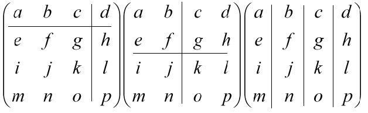
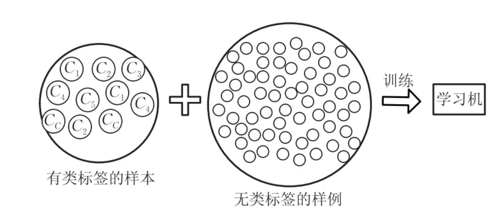
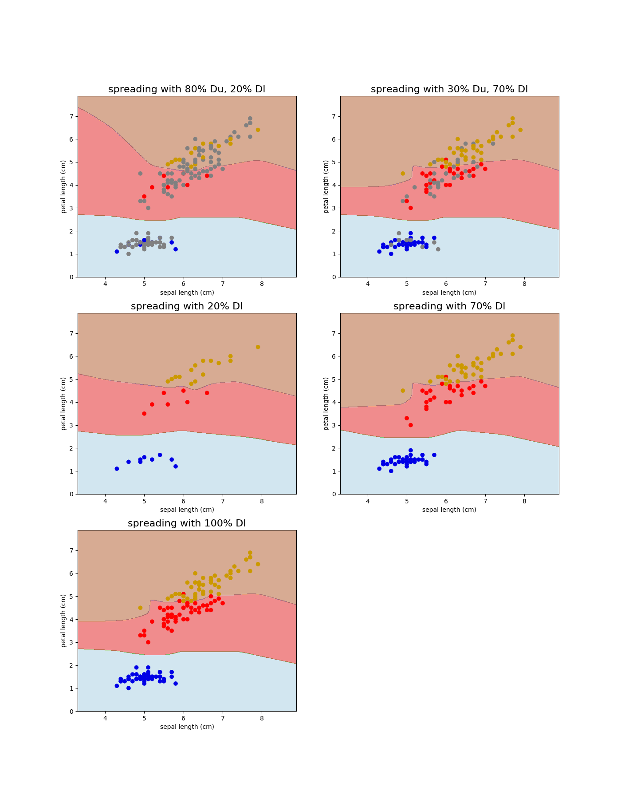

### 引言

分块矩阵是高等代数中的一个重要内容，是处理阶数较高的矩阵时常采用的技巧，也是数学在多领域的研究工具。对矩阵进行适当分块，可使高阶矩阵的运算可以转化为低阶矩阵的运算，同时也使原矩阵的结构显得简单而清晰，从而能够大大简化运算步骤，或给矩阵的理论推导带来方便。有不少数学问题利用分块矩阵来处理或证明，将显得简洁、明快。本节我们将先介绍一下分块矩阵的定义和性质，然后我们再结合机器学习中**半监督学习**问题上，基于分块矩阵运算来进行半监督学习算法的推到和分析。

### 分块矩阵定义

有时候，我们将一个大矩阵看成是由一些小矩阵组成的，就如矩阵是由数构成的一样。特别在运算中，把这些小矩阵当做数一样处理，这就是所谓的矩阵的分块。把原矩阵分别按照横竖需要分割成若干块小矩阵，其中每一块小矩阵称为子块或者子矩阵，把原矩阵称为这些子块的分块矩阵。通过将大的矩阵通过分块的方式划分，并将每个分块(称为子块)看做另一个矩阵的元素，这样之后再参与运算，通常可以简化运算。例如，有的大矩阵可以通过分块变为对角矩阵或者是三角矩阵等特殊形式的矩阵。下面我们来看看分块矩阵的数学定义：

**定义1：** 设 $A$ 是 $m \times n$ 矩阵，将 $A$ 的行分割为 $r$ 段，每段分别包含 $m_1, m_2, \cdots, m_r$ 行，将 $A$ 的列分割为 $s$ 段，每段包含 $m_1, m_2, \cdots, m_s$ 列，则：

​					$$A_{mn} = \left( \begin{matrix} A_{11} & A_{12} &\cdots & A_{1s} \\ A_{21} & A_{22} &\cdots & A_{2s} \\ \vdots & \vdots & \ddots & \vdots \\ A_{r1} & A_{r2} &\cdots & A_{rs} \end{matrix} \right)​$$

就称为分块矩阵，其中 $A_{ij}$ 是 $m_i \times m_j$ 矩阵 $(i = 1,2, \cdots, r; j = 1,2,\cdots, s)$。注意，分块矩阵每一行的子矩阵都有相同的行，每一列的子矩阵都有相同的列。

分块矩阵的分割原则是以水平线和垂直线进行划分，如下图：



### 分块矩阵的运算

进行分块矩阵的加、减、乘法与转置运算时，可以把子矩阵当做是普通的矩阵元素对待，这些操作与我们在第一章节中讲到的矩阵的加减乘法与转置类似：

**加法运算**

设 $A$ 和 $B$ 的行列相同，并采用相同的的分块方法分成：

​				$$A =  \left( \begin{matrix} A_{11} & A_{12} &\cdots & A_{1s} \\ A_{21} & A_{22} &\cdots & A_{2s} \\ \vdots & \vdots & \ddots & \vdots \\ A_{r1} & A_{r2} &\cdots & A_{rs} \end{matrix} \right)  \ \ \  B  = \left( \begin{matrix} B_{11} & B_{12} &\cdots & B_{1s} \\ B_{21} & B_{22} &\cdots & B_{2s} \\ \vdots & \vdots & \ddots & \vdots \\ B_{r1} & B_{r2} &\cdots & B_{rs} \end{matrix} \right)​$$

若 $A​$ 和 $B​$ 的对应字块有相同行列号则：

​				$$A + B =  \left( \begin{matrix} A_{11} + B_{11} & A_{12} + B_{12} &\cdots & A_{1s} + B_{1s} \\ A_{21} + B_{21} & A_{22} + B_{22} &\cdots & A_{2s} + B_{2s} \\ \vdots & \vdots & \ddots & \vdots \\ A_{r1} + B_{r1} & A_{r2} + B_{r2} &\cdots & A_{rs} + B_{rs} \end{matrix} \right)$$

**数乘运算**

设分块矩阵 $A_{mn} = (A_{ij})_{rs}$ ，$k$为任意实数，则分块矩阵与 $k$ 的数乘为：

​				$$k A = (kA_{ij})_{rs}$$

**乘法运算**

一般地说，设 $A_{ml} = (A_{ik})_{rs}, B_{ln} = (B_{kj})_{st}​$，即将矩阵 $A_{ml}​$ 分块为 $r​$ 行 $s​$ 列个子块，将矩阵 $B_{ln}​$ 分块为 $s​$ 行 $t​$ 列个子块。其中 $A_{i1}, A_{i2}, \cdots, A_{is}​$ 的列数分别等于 $B_{1j}, B_{2j},\cdots,B_{sj}​$ 的行数。 于是有：

​				$$C = AB = \left( \begin{matrix} C_{11} & C_{12} &\cdots & C_{1t} \\ C_{21} & C_{22} &\cdots & C_{2t} \\ \vdots & \vdots & \ddots & \vdots \\ C_{r1} & C_{r2} &\cdots & C_{rt} \end{matrix} \right)​$$

其中 $C_{ij} = \sum_{k=1}^s A_{ik}B_{kj}, \ \ (i= 1,2,\cdots,r; \ \ j= 1,2,\cdots,t) ​$  。

**转置**

设分块矩阵 $A$ 划分为 $r \times s$ 个子块，

​				$$A = \left( \begin{matrix} A_{11} & A_{12} &\cdots & A_{1s} \\ A_{21} & A_{22} &\cdots & A_{2s} \\ \vdots & \vdots & \ddots & \vdots \\ A_{r1} & A_{r2} &\cdots & A_{rs} \end{matrix} \right) ​$$

则 $A​$的转置 $A^T​$ 为：

​				$$A^T = \left( \begin{matrix} A_{11} & A_{21} &\cdots & A_{r1} \\ A_{12} & A_{22} &\cdots & A_{s2} \\ \vdots & \vdots & \ddots & \vdots \\ A_{1s} & A_{2s} &\cdots & A_{rs} \end{matrix} \right) ​$$


#### 分块矩阵的性质

在后面讲解分块矩阵的应用时，会频繁使用到矩阵的行列式和分块对角矩阵的一些性质，我们在第一小节讲解矩阵的概念是，提到了行列式，这里我们不妨回顾下。这里我们讲讲先矩阵的行列式和分块对角矩阵。

**矩阵的行列式**

行列式在数学中，是一个函数，其定义域为$det​$ 的矩阵 $A​$，取值为一个标量，写作 $det(A)​$ 或 $|A|​$.无论是在线性代数、多项式理论，还是在微积分学中，行列式作为基本的数学工具，都有着重要的应用。  对于一个二阶行列式，可以表示如下：

​					$$\left | \begin{matrix} a & b \\ c & d \end{matrix}\right| = ad - bc​$$

把一个 $n$ 阶行列式中的元素 $a_{ij}$ 所在的第 $i$ 行和第 $j$ 列划去后，留下来的 $n-1$ 阶行列式叫做元素 $a_{ij}$ 的余子式,记作 $M_{ij}$。记 $A_{ij}=(-1)^{i+j}M_{ij}$，叫做元素$a_{ij}$的**代数余子式**。例如：

​				$$D = \left | \begin{matrix} a_{11} & a_{12} & a_{13} & a_{14}  \\ a_{21} & a_{22} & a_{23} & a_{24} \\a_{31} & a_{32} & a_{33} & a_{34} \\ a_{41} & a_{42} & a_{43} & a_{44} \end{matrix}\right|,  \ \ \ M =  \left | \begin{matrix} a_{11} & a_{12} & a_{14} \\a_{31} & a_{32}  & a_{34} \\ a_{41} & a_{42}  & a_{44} \end{matrix}\right|​$$

​				$$A_{23} = (-1)^{2+3}M_{23} = -M_{23}$$

一个 $n \times n$ 矩阵的行列式等于任意行(或列)的元素于之对应的代数余子式乘积之和，即：

​				$$det(A) = a_{i1}A_{i1} + \cdots + a_{in}A_{in} = \sum_{j=1}^n a_{ij} (-1)^{i+j}M_{ij}$$

行列式具有一些初等变换的性质，如下：

- **性质1**：行列互换，行列式不变
- **性质2**：一数乘行列式的一行就相当于这个数乘此行列式
- **性质3**：如果行列式中有两行相同，那么行列式为0，所谓两行相同，即两行对应的元素都相等
- **性质4**：如果行列式中，两行成比例，那么该行列式为0
- **性质5**：把一行的倍数加到另一行，行列式不变
- **性质6**：对换行列式中两行的位置，行列式反号

**分块对角矩阵**

若 $A$ 为 $n$ 阶矩阵，若 $A$ 的分块矩阵只有在主对角线上有非零子块，其余子块都为零矩阵，且非零子块都是方阵，即：

​					$$A = \left( \begin{matrix} A_{1} & \  & \ & \ \\ \ & A_{2} & \ & \ \\  \ & \ & \ddots & \ \\  \ & \ & \ & A_{s} \end{matrix} \right)$$

其中，$A_i \ (i= 1,2,\cdots,s)$ 都是方阵，阶数分别为 $n_1, n_2, \cdots,n_s$ , 且 $\sum_{i=1}^s n_i = n$，则称 $A$ 为对块对角矩阵。

**性质1：** 设 $A$ 为分块对角矩阵， $A = diag(A_1, A_2, \cdots, A_s)$， 则矩阵$A$ 的行列式： $|A| = |A_1||A_2|\cdots|A_s|$。

**性质2：**设 $A​$ 为分块对角矩阵，$A = diag(A_1, A_2, \cdots, A_s)​$，且 $|A_i| \neq 0​$, 则 $|A| \neq 0​$， 并有 $A^{-1} = diag(A_1^{-1}, A_2^{-1}, \cdots A_s^{-1})​$。

### 分块矩阵的应用

#### 半监督学习方法

在机器学习中，对于有标签类别的数据我们可以用监督学习方法来训练模型拟合数据，前面讲到的PCA特征分解、LDA降维、谱聚类等方法都是在处理无样本标签的数据，这类方法属于无监督学习方法。在机器学习领域中，还有一类方法是半监督学习(semi-supervised learning)，这类方法是使用大量的未标记数据，以及同时使用有标签数据来提升学习的性能。要利用为标记样本，必要要将未标记的样本所揭示的数据分布信息与有类别标记的数据相联系的假设，与我们前面讲到数据降维聚类思想很类似。最常见的是"聚类假设"，假设数据存在簇结构，同一个簇的样本属于同一个类别。另外一种常见的假设是"流行假设"，即假设数据分布在一个流行结构上，邻近的样本拥有相似的输出值(类似第3节流行学习降维)。流行假设可以看做时聚类假设的广义版本，并且输出值没有限制，因此比聚类假设的适用范围更广。



####二分类标记传播方法

给定一个数据集，我们可以将其映射为一个图，数据集中每个样本对应于图中的一个结点，若两个样本之间的相似度很高（或相关性很强），则对应的结点之间存在一条边，边的强度(strength)正比于样本之间的相似度（或相关性）。将有标记样本所对应的结点染色，而未标记样本所对应的结点尚未染色；半监督学习对应于颜色在图上扩散或传播的过程；一个图对应一个矩阵，可基于矩阵运算来进行半监督学习算法的推导与分析。

给定带类别标签的样本数据 $D_l = \{(x_1,y_1),(x_2,y_2),\cdots, (x_l,y_l)\}$ 和未标记样本数据 $D_u = \{x_{l+1}, x_{l+2}, \cdots , x_{l+u}\} $, $ l << u, \ l +u = m$ 。我们先基于 $D_l \cup D_u$ 构建一个图 $G=(V,E)$，$V$ 为节点集，$V$ 为邻接矩阵（也称相似矩阵）。和上一章节谱聚类中讲的邻接矩阵构建方法一样，我们选取高斯核函数构建相似矩阵。

​			$$w_{ij} = \begin{cases}  \ \ \ \ \ \ \ \ \ \ \ 0 \  \ \ \ \ \ \ \ \ \ \  \ i = j  \\ exp(\frac{||x_i - x_j||_2^2}{-2\sigma^2}) \ \ \  i \neq j  \end{cases}$$       $$i,j \in \{1,2,\cdots,m\}, \sigma >0$$是用户指定的高斯函数带宽参数。

假定从图$G=(V,E)$ 学习到一个实值函数 $f: V \rightarrow R$，其中对应分类规则为：$y_i = sign(f(x_i)), y_i \in \{-1, +1\}.$ 我们可以定义关于 $f$ 的能量函数：

​				$$E(f) = \frac{1}{2}\sum_{i=1}^m\sum_{j=1}^m(W)_{ij}(f(x_i) - f(x_j))^2​$$

​				$$=\frac{1}{2}(\sum_{i=1}^m d_if^2(x_i) + \sum_{j=1}^md_j f^2(x_j) -2\sum_{i=1}^m\sum_{j=1}^m (W)_{ij}f(x_i)  f(x_j))​$$  

​				$$=\sum_{i=1}^m d_if^2(x_i) - \sum_{i=1}^m\sum_{j=1}^m (W)_{ij}f(x_i)  f(x_j)$$  

​				$$=f^T(D-W)f​$$  

其中 $f = (f_l^Tf_u^T)^T, f_l = (f(x_1), f(x_2), \cdots,f(x_l)), f_u = (f(x_{l+1}), f(x_{l+2}), \cdots, f(x_{l+u}))​$ 分别为$f​$ 在有标记样本和未标记样本上的预测结果。$D = diag(d_1, d_2,\cdots,d_{l+u})​$ 是一个对角矩阵，其对角线元素 $d_i = \sum_{j=l}^{l+u}(W)_{ij}​$为矩阵$W​$的第$i​$行元素之和。

具有最小能量的函数$f$ 满足 $L = D-W$是一个拉普拉斯矩阵。我们以第$l$列和第$l$列为界，采用**分块矩阵** 表示方式：

​					$$W = \left[ \begin{matrix} W_{ll} & W_{lu} \\  W_{ul} & W_{uu}\end{matrix} \right],   D = \left[ \begin{matrix} D_{ll} & 0_{lu} \\  0_{ul} & D_{uu}\end{matrix} \right]​$$

能量函数可以写为：

​					$$E(f) = (f_l^Tf_u^T) \left( \left[ \begin{matrix} W_{ll} & W_{lu} \\  W_{ul} & W_{uu}\end{matrix} \right] - \left[ \begin{matrix} D_{ll} & 0_{lu} \\  0_{ul} & D_{uu}\end{matrix} \right]\right) \left[ \begin{matrix} f_l \\ f_u \end{matrix} \right]​$$

​					$$= f_l^T(D_{ll} - W_{ll})f_l -2f_u^TW_{ul}f_l +f_u^T(D_{uu} - W_{uu})f_u$$

由$\frac{\partial E(f)}{\partial f_u} = 0$ 可以得到：

​					$$f_u = (D_{uu} -W_{uu})^{-1}W_{ul}f_l$$

令

​					$$P = D^{-1}W = \left[ \begin{matrix} D_{ll}^{-1} & 0_{lu} \\  0_{ul} & D_{uu}^{-1}\end{matrix} \right] \left[ \begin{matrix} W_{ll} & W_{lu} \\  W_{ul} & W_{uu}\end{matrix} \right] $$

​					$$= \left[ \begin{matrix} D_{ll}^{-1}W_{ll} & D_{ll}^{-1}W_{lu} \\  D_{uu}^{-1}W_{ul} & D_{uu}^{-1}W_{uu}\end{matrix} \right]  ​$$

即 $P_{uu} = D_{uu}^{-1}W_{uu}, P_{ul} = D_{uu}^{-1}W_{ul}$，则：

​				$$f_u = (D_{uu}(I - D_{uu}^{-1}W_{uu}))^{-1}W_{ul}f_l$$

​				$$=(I-D_{uu}^{-1}W_{uu})^{-1}D_{uu}^{-1}W_{ul}f_l$$

​				$$=(I-P_{uu})^{-1}P_{ul}f_l$$

于是，我们将$D_l$ 上的标记信息作为$f_l = (f(x_1), f(x_2), \cdots,f(x_l))$代入上式，可以求解到$f_u$对未标记样本进行预测。

下面我们看看标记传播实验图：

选用iris数据集的第1、3项属性开展测试， 使用sklearn 的半监督学习算法是利用标记传播进行学习。采用标记传播，分别用不同比例的标记和未标记进行标记传播。

```python
import numpy as np
import matplotlib.pyplot as plt
from sklearn import datasets
from sklearn.semi_supervised import label_propagation
import time

rng = np.random.RandomState(0)

iris = datasets.load_iris()

X = iris.data[:, [0,2]]
y = iris.target

y_30 = np.copy(y)
y_30[rng.rand(len(y)) < 0.3] = -1
y_80 = np.copy(y)
y_80[rng.rand(len(y)) < 0.8] = -1
lu80 = (label_propagation.LabelSpreading().fit(X, y_80), X, y_80)
lu30 = (label_propagation.LabelSpreading().fit(X, y_30), X, y_30)
l20 = (label_propagation.LabelSpreading().fit(X[y_80 != -1], y_80[y_80 != -1]), X[y_80 != -1], y_80[y_80 != -1])
l70 = (label_propagation.LabelSpreading().fit(X[y_30 != -1], y_30[y_30 != -1]), X[y_30 != -1], y_30[y_30 != -1])
l100 = (label_propagation.LabelSpreading().fit(X, y), X, y)

x_min, x_max = X[:, 0].min() - 1, X[:, 0].max() + 1
y_min, y_max = X[:, 1].min() - 1, X[:, 1].max() + 1
xx, yy = np.meshgrid(np.arange(x_min, x_max, .02), np.arange(y_min, y_max, .02))

titles = [ 'spreading with 80% Du, 20% Dl', 'spreading with 30% Du, 70% Dl',
          'spreading with 20% Dl', 'spreading with 70% Dl', 
          'spreading with 100% Dl']
color_map = {-1: (.5, .5, .5), 0: (0, 0, .9), 1: (1, 0, 0), 2: (.8, .6, 0)}
fig = plt.figure(figsize=(14,18))
for i, (clf, x, y_train) in enumerate((lu80, lu30, l20, l70, l100)):
    start = time.time()
    ax = fig.add_subplot(3, 2, i + 1)
    Z = clf.predict(np.c_[xx.ravel(), yy.ravel()])
    Z = Z.reshape(xx.shape)
    ax.contourf(xx, yy, Z, cmap=plt.cm.Paired,alpha=.5)

    colors = [color_map[y] for y in y_train]
    ax.scatter(x[:, 0], x[:, 1], c=colors, cmap=plt.cm.Paired)
    end = time.time()
    ax.set_title('{0}'.format(titles[i]), fontsize=16)
    ax.set_xlabel(iris.feature_names[0])
    ax.set_ylabel(iris.feature_names[2])
plt.show()
```





