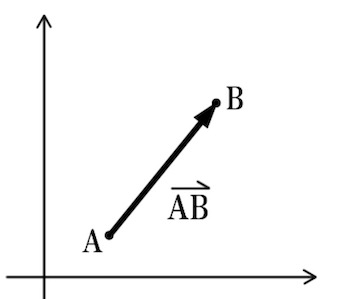
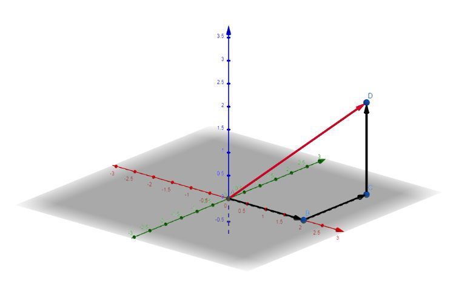
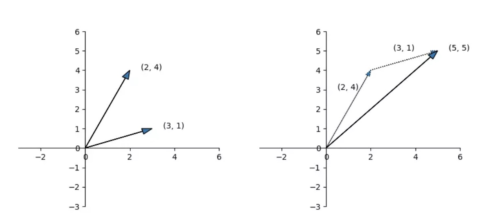
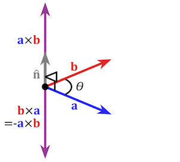
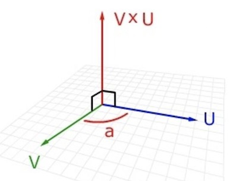
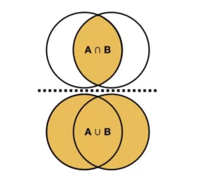
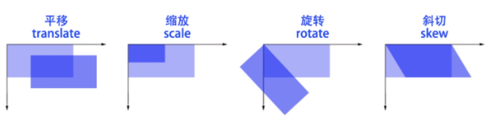
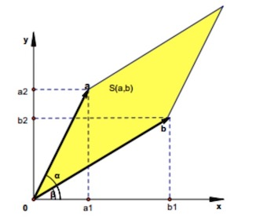

### 引言

在本书的开篇我们讲到针对一些机器学习初学者，本书将从代数、概率论、优化三个部分展开讲解数学相关的基础知识，希望能读者们在后续接触机器学习算法时，能补充上相应的数据基础，更好的理解算法。本章节将为读者们呈现代数部分的数据知识点，我们将首先讲解向量和矩阵的基本概念、紧接着我们讲解特征值和特征向量这个概念，再掌握了这些基本概念后，我们开始由浅入深的来阐述向量和矩阵在实际工作中的应用，分别从数据降维、推荐系统中的矩阵分解、数据聚类等机器学习常见问题上展开，最后我们将会讲解在大规模数据的机器学习计算问题上，讲解下分块矩阵来加速运算方面的作用。

### 向量

历史上很长一段时间，空间的向量结构并未被数学家们所认识，直到19世纪末20世纪初，人们才把空间的性质与向量运算联系起来，使向量成为具有一套优良运算通性的数学体系。18世纪末期，挪威测量学家威塞尔首次利用坐标平面上的点来表示复数 $a + bi$，并利用具有几何意义的复数运算来定义向量的运算。把坐标平面上的点用向量表示出来，并把向量的几何表示用于研究几何问题与三角问题．人们逐步接受了复数，也学会了利用复数来表示和研究平面中的向量，向量就这样平静地进入了数学。

#### 向量的概念

我们知道现实中的数据往往特征很多，，维数很高。比如我们描述一个人，有身高、体重、性别、年龄、肤色、国籍、兴趣爱好...，这些特征组合起来用一行数组表示，这个在机器学习中我们可以称它为特征向量，也就是下面我们要讲到的**向量**。我们不妨先从初等代数出发，我们在二维平面空间内表示坐标系中某个点为 $(x, y)$，在三维空间内表示某个点为 $(x,y,z)$，这些点我们可以看作是从原点到该点的有向线段，也称作向量。在高维空间内，假设空间维度为n维，在这个坐标系内表示一个向量为 $(x_1,x_2,\cdots,x_n)$。**像这样只有一行或者一列的数组**被称作为向量，因此我们把向量定义为一个一维数组。

通常，我们可以定义一个行向量 **a**  , 记作：

​					$a=\begin{pmatrix} x_1 & x_2 &  \cdots & x_n \end{pmatrix}$

定义一个列向量**a**  , 记作：

​							$a=\begin{pmatrix} x_1 \\ x_2 \\  \vdots\\ x_n \end{pmatrix}​$

通常，为了简洁表示，我们常把向量定义为列向量，我们可以用**转置**表示向量 **a**，如下面公式：

​						$a  = (a_1, a_2, ...,a_n)^T$

所谓转置就是把行向量和列向量相关转换，即行向量转置为列向量，列向量转置为行向量。

上面我们从数学上给出了向量的定义，下面我们来了解一下向量的相关概念和性质。

在数学中，向量（也称为欧几里得向量、几何向量、矢量），指具有大小和方向的量。在物理学和工程学中，几何向量更常被称为矢量。许多物理量都是矢量，比如一个物体的位移，球撞向墙而对其施加的力等等。只有大小没有方向的量称为标量，比如树木的年龄，人的身高。

向量的记法：印刷体记作黑体（粗体）的字母（如**a**、**b**、**u**、**v**）,书写时在字母顶上加一小箭头“→”。

如下图所示，我们在二维坐标系中，具有方向的线段叫做有向线段AB，以A为起点，B为终点的有向线段记作向量。

##### 向量的模

向量的大小，也就是向量的长度(或称模)。向量 **a** 的模记作|$$\vec a$$|。对于向量来说“大于”和“小于”的概念是没有意义的。向量的模是非负实数，向量的模是可以比较大小的。我们定义一个向量$a = (x_1,x_2,\cdots,x_n)$，这个向量的模定义为：

​					$$||\vec a|| = \sqrt{x_1^2 + x_2^2 + \cdots + x_n^2}$$ 

以三维坐标系一个向量$\vec a= (x , y,z) $为例，向量的模就是这个向量到原点的距离，就是这段线段的长度，如下图中向量D的大小就是红色线段在三维坐标系中的长度。

​			  		$|| \vec a||​$ = $\sqrt[2]{(x^2 + y^2 + z^2)}​$

#### 向量的性质

下面我们来介绍下向量的一些基本操作。

- 向量加法

  向量的加法，就是对两个向量对应位一一相加。定义两个向量 $(x_1,x_2,\cdots,x_n) , (y_1,y_2,\cdots,y_n)$，这两个向量相加为： $(x_1+y_1, x_2+y_2, \cdots, x_n + y_n)$。 以两个二维向量相加为例：

  ​			$$\begin{pmatrix} a_1 \\ a_2  \end{pmatrix} + \begin{pmatrix} b_1 \\ b_2  \end{pmatrix}  = \begin{pmatrix} a_1 + b_1 \\ a_2  + b_2 \end{pmatrix} $$

  

  同理，向量的减法就是两个向量对应位一一相减。

- 向量乘法

  向量的乘积，也叫做向量的内积，向量的点乘，向量的点积，数量积。对两个向量执行点乘运算，就是对这两个向量对应位一一相乘之后求和的操作，点乘的结果是一个标量。定义两个向量 $x = (x_1,x_2,\cdots,x_n) , y = (y_1,y_2,\cdots,y_n)​$，这两个向量乘积为：

  ​						$$ x \cdot y =  \sum_{i=1}^n x_iy_i​$$

  以二维向量相乘为例：

  ​					$$a \cdot b  =   a_1 b_1 + a_2 b_2 $$

- 向量外积

  数学中又称外积、叉积，物理中称矢积、叉乘，是一种在向量空间中向量的二元运算。与点积不同，它的运算结果是一个向量而不是一个标量。并且两个向量的叉积与这两个向量和垂直。其应用也十分广泛，通常应用于物理学光学和[计算机图形学中。

  定义向量$a$ 和 $b$ 的外积为$ a \times b $,  大小为$|a \times b| = |a||b|\  sin(a,b)$, 其方向垂直于$a \ b $。$sin(a, b)$ 表示这两个向量夹角的正弦值。

  以向量 $a = (x_1, y_1, z_1), b=(x_2, y_2, z_2)$为例，这两个向量的外积为：

  ​						$a \times b  =  (y_1z_2 -y_2z_1, x_2z_1 -x_1z_2, x_1y_2 - x_2y_1)$

  我们以下图直观的看看两个向量$a, \ b$ 外积的结果 $a \times b​$。

  

##### 单位向量

长度为一个单位（即模为1）的向量，叫做单位向量。与 **a **同向，且长度为单位1的向量，叫做 **a** 方向上的单位向量，记作  $\frac {\vec a} {||\vec a||} $， 由向量的乘积定义和转置，我们知道：

​					$$\frac {\vec a} {||\vec a||} = \frac {\vec a} {\sqrt{\vec a^T \vec a }}​$$

##### 法向量

法向量是空间解析几何的一个概念，垂直于平面的直线所表示的向量为该平面的法向量。通常，我们用 **w** 标识未向量 **a** 的法向量，$\vec w \cdot \vec a = 0$。例如在三维坐标系内，$x, y, z$三个坐标轴上的向量$(x, 0 , 0), (0, y, 0), (0,0,z)$ 的乘积为0。在上面向量外积中，外积向量$V \times U$ 就是向量$V$ 和 $U​$ 的法向量。

#### 向量的应用

在机器学习中我们是离不开向量这个概念，例如在特征工程上，我们通常使用一个特征向量代表一个训练样本；在自然语言处理领域向量也有着广泛的应用，例如我们在判断两段文本的相似度时，通常会把文本用向量形式表示(比如词袋模型Bag of words, 词向量word embedding等)，然后在向量空间上求解两段文本的余弦相似度; 在比较有限样本集之间的相似性与差异性，在处理离散型（类别型）变量的相似度时杰卡德系数非常有用。

##### 欧几里得距离

欧氏距离是最常用的距离计算公式，衡量的是多维空间中各个点之间的绝对距离，当数据很稠密并且连续时，这是一种很好的计算方式。因为计算是基于各维度特征的绝对数值，所以欧氏度量需要保证各维度指标在相同的刻度级别，比如对身高（cm）和体重（kg）两个单位不同的指标使用欧式距离可能使结果失效。比如两个向量$X = (x_1,x_2,\cdots,x_n), \ Y = (y_1,y_2,\cdots,y_n)$，计算两个向量欧氏距离公式为：

​					$$dist(X, Y) = \sqrt{\sum_{i=1}^n (x_i -y_1)^2}​$$

##### 余弦相似度

余弦相似度用向量空间中两个向量夹角的余弦值作为衡量两个个体间差异的大小。余弦值越接近1，就表明夹角越接近0度，也就是两个向量越相似，这就叫"余弦相似性"。如下图所示，两个向量的余弦相似度可以理解为两个向量之间夹角，它们直接夹角越小可以认为这两个向量越近。

我们定义两个向量的余弦相似度为两个向量乘积除上两个向量的模：

​				$$cos(\theta) = \frac{a \cdot b}{\left \| a \right \| \times \left \| b\right \|} $$

以二维向量为例：

​					$$cos(\theta) = \frac{a \cdot b}{\left \| a \right \| \times \left \| b\right \|}  = \frac{x_1x_2 + y_1y_2}{\sqrt{x_1^2 + y_1^2} \times \sqrt{x_2^2 + y_2^2}}$$

##### Jaccard

杰卡德系数(Jaccard Index)，也称Jaccard相似系数(Jaccard similarity coefficient)，用于比较有限样本集之间的相似性与差异性，在处理**离散型（类别型）**变量的相似度时非常有用。如集合间的相似性、字符串相似性、目标检测的相似性、文档查重等。Jaccard系数的计算方式为:交集个数和并集个数的比值。

​						$$J(A,B) = \frac{|A \bigcap B|}{|A \cup  B|}​$$

给定两个n维二元向量$A, B$， $A, B$的每一维都只能是0或者1，利用Jaccard相似系数来计算二者的相似性：

+ $M_{00}$代表向量A与向量B都是0的维度个数；
+ $M_{01}$代表向量A是0而向量B是1的维度个数；
+ $M_{10}$ 代表向量A是1而向量B是0的维度个数；
+ $M_{11}​$代表向量A和向量B都是1的维度个数。

则Jaccard相似系数为:

​					$$J(A, B) = \frac{M_{11}}{M_{01} + M_{10} + M_{11}}$$

### 矩阵

在数学中，矩阵（Matrix）是一个按照长方阵列排列的复数或实数集合，最早来自于方程组的系数及常数所构成的方阵。作为解决线性方程的工具，矩阵也有不短的历史。在东汉前期的《九章算术》中，用分离系数法表示线性方程组，得到了其增广矩阵。在消元过程中，使用的把某行乘以某一非零实数、从某行中减去另一行等运算技巧，相当于矩阵的初等变换，矩阵的概念在19世纪逐渐形成。下面我们开始讲解矩阵的概念。

#### 矩阵的概念

在数学中，矩阵(Matrix)是一个按照长方阵列排列的复数或实数集合，我们可以把矩阵当做是向量的扩展形式。

通常我们定义一个二维矩阵 **A** ,有m行n列,  记作 $A_{m\times n}$。

​				$$ A_{m \times n} = \begin{pmatrix} 
a_{11}&a_{12}&...&a_{1n}\\
a_{21}&a_{22}&...&a_{2n}\\{\vdots}&{\vdots}&{\ddots}&{\vdots}\\
{a_{m1}}&{a_{m2}}&{\cdots}&{a_{mn}}\\\end{pmatrix}$$

#### 矩阵的四则运算

下面我们来介绍下矩阵的一些性质和基本操作。

##### 交换律和结合律

矩阵的交换律： $A + B = B + A$

矩阵的结合律：$( A + B) + C) = A + (B + C)$ 

##### 矩阵的加减法

设矩阵$ A_{m \times n} = \begin{pmatrix} 
a_{11}&a_{12}&...&a_{1n}\\
a_{21}&a_{22}&...&a_{2n}\\{\vdots}&{\vdots}&{\ddots}&{\vdots}\\
{a_{m1}}&{a_{m2}}&{\cdots}&{a_{mn}}\\\end{pmatrix} ​$   ,  $ B_{m \times n} = \begin{pmatrix} 
b_{11}&b_{12}&...&b_{1n}\\
b_{21}&b_{22}&...&b_{2n}\\{\vdots}&{\vdots}&{\ddots}&{\vdots}\\
{b_{m1}}&{b_{m2}}&{\cdots}&{b_{mn}}\\\end{pmatrix}​$ 

则有

$ A_{m \times n} \plusmn B_{m \times n} = \begin{pmatrix} 
a_{11} \plusmn b_{11}&a_{12}  \plusmn b_{12}&...&a_{1n}  \plusmn b_{1n}\\
a_{21}  \plusmn b_{21}&a_{22}  \plusmn b_{22}&...&a_{2n}  \plusmn b_{2n}\\{\vdots}&{\vdots}&{\ddots}&{\vdots}\\
{a_{m1}  \plusmn {b_{m1}}}&{a_{m2}  \plusmn {b_{m2}}}&{\cdots}&{a_{mn}  \plusmn {b_{mn}}}\\\end{pmatrix} $

对比向量的加减法可以看出，矩阵的加减法和向量的加减法一样，都是一一对应位上相加减。

##### 矩阵的乘法

设矩阵 $ A_{m \times s}​$， $B_{s \times n}​$ , 则A与B的乘积 $C_{m \times n} =  A_{m \times s} \ B_{s \times n}​$ 是这样一个矩阵：

​	$ A_{m \times s} \times B_{s \times n} = \begin{pmatrix} 
a_{11}b_{11} + a_{12}b_{21} + \cdots + a_{1s}b_{s1}&a_{11}b_{12} + a_{12}b_{22} + \cdots + a_{1s}b_{s2}&\cdots&a_{11}b_{1n} + a_{12}b_{2n} + \cdots + a_{1s}b_{sn}\\
a_{21}b_{11} + a_{22}b_{21} + \cdots + a_{2s}b_{s1}&a_{21}b_{12} + a_{22}b_{22} + \cdots + a_{2s}b_{s2}&\cdots&a_{21}b_{1n} + a_{22}b_{2n} + \cdots + a_{2s}b_{sn}\\{\vdots}&{\vdots}&{\ddots}&{\vdots}\\
a_{m1}b_{11} + a_{m2}b_{21} + \cdots + a_{ms}b_{s1}&a_{m1}b_{12} + a_{m2}b_{22} + \cdots + a_{ms}b_{s2}&\cdots&a_{m1}b_{1n} + a_{m2}b_{2n} + \cdots + a_{ms}b_{sn}\\\end{pmatrix} ​$	

1. 行数与左矩阵$ A_{m \times s}​$相同，列数与右矩阵$B_{s \times n}​$相同， 即  $C_{m \times n}​$

2. $C​$ 的第$i​$ 列第$j​$ 列的元素 $c_{ij}​$ 由$A​$ 的第 $i​$ 行元素和 $B​$ 的第 $j​$ 列元素相乘，再取乘积之和。

   $$c_{ij} = a_{i1}b_{1j} + a_{i2}b_{2j} + \cdots + a_{is}b_{sj} = \sum_{k=1}^{s} a_{ik}b_{kj}​$$

#### 常见矩阵及其性质

##### 矩阵的转置

转置矩阵定义：将矩阵的行列互换得到的新矩阵称为转置矩阵。

设 $A_{mn}$ 为 $m × n$ 阶矩阵, 第i行j列的元素为 $a(i,j)$, 定义A的转置为这样一个n×m阶矩阵$B_{nm}$。 满足$b(i,j)$ = $a(j, i)$,  即$B$的第 $i$ 行 $j$ 列元素是$A$的第 $j$ 行 $i$ 列元素, 记作 $A^T = B$。

矩阵的转置满足下面几点性质。

- $$(A \plusmn B )^T = A^T \plusmn B^T​$$ 
- $$(A \times B )^T = B^T \times A^T​$$   (在公式化简中常用到)
- $$(A^T)^T = A$$

##### 单位矩阵

它是个方阵($A_{mn},m=n$)，从左上角到右下角的对角线(称为主对角线)上的元素均为1。除此以外全都为0。我们定义单位矩阵

​				 $E = \left[  \begin{matrix} 1&0&\cdots&0 \\ 0&1&\cdots&0 \\ \vdots & \vdots &\ddots &\vdots \\ 0&0&\cdots&1\end{matrix} \right]$ 

##### 矩阵的逆

**逆矩阵定义**：一个 $n$ 阶方阵 $A$ 称为可逆的，或非奇异的，如果存在一个 $n$ 阶方阵 $B$，使得

​						$$AB = BA = E​$$

则称 $B$ 是 $A$ 的一个逆矩阵。$A$ 的逆矩阵记作 $A^{-1}$。

矩阵的逆满足以下几点性质。

- $$(AB)^{-1} = B^{-1}A^{-1}$$
- $$(kA^{-1}) = A^{-1}/k​$$
- $$(A^{-1})^T = (A^T)^{-1}$$
- $$(A^n)^{-1} = (A^{-1})^n​$$
- $$A^{-1}A = AA^{-1} = E $$   ( $E​$ 为单位矩阵 )
- $(A^{-1})^{-1} = A$

##### 对角矩阵

对角矩阵(diagonal matrix)是一个主对角线之外的元素皆为0的矩阵，对角线上元素相等的对角矩阵称为数量矩阵；对角线上元素全为1的对角矩阵称为单位矩阵。我们定义对角矩阵

​				 $\Sigma = \left[  \begin{matrix} \lambda_1&0&\cdots&0 \\ 0&\lambda_2 &\cdots&0 \\ \vdots & \vdots &\ddots &\vdots \\ 0&0&\cdots&\lambda_n\end{matrix} \right]​$

##### 对称矩阵

对称矩阵是指元素以主对角线为对称轴对应相等的矩阵。对称矩阵是一个方形矩阵，其转置矩阵和自身相等。

设一个$N*N$的对称矩阵$A$，$A$ 中任意元素$a_{ij}$,  满足$\ a_{ij} = a_{ji}$， 如下面这个矩阵：

​									$$\left[  \begin{matrix} 1&3&5&9 \\ 3&-6 &2&4 \\ 5 & 2 &0 &-2 \\ 9&4&-2&8\end{matrix} \right]​$$

##### 矩阵的迹

在线性代数中，一个 $n×n​$ 矩阵***A***的主对角线（从左上方至右下方的对角线）上各个元素的总和被称为矩阵***A***的**迹**（或**迹数**），一般记作tr(A)。

​							$$tr(A) = \sum_i^n a_{ii}$$

矩阵迹的性质：

+ $$tr(A) = tr(A^T)​$$
+ $$tr(k*A) = k*tr(A)​$$
+ $$tr(A + B) = tr(A)  + tr(B)$$
+ $$tr(AB) = tr(BA)$$

下面我们将介绍下矩阵常用到的几个基本应用和概念：初等变换，等价矩阵，行列式。

#### 矩阵的应用

矩阵是高等代数学中的常见工具，也常见于统计分析等应用数学学科中。 在物理学中，矩阵于电路学、力学、光学和量子物理中都有应用；计算机科学中，三维动画制作也需要用到矩阵。 矩阵的运算是数值分析领域的重要问题。将矩阵分解为简单矩阵的组合可以在理论和实际应用上简化矩阵的运算。

矩阵变换在图形学上经常用到。基本的常用矩阵变换操作包括平移、缩放、旋转、斜切。

##### 初等变换

矩阵变换是线性代数中矩阵的一种运算形式。在线性代数中，矩阵的初等变换是指以下三种变换类型 ：

+ 交换矩阵的两行
+ 以一个非零数k乘矩阵的某一行所有元素
+ 把矩阵的某一行所有元素乘以一个数k后加到另一行对应的元素

类似地，把以上的“行”改为“列”便得到矩阵初等变换的定义,矩阵的初等行变换与初等列变换合称为矩阵的初等变换。

矩阵的初等变换有着非常重要的用途。例如在后面我们降到分块矩阵中，分块矩阵有相应的加法、乘法、数乘、转置等运算的定义，也可进行初等变换，使得阶数较高的矩阵化为阶数较低的分块矩阵，在运算中,我们有时把这些子块当作数一样来处理,从而简化了表示，便于计算。它在线性代数中的更重要的应用主要体现于以下几点：求矩阵的秩，求向量组的极大无关组、秩，求解线性方程组，求多项式的最大公因式等。

##### 等价矩阵

在线性代数和矩阵论中，有两个 $m×n$ 阶矩阵A和B，如果这两个矩阵满足 $B=Q^{-1}AP$ （$P$是 $n×n$ 阶可逆矩阵，$Q$ 是 $m×m$ 阶可逆矩阵），那么这两个矩阵之间是等价关系。也就是说，存在可逆矩阵，A经过有限次的初等变换得到B。

##### 行列式

行列式在数学中，是一个函数，其定义域为$det$ 的矩阵 $A$，取值为一个标量，写作 $det(A)$ 或 $|A|$.无论是在线性代数、多项式理论，还是在微积分学中，行列式作为基本的数学工具，都有着重要的应用。  

把一个 $n$ 阶行列式中的元素 $a_{ij}$ 所在的第 $i$ 行和第 $j$ 列划去后，留下来的 $n-1$ 阶行列式叫做元素 $a_{ij}$ 的余子式,记作 $M_{ij}$。记 $A_{ij}=(-1)^{i+j}M_{ij}$，叫做元素$a_{ij}$的**代数余子式**。例如：

​				$$D = \left | \begin{matrix} a_{11} & a_{12} & a_{13} & a_{14}  \\ a_{21} & a_{22} & a_{23} & a_{24} \\a_{31} & a_{32} & a_{33} & a_{34} \\ a_{41} & a_{42} & a_{43} & a_{44} \end{matrix}\right|,  \ \ \ M =  \left | \begin{matrix} a_{11} & a_{12} & a_{14} \\a_{31} & a_{32}  & a_{34} \\ a_{41} & a_{42}  & a_{44} \end{matrix}\right|$$

​				$$A_{23} = (-1)^{2+3}M_{23} = -M_{23}$$

一个 $n \times n$ 矩阵的行列式等于任意行(或列)的元素于之对应的代数余子式乘积之和，即：

​				$$det(A) = a_{i1}A_{i1} + \cdots + a_{in}A_{in} = \sum_{j=1}^n a_{ij} (-1)^{i+j}M_{ij}$$

行列式也满足矩阵的初等变换性质。行列式的引进是为了方便计数，当线性问题遇到大量的数据时，可以用矩阵和行列式来方便的进行计算。比如有的线性方程组求解，就可以用行列式来计算。

##### 行列式的几何意义

一个解释是行列式就是行列式中的行或列向量所构成的超平行多面体的有向面积或有向体积；另一个解释是矩阵A的行列式$detA$ 就是线性变换A下的图形面积或体积的伸缩因子。对于一个二阶行列式，可以表示如下：

​					$$\left | \begin{matrix} a & b \\ c & d \end{matrix}\right| = ad - bc$$

二阶行列式的几何意义就是由行列式的向量所张成的平行四边形的面积。

本章节先介绍这些向量和矩阵的基本概念和基本操作，后续章节我们会继续介绍到有关向量和矩阵的一些复杂操作和应用。

