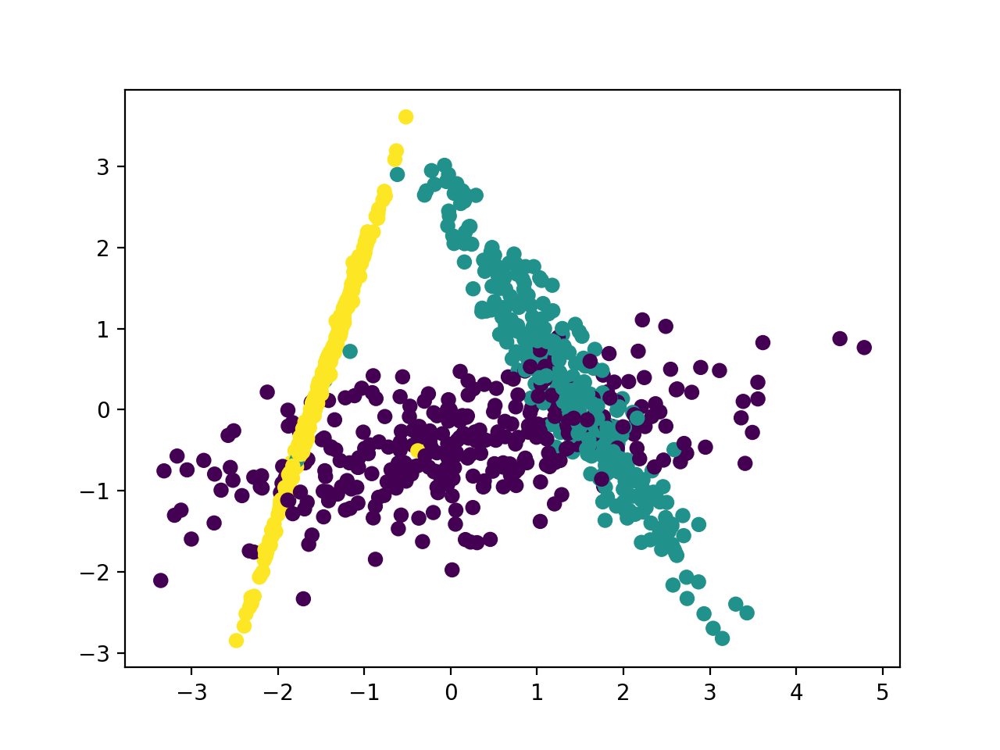

### 引言

在自然语言处理（NLP）相关任务中，需要将自然语言交给机器学习中的算法来处理，通常需要首先将语言数学化。比如在中文处理上，很多时候是以词来作为一个基础单元。我们都知道汉字的博大精深，在线新华字典现已经收录20959个汉字，而由汉字组合成的词大概有52w个。比如我们在文本分类上，通常会将我们的语料库中的词进行编码，一种最简单的方式就是one-hot representation，也叫 one-hot Encoder。

假设在语料库中存在2w个词，我们会使用2w个0或者1组成的向量来表示一个词。通常将这种表示形式称作**词袋模型**。在一份中文的数据集(也可以称为语料)上，我们要用向量表示每个城市名称，比如杭州、上海、宁波、北京这四个城市名称，每个词都会对应一个one-hot Encoder 的向量表示，它们中只有一个值为1，其余都为0，如下面我们列举的四个向量。

​				$$杭州 \ \ \ [0,0,0,0,0,0,0,1,0,……,0,0,0,0,0,0,0]$$

​				$$上海 \ \ \ [0,0,0,0,1,0,0,0,0,……,0,0,0,0,0,0,0]$$

​				$$宁波 \ \ \ [0,0,0,1,0,0,0,0,0,……,0,0,0,0,0,0,0]$$

​				$$北京 \ \ \ [0,0,0,0,0,0,0,0,0,……,1,0,0,0,0,0,0]$$

这种词表示有两个缺点：

+ 容易受维数灾难的困扰，数据稀疏，计算量大

+ 不能很好地刻画词与词之间的相似性：任意两个词之间都是孤立的。比如说两个在语义上很接近的词，光从这两个向量中看不出两个词是否有关系，哪怕是番茄和西红柿这样的同义词也不能幸免于难。

为了克服传统自然语言处理中词袋模型这种**维度灾难**，更好的刻画语义上相近的词直接的距离，我们设想能否用一个稠密的、低维度的编码空间表示每个词，同时语义相似的词在这个向量空间内的距离也比较靠近。Distributed Representation 就是这样一种表示。它最早是 Hinton 于 1986 年提出的，其基本想法是直接用一个普通的向量表示一个词，这种向量一般长成这个样子：[0.792, −0.177, −0.107, 0.109, −0.542, ...]，向量中每个元素时一个连续的浮点数，而不是二进制的0或者1，这样我们就可以用维度规模小的向量空间来表示我们语料中的每一个词 。通常这样一个词向量，维度以 50 维、100 维和200维比较常见。由于是用向量表示，而且用较好的训练算法得到的词向量的向量一般是有空间上的意义的，也就是说，将所有这些向量放在一起形成一个词向量空间，而每一向量则为该空间中的一个点，在这个空间上的词向量之间的距离度量也可以表示对应的两个词之间的“距离”。所谓两个词之间的“距离”，就是这两个词之间的语法，语义之间的相似性。

我们再后面部分再来讲解这种词向量的原理，上面说的这种思想就是**数据降维**。接下来我们将会接触到数据降维的概念、意义以及常用的数据降维方法。

### 数据降维的概念

​	数据降维的目的:数据降维，直观地好处是维度降低了，便于计算和可视化，其更深层次的意义在于有效信息的提取综合及无用信息的摈弃。

​	机器学习领域中所谓的降维就是指采用某种映射方法，将原高维空间中的数据点映射到低维度的空间中。降维的本质是学习一个映射函数 $f : x \rightarrow y$ ，其中 $x$ 是原始数据点的表达，目前最多使用向量表达形式。 $y$ 是数据点映射后的低维向量表达，通常 $y$ 的维度小于 $x$ 的维度（当然提高维度也是可以的）。$f$ 可能是**显式的**或**隐式的**、**线性的**或**非线性的**。

​	以图像处理为例，通过单幅图像数据的高维化,将单幅图像转化为高维空间中的数据集合,对其进行非线性降维,寻求其高维数据流形本征结构的一维表示向量,将其作为图像数据的特征表达向量。从而将高维图像识别问题转化为特征表达向量的识别问题,大大降低了计算的复杂程度,减少了冗余信息所造成的识别误差,提高了识别的精度。通过指纹图像的实例说明,将非线性降维方法(如Laplacian Eigenmap方法)应用于图像数据识别问题,在实际中是可行的,在计算上是简单的,可大大改善常用方法(如K-近邻方法)的效能,获得更好的识别效果。

###数据降维的意义

在实际的机器学习项目中，特征选择/降维是必须进行的，因为在数据中存在以下几个 方面的问题：

- 数据的多重共线性：特征属性之间存在着相互关联关系。多重共线性会导致解的空间不稳定， 从而导致模型的泛化能力弱；
- 高纬空间样本具有稀疏性，导致模型比较难找到数据特征；
- 仅仅考虑单个变量对于目标属性的影响可能忽略变量之间的潜在关系。

这里我们将要讨论所谓的“维数灾难”，同时结合过拟合现象来解释它在分类器学习中的重要性。举一个分类应用的简单例子，假设我们有一系列的图片，每张图片的内容可能是猫也可能是狗；我们需要构造一个分类器能够对猫、狗自动的分类。首先，要寻找到一些能够描述猫和狗的特征，这样我们的分类算法就可以利用这些特征去识别物体。猫和狗的皮毛颜色可能是一个很好的特征，考虑到红绿蓝构成图像的三基色，因此用图片三基色各自的平均值称得上方便直观。这样就有了一个简单的Fisher分类器：

​		$$if  \  0.5 \times red + 0.3 \times green + 0.2 \times blue  > 0.6 : return cat; $$

​			$$else \ return \ dog;$$

但是，使用颜色特征可能无法得到一个足够准确的分类器，如果是这样的话，我们不妨加入一些诸如图像纹理(图像灰度值在其X、Y方向的导数dx、dy)，我们就有5个特征(Red、Blue、Green、dx、dy)来设计我们的分类器了。

接下来，也许分类器准确率依然无法达到要求，我们可以加入更多的特征，比如颜色、纹理的统计信息等等，如此下去，我们也许可能会得到上百个特征。那是不是我们的分类器性能会随着特征数量的增加而逐步提高呢？答案也许有些让人沮丧，事实上，当特征数量达到一定规模后，分类器的性能是在下降的。随着维度(特征数量)的增加，分类器的性能可以用下图来描述：


*Figure 1 随着维度的增加，分类器性能逐步上升，到达某点之后，其性能便逐渐下降.*

###数据降维方法

通常，降维方法分为线性和非线性降维，非线性降维又分为基于核函数和基于特征值的方法。

- 线性映射方法： PCA、LDA、SVD等
- 非线性映射方法：
  - 基于核的非线性降维 KPCA、KFDA
  - 流形学习 LE(拉普拉斯特征映射)、 LLE(局部线性嵌入)
- 其他方法:神经网络和聚类
  - 神经网络 - 多层自编码

下面我们将挑选几种数据降维的方法做一些讲解。

####线性降维

我们知道在机器学习任务中，样本在高维情形下会出现数据样本稀疏，计算量大，可视化困难，容易过拟合等问题。一般来说，想要获得低维子空间，最简单的是对原始高维空间进行线性变换。给定 $d$ 维空间中的样本 $X=(x_1,x_2,\cdots,x_n) \in R_{d\times n}$，变换后得到$d^{'} < d$ 维空间的样本：

​							$$X^{'} = W^TX​$$

其中 $W \in R^{d\times d^{'}}$ 是变换矩阵，$X^{'} \in R^{d^{'} \times n} $是样本在新坐标空间中的表达。$x_i^{'} = W^Tx_i$ 也可以看成是第 $i$ 个 $d$维的样本$x_i$在新坐标系$\{w_1,w_2,\cdots,w_d^{'}\}$中的坐标向量。显然，新空间中的特征是原空间中特征的线性组合。 基于线性变换来降维的方法称为**线性降维**方法，不同的线性降维方法基本上就是对低维子空间的性质有不同要求。

####LDA

**线性判别分析**(Linear Discriminant Analysis), **LDA**是一种有监督的(supervised)线性降维算法，也就是说它的数据集的每个样本是有类别输出的。与PCA保持数据信息不同，不是希望保持数据最多的信息，而是希望数据在降维后能够很容易地被区分开来。核心思想：往线性判别超平面的法向量上投影，是的区分度最大(高内聚，低耦合)。

举图说明：


如上图所示有两种投影方式，左边的投影后红色数据和蓝色数据还有重叠部分，右边的投影后红色数据和蓝色数据则刚好被分开，显然是右边的图更符合我们表述的思想吧。

LDA的投影即类似右边的投影方式，投影后使得不同类别的数据尽可能分开，而相同类别的数据则尽可能紧凑地分布。其基本的想法就是，**使类内方差最小的同时，使类外方差最大。** 下面我们来了解类内散度和类间散度两个概念。

##### 类内散度：

设由$M​$个类别, $C_1, C_2, \cdots, C_m​$， $C_i​$ 类样本集 $\{X_1^i, X_2^i, \cdots, X_N^i\},​$ $C_i​$类的散度矩阵定位为：

​				$$S_w^i = \frac{1}{N_i}\sum_{k=1}^{N_i}(X_k^i - m^i)(X_k^i - m^i)^T​$$

其中，$S_w^i$ 是类别$C_i$的协方差矩阵，$m^i$ 是类别$C_i$对应样本集的均值。

总的类内散度矩阵为：

​				$$S_w = \sum_{i=1}^M P(C_i)S_w^i = \sum_{i=1}^M P(C_i)\frac{1}{N}\sum_{k=1}^{N_i}(X_k^i - m^i)(X_k^i - m^i)^T$$

$P(C_i)$是类别$C_i$在样本集合中的概率。

##### 类间散度：

第$i$个类别和第$j$个类别之间的散度矩阵定义为：

​				$$S_b^{ij} = (m^i - m^j)(m^i - m^j)^T​$$

总的类间散度矩阵定位为：

​				$$S_b = \frac{1}{2}\sum_{i=1}^M P(C_i)\sum_{j=1}^M P(C_j) S_b^{ij} = \frac{1}{2}\sum_{i=1}^M P(C_i)\sum_{j=1}^M P(C_j) (m^i - m^j)(m^i - m^j)^T$$

**LDA**算法实现步骤：

输入：数据集$D = \{(x_1, y_1), (x_2, y2),\cdots,(x_m,y_m) \}, ​$ 其中任意样本$x_i​$ 为$n​$ 维向量， $y_i \in \{ C_1, C_2,\cdots, C_k \}​$

目标：将样本维度将到d, 得到新的数据集$D^{'}$。  

- 计算类内散度矩阵$Sw​$
- 计算类间散度矩阵$S_b$
- 计算矩阵$S_w^{-1}S_b​$
- 计算$S_w^{-1}S_b​$的最大的d个特征值和对应的d个特征向量$(w_1,w_2,\cdots,w_d)​$,得到投影矩阵$W​$
- 对样本集合中的每一个样本$x_i​$ ,转化为新的样本$z_i = W^Tx_i​$
- 得到输出样本集合$D^{'}= \{(z_1, y_1), (z_2, y2),\cdots,(z_m,y_m) \} $

####PCA

上一章节我们讲解特征向量和特征值得概念时讲解到了PCA算法。主成分分析(PCA) 是最常用的线性降维方法，它的目标是通过某种线性投影，将高维的数据映射到低维的空间中表示，并期望在所投影的维度上数据的方差最大，以此使用较少的数据维度，同时保留住较多的原数据点的特性。 是将原空间变换到特征向量空间内，数学表示为 $Ax = \lambda x$ 。这种降维方法认为数据样本经过特征向量变换后的各分量，它们所包括的信息量不同，呈逐渐减少趋势。事实上，第一主分量集中了最大的信息量，常常占80％以上。第二、三主分量的信息量依次很快递减，到了第N分量，信息几乎为零。选择较少的主成分来表示数据不但可以用作特征降维，还可以用来消除数据中的噪声。

一般做法是：

+ 将原始数据按列组成 $n$ 行 $m$ 列矩阵 $X$ 的每一行（代表一个属性字段）进行零均值化，即减去这一行的均值
+ 接着求出协方差矩阵并求出协方差矩阵的特征值及对应的特征向量 $r$ 
+ 然后将特征向量按对应特征值大小从上到下按行排列成矩阵，取前 $k$ 行组成矩阵 $P$ 
+ 最后将样本点投影到选取的特征向量上，就将原始样例的 $m$ 维特征变成了 $k$ 维。

以下图两簇数据划分为例：


对于上面那张图，与LDA的使类内方差最小的同时，使类外方差最大思想不同，PCA算法通过衡量在投影方向上的**数据方差**的大小来衡量该方向的重要性，会选择$\phi_2$ 方向上投影，这使得原本很容易区分的两簇点被揉杂在一起变得无法区分。这也是PCA存在的最大一个问题，这导致使用PCA在很多情况下的分类效果并不好。

下面我们从实验角度来对比下PCA算法和LDA算法。

```python
import numpy as np
import matplotlib.pyplot as plt
from mpl_toolkits.mplot3d import Axes3D
from sklearn.datasets.samples_generator import make_classification
X, y = make_classification(n_samples=1000, n_features=3, n_redundant=0, n_classes=3, n_informative=2,n_clusters_per_class=1,class_sep =0.5, random_state =10)
fig = plt.figure()
plt.scatter(X[:, 0], X[:, 1], X[:, 2],marker='o',c=y)
```

我们看看数据在三维空间的分布情况


首先我们看看使用PCA降维到二维的情况，注意PCA无法使用类别信息来降维，代码如下：

```python
from sklearn.decomposition import PCA
pca = PCA(n_components=2)
pca.fit(X)
print pca.explained_variance_ratio_
print pca.explained_variance_
X_new = pca.transform(X)
plt.scatter(X_new[:, 0], X_new[:, 1],marker='o',c=y)
plt.show()
```


由于PCA没有利用类别信息，我们可以看到降维后，样本特征和类别的信息关联几乎完全丢失。

现在我们再看看使用LDA的效果，代码如下:

```python
from sklearn.discriminant_analysis import LinearDiscriminantAnalysis
lda = LinearDiscriminantAnalysis(n_components=2)
lda.fit(X,y)
X_new = lda.transform(X)
plt.scatter(X_new[:, 0], X_new[:, 1],marker='o',c=y)
plt.show()
```



可以看出降维后样本特征和类别信息之间的关系得以保留。

本节我们主要介绍了数据降维的概念和意义，然后对降维方法分类概括。降维这块内容较多，本小节我们先介绍了以LDA和PCA为代表的两种线性降维方法，并给出了算法的实验图。期待下一节给大家带来非线性降维方法的知识讲解。


