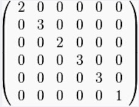

###引言

前篇我们介绍了数据降维定义和意义以及两种常见的线性降维的方法，下面我们将要介绍下非线性降维的方法。

####非线性降维

有时候数据之间的非线性关系是很重要的，这时候我们用线性降维会得到很差的结果。对于图像、文本、金融等高维数据，特征之间存在着极为复杂的非线性关系，简单的线性分析无法挖掘出特征之间的蕴含的关联。下面将要讲到的拉普拉斯降维(LE)和局部线性嵌入降维(LLE)都是**流形学习**的一种。流形学习是一大类基于流形的框架。数学意义上的流形比较抽象，不过我们可以认为LLE中的流形是一个不闭合的曲面。这个流形曲面有数据分布比较均匀，且比较稠密的特征，有点像流水的味道，但它在**局部具有欧式空间的性质**。基于流行的降维算法就是将流形从高维到低维的降维过程，在降维的过程中我们希望流形在高维的一些特征可以得到保留。

####LE

拉普拉斯特征映射（Laplacian Eigenmaps）是一种不太常见的降维算法，是从局部的角度去构建数据之间的关系。具体来讲，拉普拉斯特征映射是一种基于**图的降维算法**，它希望相互间有关系的点（**在图中相连的点**）在降维后的空间中尽可能的靠近，从而在降维后仍能保持原有的数据结构。

先了解一下图结构中邻接矩阵概念。邻接矩阵(Adjacency Matrix)是表示顶点之间相邻关系的矩阵。逻辑结构分为两部分：$V$和$E$集合。因此，用一个一维数组存放图中所有顶点数据；用一个二维数组存放顶点间关系（边或弧）的数据，这个二维数组称为邻接矩阵。

下面我们先给出和图有关的几个例子。

举个例子。给定一个简单的图，如下：


把此“图”转换为**邻接矩阵**的形式，记为


把$W$的每一列元素加起来得到$N$个数，然后把它们放在对角线上（其它地方都是零），组成一个$N \times N$的对角矩阵，记为**度矩阵** $D​$，如下图所示：



拉普拉斯特征映射通过构建邻接矩阵为$W$的图来重构数据流形的局部结构特征。设数据实例的数目为$n$，目标子空间即最终的降维目标的维度为$m$。定义$n \times m$大小的矩阵$Y$，其中每一个行向量$y_i^T$是数据实例$i$在目标$m$维子空间中的向量表示（即降维后的数据实例$i$）。我们的目的是让相似的数据样例$i$和$j$在降维后的目标子空间里仍旧尽量接近，故拉普拉斯特征映射优化的目标函数如下：

​				$$min \sum_{i,j}||y_i - y_j||^2W_{ij}​$$

下面开始推导：

​				$$\sum_{i=1}^n\sum_{j=1}^n||y_i-y_j||^2W_{ij}​$$

​			$$=\sum_{i=1}^n\sum_{j=1}^n (y_i^Ty_i -2y_i^Ty_j + y_j^Ty_j) W_{ij}$$

​			$$=\sum_{i=1}^n(\sum_{j=1}^n W_{ij}y_i^Ty_i)   +\sum_{j=1}^n (\sum_{i=1}^n  W_{ij}y_j^Ty_j) - 2\sum_{i=1}^n \sum_{j=1}^n  y_i^Ty_j W_{ij}$$

​			$$=2\sum_{i=1}^nD_{ii}y_i^Ty_i -2\sum_{i=1}^n \sum_{j=1}^n  y_i^Ty_j W_{ij}$$

上面 $W$是图的邻接矩阵，**对角矩阵**$D$是图的**度矩阵**$(D_{ij} = \sum_{j=1}^nW_{ij})$。

在前面的章节我们讲到对角矩阵一个主对角线之外的元素皆为0的矩阵。由于对角矩阵的特殊性，上面的式子中左边可以等价为$2tr(Y^TDY)​$，其中$tr​$ 表示矩阵的**迹**，即主对角线上各个元素的总和。所以我们可以推导如下式：

​			$$=2\sum_{i=1}^n(\sqrt{D_{ii}}y_i)^T(\sqrt{D_{ii}}y_i) - 2 \sum_{i=1}^n y_i^T (\sum_{j=1}^ny_jW_{ij})$$

​			$$=2tr(Y^TDY) -2\sum_{i=1}^ny_i^T(YW)_i​$$

​			$$=2tr(Y^TDY) -2tr(Y^TWY)$$

​			$$=2tr[Y^T(D-W)Y]$$

​			$$=2tr(Y^TLY)​$$

其中$tr$是矩阵的迹，$ L = D -W$成为图的**拉普拉斯矩阵**，关于拉普拉斯矩阵我们在后面谱聚类章节中还会继续讲解到。

变换后的拉普拉斯特征映射优化的目标函数如下：

​				$$min\ \ \  tr(Y^TLY), \ \ \ s.t. \ \ \ Y^TDY = I$$

下面用拉格朗日乘子法对目标函数求解：

​				$$f(Y) = tr(Y^TLY) + tr[\Lambda (Y^TDY -I)]$$

​				$$\frac{\partial f(Y)}{\partial Y} = LY + L^TY + D^TY\Lambda^T + DY\Lambda$$

​					$$= 2LY + 2DY\Lambda = 0$$

由此有，$LY = -DY\Lambda$。 其中用到了矩阵的迹的求导， $\Lambda$为一个对角矩阵，另外$L、D$均为实对称矩阵，其转置与自身相等。对于单独的 $y$ 向量，上式可写为：$Ly = \lambda D y$, 这是一个广义特征值问题。为了目标函数最小化，通过求得$m$个最小非零特征值所对应的特征向量，即可达到降维的目的。

####LLE

LLE(Locally linear embedding 也是一种非线性降维算法，它能够使降维后的数据较好地保持原有流形结构,可以说是流形学习方法最经典的工作之一。LLE算法首先假设数据在较小的**局部是线性的**，每一个数据点都可以由其近邻点的线性加权组合构造得到，也就是说，某一个数据可以由它邻域中的几个样本来线性表示。不过我们可以认为LLE中的流形是一个不闭合的曲面。这个流形曲面有数据分布比较均匀，且比较稠密的特征，有点像流水的味道。基于流行的降维算法就是将流形从高维到低维的降维过程，在降维的过程中我们希望流形在高维的一些特征可以得到保留。

一个形象的流形降维过程如下图。我们有一块卷起来的布，我们希望将其展开到一个二维平面，我们希望展开后的布能够在局部保持布结构的特征，其实也就是将其展开的过程，就想两个人将其拉开一样。


用一句话概括：**用一个样本点的邻居的线性组合近似重构这个样本，将样本投影到低维空间中后依然保持这种线性组合关系**。

LLE 算法假设在局部领域内数据点是线性的，所以邻域内任意一点，都可用局部近邻点来线性表示。

​						$$x_i = \sum_{j=1}^{k}w_{ji}x_{ji}$$

其中$x_{ji}$是$x_i$ 的局部近邻点，$w_{ji}$是权重系数。那么LLE算法最终的 $loss function$ 最小化可以表示为下式：

​						$$arg \  min \ sum_{i=1}^{N}(||x_i - \sum_{j=1}^k w_{ji}x_{ji}||_2^2) $$

我们介绍下这个算法的流程。算法的主要步骤分为四步：

+ 寻找每个样本点的k个近邻点，例如采用K近邻(KNN)来求样本点距离(常用欧式距离)最近的K个点
+ 由每个样本点的近邻点计算出该样本点的局部协方差矩阵 $C​$ 并求出对应的权重系数向量
+ 由权重系数向量组成权重系数矩阵$M​$,计算矩阵 $M​$ 的前 $d+1​$个特征值，并计算这$d+1​$个特征值对应的特征向量
+ 由第二个特征向量到第$d+1​$个特征向量所张成的矩阵即为输出低维样本集矩阵(一般第一个最小的特征值接近0，我们将其舍弃)

下面我们给出一个简单的效果图。在图A所示中，LLE能够将三维非线性数据映射到二维空间中，使用LLE将三维数据(B)映射到二维之后，如图(C)。


下面我们直观的看看拉普拉斯和LLE在数据降维上的区别，见下图。


现在我们已经介绍了两种常规的非线性降维方法后，下面我们来看看基于神经网络的非线性降维方法。

#### word2vec

下面我们来讲讲以word2vec为例的神经网络降维方法。

前面我们讲到，$One \ hot\  representation$ 用来表示词向量非常简单，但是却有很多问题。最大的问题是我们的词汇表一般都非常大，比如达到百万级别，这样每个词都用百万维的向量来表示简直是内存的灾难。这样的向量其实除了一个位置是1，其余的位置全部都是0，表达的效率不高，能不能把词向量的维度变小呢？

$Distributed \ representation$可以解决 $One \ hot \ representation$ 的问题，它的思路是通过训练，将每个词都映射到一个较短的词向量上来。所有的这些词向量就构成了向量空间，进而可以用普通的统计学的方法来研究词与词之间的关系。在word2vec出现之前，已经有用神经网络DNN来用训练词向量进而处理词与词之间的关系了。采用的方法一般是一个三层的神经网络结构（当然也可以多层），分为输入层，隐藏层和输出层(softmax层)。下面图中给出的是基于三层神经网络的自然语言估计模型NNLM(Neural Network Language Model)，词向量是其训练的副产物。图中的**Matrix  $C$** 就是 一个**矩阵**, 矩阵中的每一行都代表一个词向量。假设预料中总共有 $n$ 个词，词向量表示维度为 $k$ , 那么这个矩阵 $C$ 的维度就是 $n \times k$ 。


google的word2vec模型就是基于这个思想做出来的, 具体网络训练的一些细节我们这里就不展开了。

我们先看看一个英文语料上word2vec训练的词向量在空间可视化图。图中每个节点标识一个词，相似的词在词空间中距离比较接近。


我们不妨可以体验下这个模型。我们用搜狗实验室的搜狗新闻语料库，[数据链接][http://www.sogou.com/labs/resource/cs.php]。

下载下来的文件名为：news_sohusite_xml.full.tar.gz。解压数据 tar -xvf news_sohusite_xml.full.tar.gz,会生成一个news_sohusite_xml.dat的文件。查看这个语料文件，我们发现里面正文部分需要抽取出来。

```bash
cat news_tensite_xml.dat | iconv -f gbk -t utf-8 -c | grep "<content>"  > corpus.txt 
```

​

对抽取后的文本数据进行分词

```python
##!/usr/bin/env python
## coding=utf-8
import jieba

filePath='corpus.txt'
fileSegWordDonePath ='corpusSegDone.txt'
# 读取文件每一行
fileTrainRead = []
with open(filePath) as fileTrainRaw:
    for line in fileTrainRaw:
        fileTrainRead.append(line)
        
# jieba分词
fileTrainSeg=[]
#注意每行移除行首<content>和行尾</content>字符，需要截取fileTrainRead[i][9:-11]
for i in range(len(fileTrainRead)):
    fileTrainSeg.append([' '.join(list(jieba.cut(fileTrainRead[i][9:-11],cut_all=False)))])
    if i % 100 == 0 :
        print(i)

# 保存分词后的结果
with open(fileSegWordDonePath,'wb') as fW:
    for i in range(len(fileTrainSeg)):
        fW.write((fileTrainSeg[i][0] + "\n").encode('utf-8'))
```


接下来我们训练word2vec模型，训练完成后我们可以得到一个很大的二维数组，也可以看作是词**矩阵**，矩阵的每一行都是一个200维的**向量**，代表我们分词后的每个词在这个200维的向量空间中的表示。我们衡量两个词在语义上是否相似时，可以计算这两个词向量的余弦距离。

```python
import word2vec
word2vec.word2vec('corpusSegDone.txt', 'corpusWord2Vec.bin', size=200,verbose=True)
model = word2vec.load('corpusWord2Vec.bin')
#查看词向量
for i in range(10000,10010):
    print(model.vocab[i] + "\t", end='')
    for j in range(0,10):
        print(str(model.vectors[i][j])+"   ", end='')
    print("...")
print("显示空间距离相近的词\n")
#显示空间距离相近的词
indexes = model.cosine(u'加拿大')
for index in indexes[0]:
    print(model.vocab[index])
```

我们打印一下训练的词向量数据，$model.vocab$ 可以看作是一个**向量**存储的是分词后词集合，$model.vectors​$ 可以看作是一个二维**矩阵**存储的是每个词对应的200维的词向量表示，我们通过计算向量之间的余弦相似度可以找出与"加拿大"很接近的词。实验结果如下图所示：


好了，到这里为止。我们已经把数据降维这部分的知识点介绍完了。下面一节我们将介绍在推荐场景下的矩阵分解方法。


