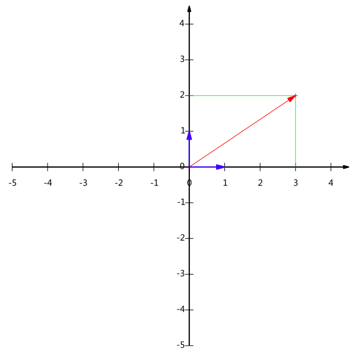

### 引言

前面一节我们介绍了向量和矩阵的概念，这节我们来说说特征向量和特征值。机器学习中，矩阵的特征值/特征向量理论有着非常广泛的应用，比如数据降维，人脸识别等，其目的是提取出一个矩阵最重要的特征。

戏说在朝代宋的时候，我国就与发现矩阵特征值理论的机会擦肩而过。话说没有出息的秦少游在往池塘里扔了一颗小石头后，刚得到一句“投石冲开水底天”的泡妞诗对之后，就猴急猴急地去洞房了，全然没有想到水波中隐含着矩阵的特征值及特征向量的科学大道理。大概地说，水面附近的任一点水珠在原处上下振动（实际上在做近似圆周运动），并没有随着波浪向外圈移动，同时这些上下振动的水珠的幅度在渐渐变小，直至趋于平静。在由某块有着特定质量和形状的石头被以某种角度和速度投入某个面积和深度特定的水池中所决定的某个矩阵中，纹波荡漾中水珠的渐变过程中其特征值起着决定性的作用，它决定着水珠振动的频率和幅度减弱的衰退率。

下面我们看看在数学中特征值和特征向量的概念。

### 特征值、特征向量

#### 概念

我们引用《线性代数的几何意义》的描述：“矩阵乘法对应了一个变换，是把任意一个向量变成另一个方向或长度都大多不同的新向量。在这个变换的过程中，原向量主要发生旋转、伸缩的变化。**如果矩阵对某一个向量或某些向量只发生伸缩变换，不对这些向量产生旋转的效果，那么这些向量就称为这个矩阵的特征向量，伸缩的比例就是特征值**。”

我们来看一个例子，比如一个矩阵 $A = \begin{pmatrix}  a_{11} & a_{12} \\ a_{21} & a_{22} \end{pmatrix}​$ , 一个列向量 $X = \begin{pmatrix} x_1 \\ x_2 \end{pmatrix}​$,

它们的乘积为：

$$AX = \begin{pmatrix} a_{11} & a_{12} \\ a_{21} & a_{22}  \end{pmatrix} \begin{pmatrix} x_1 \\ x_2 \end{pmatrix} = \begin{pmatrix} a_{11}x_1  +  a_{12} x_2 \\ a_{21}x_1 + a_{22}x_2  \end{pmatrix} = \begin{pmatrix} y_1 \\ y_2 \end{pmatrix} = Y​$$

向量 $X​$ 通过矩阵 $A​$ 的这个变化规则就可以变换为向量 $Y​$ 了。

$$X= \begin{pmatrix} x_1 \\ x_2 \end{pmatrix}  \frac{矩阵变换}{} \begin{pmatrix} y_1 \\ y_2 \end{pmatrix} = Y$$

在几何上的变换就类似于这样：


由上图我们可以看出，向量$X$ 经过和矩阵 $A$乘积变换后，得到的向量$Y$ 。对比原向量 $X$ 不仅发生了伸缩变化，还产生了旋转效果。

我们看下面一种特别的情况：

$$AX = \begin{pmatrix} a_{11} & a_{12} \\ a_{21} & a_{22}  \end{pmatrix} \begin{pmatrix} x_1 \\ x_2 \end{pmatrix} = \begin{pmatrix} a_{11}x_1  +  a_{12} x_2 \\ a_{21}x_1 + a_{22}x_2  \end{pmatrix} = \begin{pmatrix} \lambda x_1 \\ \lambda x_2 \end{pmatrix} = \lambda X$$

向量$X​$对应的变化图如下：


由上图我们可以看出，在第二种情况下，向量$X$ 经过和矩阵 $A$乘积变换后，得到的向量$Y$ 对比向量$X$ 仅产生了尺度上的伸缩变化，并没有产生旋转变化。这种情况下，我们称 向量$X$ 是矩阵 $A$ 的特征向量，$\lambda$ 是向量 $X$ 对应的特征值了。

好了，现在我们来讲讲特征向量和特征值的**理论部分**吧。首先我们来看看在数学上，特征值和特征向量的定义：

设 $A$ 为 $n$ 阶矩阵($A_{nn}$) ,若存在 $n$ 维非零向量 $x​$ ,使

​				$$Ax = \lambda x​$$

则称数$\lambda$ 为矩阵 $A$ 的特征值，$x$ 为矩阵 $A$ 属于 $\lambda$ 的特征向量。通常也可以写成下面的等式：

​				$$(A -\lambda E)x = 0 $$

其中， $E$ 为单位矩阵。

特征向量的代数上含义是：将矩阵乘法转换为数乘操作；特征向量的几何含义是：特征向量通过方阵 $A$ 变换只进行伸缩，而保持特征向量的方向不变。特征值表示的是这个特征到底有多重要，类似于权重，而特征向量在几何上就是一个点，从原点到该点的方向表示向量的方向。

#### 特征值特征向量意义

下面我们来看看特征向量和特征值在现实中的意义。

在理解关于振动的特征值和特征向量的过程中，以机械振动为例。机械振动和电振动有频谱，振动的某个频率具有某个幅度；矩阵也有矩阵的谱，矩阵的谱就是矩阵特征值的概念，是矩阵所固有的特性，所有的特征值形成了矩阵的一个频谱，每个特征值是矩阵的一个“谐振频点”。就像孩子的秋千那样，你一旦注意到一个秋千的频率，和此频率相配，你就使频率荡得更高。一个工程师总是试图使他的桥梁或他的火箭的自然频率远离风的频率或液体燃料的频率；而在另一种极端情况，一个证券经纪人则尽毕生精力于努力到达市场的自然频率线。特征值是几乎任何一个动力系统的最重要的特征。

在图像处理中，脸部图像的处理可以看作分量为每个像素的灰度的向量。该向量空间的维数是像素的个数。一个标准化面部图形的一个大型数据集合的协方差矩阵的特征向量称为特征脸。它们对于将任何面部图像表达为它们的线性组合非常有用。特征脸提供了一种用于识别目的的数据压缩的方式。在这个应用中，一般只取那些最大特征值所对应的特征脸。如下图所示


#### 定理1

$n$ 阶矩阵 $A$ 的 $n$ 个特征值就是其特征方程 $|\lambda E - A| = 0$ 的 $n $ 个根 $\lambda_1,\lambda_2,...\lambda_n $ ；而 $A$ 的属于特征值 $\lambda_i$ 的特征向量就是其次线性方程 $(\lambda_i E - A)x = 0$ 的非零解。

特征向量有一个重要的性质：同一特征值的任意多个特征向量的线性组合仍然是A属于同一特征值的特征向量。

#### 定理2

设$\lambda_1 , \lambda_2, \cdots, \lambda_n​$ 是方阵 $A​$ 的$n​$ 个特征值，$p_1, p_2, \cdots, p_n​$ 依次是与之对应的的特征向量，如果 $\lambda_1 , \lambda_2, \cdots, \lambda_n​$各不相等，则$p_1, p_2, \cdots, p_n​$线性无关。

#### 定理3

设$\lambda_1 , \lambda_2$ 是对称矩阵 $A$ 的$n$ 个特征值，$p_1, p_2$ 依次是与之对应的的特征向量。若$\lambda_1 \neq \lambda_2$, 则 $\lambda_1$ 与 $\lambda_2$正交。


### 特征值分解

矩阵的特征值分解是一个很重要的方法，我们在后面的章节中会讲到它，先来看看它的定义吧。对于矩阵A，有一组特征向量$v​$，将这组向量进行正交化单位化，就能得到一组正交单位向量。特征值分解，就是将矩阵A分解为如下式：

​								$$A = Q \Sigma Q^{-1}​$$

其中 $\Sigma$ 是一个对角矩阵。

其中$Q$是这个矩阵$A$的特征向量组成的矩阵。$\Sigma = diag(\lambda_1, \lambda_2,\cdots,\lambda_n)$ 是一个对角矩阵，每一个对角线上的元素就是一个特征值。

### 特征向量的应用

下面我们来讲讲特征向量和特征值在机器学习中的应用。本小节我们将讲述**主成分分析** $(Principle Component Analysis, PCA)$ 。

在推导 $PCA$ 算法前，我们先铺垫一些基础概念。接上一章节矩阵的概念，我们先了解几个概念。

统计学里最基本的概念就是样本的均值、方差等。首先，我们给定一个含有n个样本的集合，下面给出这些概念的公式描述：

**均值：**

​				$$E(x) = \frac{\sum_{i=1}^{n} X_i}{n}$$

方差（variance)是在概率论和统计方差衡量随机变量或一组数据时离散程度的度量。概率论中方差用来度量随机变量和其数学期望（即均值）之间的偏离程度。

**方差**：

​				$$S^2 = \frac{\sum_{i=1}^{n}(X_i - E(X))^2}{n-1}$$

标准差和方差一般是用来描述一维数据的，但现实生活中我们常常会遇到含有多维数据的数据集。面对这样的数据集，协方差就是这样一种用来度量两个随机变量关系的统计量，我们可以仿照方差的定义：

**协方差:**

​				$$var(X) = E[(X−E[X])(X−E[X])] =  \frac{\sum_{i=1}^{n}(X_i - E(X))(X_i - E(X))}{n-1}$$

通常我们定义协方差矩阵为$\Sigma​$ ,

​				$$\Sigma = E[(X - E(X))(X - E(X))^T]​$$


我们先来看一个列子。给出下面这个向量 $(3,2)​$：



在代数表示方面，我们经常用线段终点的点坐标表示向量，例如上面的向量可以表示为(3,2)，这是我们再熟悉不过的向量表示。

不过我们常常忽略，**只有一个(3,2)本身是不能够精确表示一个向量的**。我们仔细看一下，这里的3实际表示的是向量在x轴上的投影值是3，在y轴上的投影值是2。也就是说我们其实隐式引入了一个定义：以x轴和y轴上正方向长度为1的向量为标准。那么一个向量(3,2)实际是说在x轴投影为3而y轴的投影为2。注意投影是一个矢量，所以可以为负。

更正式的说，向量(x,y)实际上表示线性组合：

​					$$x (1,0)^T  + y (0,1)^T$$

所有二维向量都可以表示为这样的线性组合,此处 $(1,0)^T$ 和 $(0,1)^T$ 叫做二维空间中的一组基。

一般地，**要准确描述向量，首先要确定一组基，然后给出在基所在的各个直线上的投影值，就可以了**。但基不是唯一的，例如上一个例子中选 $(1,0)^T$ 和 $(0,1)^T$ 为基，同样，上面的基可以变为 $(1/ \sqrt2, 1/\sqrt2)^T$ 和 $(-1/ \sqrt2, 1/\sqrt2)^T$。


对比上面两个图和与之对应的四个基向量  $(1,0)^T$ , $(0,1)^T$ ,$(1/ \sqrt2, 1/\sqrt2)^T$ 和 $(-1/ \sqrt2, 1/\sqrt2)^T$。我们的原始向量 $(3,2)$ 和这四组向量相乘后，我们会发现乘积后的结果

**一般的，如果我们有M个N维向量，想将其变换为由R个N维向量表示的新空间中，那么首先将R个基按行组成矩阵A，然后将向量按列组成矩阵B，那么两矩阵的乘积AB就是变换结果，其中AB的第m列为A中第m列变换后的结果**。

对应数学表达：

​					$$\left ( \begin{matrix}p_1 \\ p_2 \\ \vdots \\ p_R\end{matrix}\right) (\begin{matrix} a_1, a_2, \cdots a_M\end{matrix}) = \left( \begin{matrix}  p_1a_1&p_1a_2&\cdots & p_1a_M \\ p_2a_1&p_2a_2&\cdots &p_2a_M \\ \vdots &\vdots&\ddots&\vdots\\ p_Ra_1&p_Ra_2&\cdots&p_Ra_M\end{matrix}\right)​$$	


其中$p_i$是一个行向量，表示第$i$个基，$a_j$ 是一个列向量，表示第$j​$个原始数据记录。

上述分析同时给矩阵相乘找到了一种物理解释：**两个矩阵相乘的意义是将右边矩阵中的每一列列向量变换到左边矩阵中每一行行向量为基所表示的空间中去**。这种操作便是降维。根据上面的分析，可以得出：只要找出合适的$p_1,p_2,...p_R$，就可以实现对特征矩阵的投影，从而实现降维。

**在信号处理中认为信号具有较大的方差，噪声有较小的方差，信噪比就是信号与噪声的方差比，越大越好。因此我们认为，最好的k维特征是将n维样本点变换为k维后，每一维上的样本方差都尽可能的大**。

#### PCA

PCA的思想是将$n$维特征映射到k维空间上$k < n$，这k维特征是全新的正交特征，是重新构造出来的$k$维特征，而不是简单地从n维特征中去除其余n−k维特征。

对于未知的投影向量，我们假设投影变换表示为：

$$y = \left [ \begin{matrix}y_{1} \\ y_{2} \\ \vdots \\ y_{M} \end{matrix} \right]  = [\begin{matrix} p_{1} & p_{2} &\cdots &p_{N}\end{matrix}]  \left[ \begin{matrix}  a_{11}&a_{12}&\cdots&a_{1M} \\ a_{21}&a_{22}&\cdots&a_{2M}\\ \vdots &\vdots &\ddots & \vdots \\ a_{N1} & a_{N2} & \cdots & a_{NM}\end{matrix}\right] ​$$

对于每一组基向量 $p_i$ , 我们希望矩阵 $A$ 在这个基向量方向上投影，结果方差最大。

特别地，我们以基向量 $p_{1}​$ 为例推导，即：

​				$$y_1 = p_1^T\cdot A$$

我们要是 $y_1$的协方差最大。

首先，我们要对数据样本进行中心化，中心化即是指变量减去它的均值，这样中心化后其均值就为零。不妨假设矩阵$A$ 已经中心化，矩阵$A$ 进过基向量$p_1$ 投影后，协方差最大化即：

​					$$var_1 = E\{y_1y_1^T\} = E[(p_1^TA )(p_1^TA)^T] = p_1^T \cdot E\{A \cdot A^T\} \cdot p_1$$

又对于投影向量，有$p_1^Tp_1 = 1$， 这个优化问题就变为一个带等式约束的向量$p_1$的优化问题，

​					$$max(var_1) = p_1^T\cdot E[A\cdot A^T] \cdot p_1$$ ,

​					$$s.t   \  \ \ \   p_1^Tp_1 = 1​$$

从而方差最大化可转化为含有拉格朗日乘子的函数：

​					$$f(p_1) = p_1^T \cdot E\{A \cdot A^T\} \cdot p_1 - \lambda (p_1^T \cdot p_1 -1 )$$

为了简化书写，记作：

​					$$\Sigma = E\{A \cdot A^T\}​$$

求$p_1^T​$导数并另导数为零，得出最优解：

​					$$\Sigma \cdot p_1 = \lambda p_1$$

由上公式，我们发现基向量$p_1$ 就是矩阵 $\Sigma = E\{A\cdot A^T\}$的**特征向量**。

同理，$p_2$为次大特征值对应的特征向量，依次类推，即可求得投影矩阵。

现在我们可以来总结下PCA算法步骤：

设有$m$条$n$维数据

1. 将原始数据按列组成$n$行$m$列矩阵$X$
2. 将$X$的每一行（代表一个属性字段）进行零均值化，即减去这一行的均值
3. 求出协方差矩阵 $\Sigma = \frac{1}{m} X X^T$ 
4. 求出协方差矩阵的特征值及对应的特征向量
5. 将特征向量按对应特征值大小从上到下按行排列成矩阵，取前$k$行组成矩阵$P​$
6. $Y = PX$ 即为降维到$K$维后的数据

### 实验部分

介绍完概念后，我们来做个实验来感受下PCA算法。我们使用搜狗实验室的搜狗新闻语料库，[数据链接][http://www.sogou.com/labs/resource/cs.php]，训练的200维的词向量，将词向量采用PCA进行降维，得到二维的词向量。

下面附上实验代码。

```python
#!/usr/bin/env python
# coding=utf-8
import numpy as np
import matplotlib
import matplotlib.pyplot as plt

from sklearn.decomposition import PCA
import word2vec
# load the word2vec model
model = word2vec.load('corpusWord2Vec.bin')
rawWordVec=model.vectors

# reduce the dimension of word vector
X_reduced = PCA(n_components=2).fit_transform(rawWordVec)

# show some word(center word) and it's similar words
index1,metrics1 = model.cosine(u'中国')
index2,metrics2 = model.cosine(u'清华')
index3,metrics3 = model.cosine(u'牛顿')
index4,metrics4 = model.cosine(u'自动化')
index5,metrics5 = model.cosine(u'刘亦菲')

# add the index of center word 
index01=np.where(model.vocab==u'中国')
index02=np.where(model.vocab==u'清华')
index03=np.where(model.vocab==u'牛顿')
index04=np.where(model.vocab==u'自动化')
index05=np.where(model.vocab==u'刘亦菲')

index1=np.append(index1,index01)
index2=np.append(index2,index03)
index3=np.append(index3,index03)
index4=np.append(index4,index04)
index5=np.append(index5,index05)

# plot the result
zhfont = matplotlib.font_manager.FontProperties(fname='/usr/share/fonts/truetype/wqy/wqy-microhei.ttc')
fig = plt.figure()
ax = fig.add_subplot(111)

for i in index1:
    ax.text(X_reduced[i][0],X_reduced[i][1], model.vocab[i], fontproperties=zhfont,color='r')

for i in index2:
    ax.text(X_reduced[i][0],X_reduced[i][1], model.vocab[i], fontproperties=zhfont,color='b')

for i in index3:
    ax.text(X_reduced[i][0],X_reduced[i][1], model.vocab[i], fontproperties=zhfont,color='g')

for i in index4:
    ax.text(X_reduced[i][0],X_reduced[i][1], model.vocab[i], fontproperties=zhfont,color='k')

for i in index5:
    ax.text(X_reduced[i][0],X_reduced[i][1], model.vocab[i], fontproperties=zhfont,color='c')

ax.axis([0,0.8,-0.5,0.5])
plt.show()
```


本章我们主要介绍的特征值和特征向量以及它的一个具体应用算法PCA。特征值和特征向量对于我们后续的降维算法和矩阵分解算法等都有铺垫作用，希望大家认真掌握这章内容，为后面的知识点打好基础。

