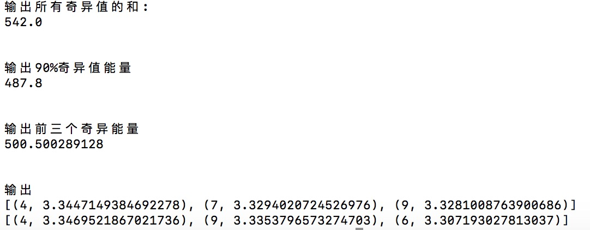

### 引言

**推荐系统**是一种信息过滤系统，用于预测用户对物品的“评分”或“偏好”。推荐系统近年来非常流行，应用于各行各业。推荐的对象包括：电影、音乐、新闻、书籍、学术论文、搜索查询、分众分类、以及其他产品。也有一些推荐系统专门为寻找专家、合作者、笑话、餐厅、美食、金融服务、生命保险、网络交友，以及Twitter页面设计。

推荐算法具有非常多的应用场景和商业价值，推荐算法种类很多。

+ **基于内容的推荐**：这一类一般依赖于自然语言处理NLP的一些知识，通过挖掘文本的TF-IDF特征向量，来得到用户的偏好，进而做推荐。这类推荐算法可以找到用户独特的小众喜好，而且还有较好的解释性。
+ **基于规则的推荐**：这类算法常见的比如基于最多用户点击，最多用户浏览等，属于大众型的推荐方法，在目前的大数据时代并不主流。
+ **协同过滤推荐**：协同过滤是推荐算法中目前最主流的种类，花样繁多，在工业界已经有了很多广泛的应用。它的优点是不需要太多特定领域的知识，可以通过基于统计的机器学习算法来得到较好的推荐效果。最大的优点是工程上容易实现，可以方便应用到产品中。目前绝大多数实际应用的推荐算法都是协同过滤推荐算法。
+ **混合推荐**：这个类似我们机器学习中的集成学习，博才众长，通过多个推荐算法的结合，得到一个更好的推荐算法，起到三个臭皮匠顶一个诸葛亮的作用。比如通过建立多个推荐算法的模型，最后用投票法决定最终的推荐结果。混合推荐理论上不会比单一任何一种推荐算法差，但是使用混合推荐，算法复杂度就提高了，在实际应用中有使用，但是并没有单一的协同过滤推荐算法，比如逻辑回归之类的二分类推荐算法广泛。

### 推荐系统

##### 基于用户的协同过滤

基于用户的协同过滤本质上是寻找与我们的目标用户具有相似品味的用户。在下表中，每行代表一个用户，每列代表一部电影，只需简单地查找这个矩阵中行之间的相似度，就可以找到相似的用户了。


如果Jean-Pierre和Jason曾对几部电影给出了相似的评分，那么我们认为他们就是相似的用户，接着我们就可以使用Jean Pierre的评分来预测Jason的未知评分。例如，如果Jean-Pierre喜欢星球大战3:绝地武士归来和星球大战5:帝国反击战，Jason也喜欢绝地武士归来，那么帝国反击战对Jason来说是就是一个很好的推荐。一般来说，你只需要一小部分与Jason相似的用户来预测他的评价。


##### 基于物品的协同过滤

基于物品的协同过滤过程很简单。两个物品的相似性基于用户给出的评分来算出。让我们回到Jean-Pierre与Jason的例子，他们两人都喜欢“绝地武士归来”和“帝国反击战”。 因此，我们可以推断，喜欢第一部电影的大多数用户也可能会喜欢第二部电影。所以，对于喜欢“绝地武士归来”的第三个人Larry来说，”帝国反击战“的推荐将是有意义的。


在推荐系统中，我们常常遇到的问题是这样的，我们有很多用户和物品，也有少部分用户对少部分物品的评分，我们希望预测目标用户对其他未评分物品的评分，进而将评分高的物品推荐给目标用户。比如下面的用户物品评分表：

| 用户\物品 | 物品1 | 物品2 | 物品3 | 物品4 | 物品5 | 物品6 | 物品7 |
| --------- | ----- | ----- | ----- | ----- | ----- | ----- | ----- |
| 用户1     | 3     |       | 5     |       |       | 1     |       |
| 用户2     |       | 2     |       |       |       |       | 4     |
| 用户3     |       |       |       | 4     |       |       |       |
| 用户4     |       |       | 2     |       |       |       | 1     |
| 用户5     | 1     |       |       |       | 4     |       |       |

在推荐系统中，最重要的数据是用户对商品的打分数据，对于每个用户，我们希望较准确的预测出用户对未评分物品的评分。推荐系统中有一类问题是对**未打分**的商品进行评分的预测，目前推荐系统中用的最多的就是**矩阵分解**方法。以用户-项目评分矩阵为例，矩阵分解就是预测出评分矩阵中的缺失值，然后根据预测值以某种方式向用户推荐。

### 矩阵分解 

推荐系统评分预测任务可看做是一个矩阵补全（Matrix Completion）的任务，即基于矩阵中已有的数据（observed data）来填补矩阵中没有产生过记录的元素（unobserved data）。值得注意的是，这个矩阵是非常稀疏的（Sparse），稀疏度一般能达到90%以上，因此如何根据极少的观测数据来较准确的预测未观测数据一直以来都是推荐系统领域的关键问题。


#### 奇异值分解SVD

说到矩阵分解，我们首先想到的就是奇异值分解$SVD$。前面章节我们降到数据降维方法，$SVD$ 也是数据降维的代表算法之一。在机器学习领域，有相当多的应用与奇异值都可以扯上关系，比如做特征降维的$PCA$，做数据压缩（以图像压缩为代表）的算法，还有做搜索引擎语义层次检索的$LSI(Latent \ Semantic \ Indexing)$。

奇异值分解是一个有着很明显的物理意义的一种方法，它可以将一个比较复杂的矩阵用更小更简单的几个子矩阵的相乘来表示，这些小矩阵描述的是矩阵的重要的特性。就像是描述一个人一样，给别人描述说这个人长得浓眉大眼，方脸，络腮胡，而且带个黑框的眼镜，这样寥寥的几个特征，就让别人脑海里面就有一个较为清楚的认识，实际上，人脸上的特征是有着无数种的，之所以能这么描述，是因为人天生就有着非常好的抽取重要特征的能力，让机器学会抽取重要的特征，$SVD$是也一个重要的方法。

特征值分解是一个提取矩阵特征很不错的方法，但是它只是对方阵而言的，在现实的世界中，我们看到的大部分矩阵都不是方阵。这时描述这些普通矩阵的重要特征就会用到：**奇异值分解**。它是可以适应任意矩阵分解的方法： 

​						$$A_{mn} = U_{mm}\Sigma_{mn}V_{nn}^T​$$

其中，$U​$ 是一个$m \times m​$ 的一个方阵(里面的向量是正交的，$U​$ 里面的向量称为左奇异向量)，$\Sigma​$ 是一个 $m \times n​$ 的矩阵(除了对角线的元素都是0，对角线上的元素称为奇异值)，$V​$ 是一个 $n \times n​$ 的矩阵里面的向量也是正交的，$V​$里面的向量称为右奇异向量。

奇异值跟特征值相似，在矩阵 $\Sigma$ 中也是按从大到小的方式排列。而且奇异值减小的特别的快，在很多的情况下前10%甚至1%的奇异值之和就占了全部奇异值之和的99%以上。也就是说可以用前$r$个大的奇异值来近似的描述矩阵，这里定义奇异值的分解：

​						$$A_{mn} \approx U_{mr}\Sigma_{rr}V_{rn}^T$$ 

拿上面的物品推荐的场景来说，如果将$m​$个用户和$n​$个物品对应的评分看做一个矩阵$M​$。此时可以将这个用户物品对应的$m\times n​$矩阵$M​$进行$SVD​$分解，并通过选择部分较大的一些奇异值来同时进行降维，也就是说矩阵$M​$此时分解为:

​						$$M_{mn} = U_{mk}\Sigma_{kk}V_{kn}^T​$$

其中，$k$ 是矩阵$M$ 中较大的部分奇异值的个数，一般会远远的小于用户数和物品数。如果我们要预测第$i$个用户对第$j$个物品的评分$m_{ij}$,则只需要计算$u_i^T\Sigma v_j$即可。通过这种方法，我们可以将评分表里面所有没有评分的位置得到一个预测评分。通过找到最高的若干个评分对应的物品推荐给用户。但是有一个很大的问题我们忽略了，就是$SVD$分解要求矩阵是稠密的，也就是说矩阵的所有位置不能有空白，有空白时我们的$M$是没法直接去$SVD$分解的。对于这个问题，统采用的$SVD$方法是对评分矩阵中的缺失值进行简单的补全，比如用全局平均值或者用用户物品平均值补全，得到补全后的矩阵。接着可以用$SVD$分解并降维。

```python
from numpy import *
from numpy import linalg as la
# （用户x商品）    # 为0表示该用户未评价此商品，即可以作为推荐商品
def loadExData2():
    return [[0, 0, 0, 0, 0, 4, 0, 0, 0, 0, 5],
            [0, 0, 0, 3, 0, 4, 0, 0, 0, 0, 3],
            [0, 0, 0, 0, 4, 0, 0, 1, 0, 4, 0],
            [3, 3, 4, 0, 0, 0, 0, 2, 2, 0, 0],
            [5, 4, 5, 0, 0, 0, 0, 5, 5, 0, 0],
            [0, 0, 0, 0, 5, 0, 1, 0, 0, 5, 0],
            [4, 3, 4, 0, 0, 0, 0, 5, 5, 0, 1],
            [0, 0, 0, 4, 0, 4, 0, 0, 0, 0, 4],
            [0, 0, 0, 2, 0, 2, 5, 0, 0, 1, 2],
            [0, 0, 0, 0, 5, 0, 0, 0, 0, 4, 0],
            [1, 0, 0, 0, 0, 0, 0, 1, 2, 0, 0]]

# 欧几里德距离 这里返回结果已处理 0，1   0最大相似，1最小相似   欧氏距离转换为2范数计算
def ecludSim(inA,inB):
    return 1.0 / (1.0 + la.norm(inA-inB))
 
# 皮尔逊相关系数 numpy的corrcoef函数计算
def pearsSim(inA,inB):
    if(len(inA) < 3):
        return 1.0
    return 0.5 + 0.5*corrcoef(inA,inB,rowvar=0)[0][1]   # 使用0.5+0.5*x 将-1，1 转为 0，1
 
# 余玄相似度 根据公式带入即可，其中分母为2范数计算，linalg的norm可计算范数
def cosSim(inA,inB):
    num = float(inA.T * inB)
    denom = la.norm(inA) * la.norm(inB)
    return 0.5 + 0.5*(num/denom)    # 同样操作转换 0，1

# 该函数用SVD降维后的矩阵来计算评分
def svdEst(dataMat, user, simMeas, item):
    n = shape(dataMat)[1]
    simTotal = 0.0; ratSimTotal = 0.0
    U,Sigma,VT = la.svd(dataMat)
    Sig4 = mat(eye(4)*Sigma[:4])  #将奇异值向量转换为奇异值矩阵
    xformedItems = dataMat.T * U[:,:4] * Sig4.I  # 降维方法 通过U矩阵将物品转换到低维空间中 （商品数行x选用奇异值列）
    for j in range(n):
        userRating = dataMat[user,j]
        if userRating == 0 or j == item:
            continue
        # 这里需要说明：由于降维后的矩阵与原矩阵代表数据不同（行由用户变为了商品），所以在比较两件商品时应当取【该行所有列】 再转置为列向量传参
        #计算物品item与物品j之间的相似度
        similarity = simMeas(xformedItems[item,:].T,xformedItems[j,:].T)  
        simTotal += similarity
        #用"物品item和物品j的相似度"乘以"用户对物品j的评分"，并求和
        ratSimTotal += similarity * userRating
    if simTotal == 0:
        return 0
    else:
         #得到对物品item的预测评分
        return ratSimTotal/simTotal
 
# 给出推荐商品评分 函数recommend()产生预测评分最高的N个推荐结果，默认返回3个；
def recommend(dataMat, user, N=3, simMeas=cosSim, estMethod=svdEst):
    unratedItems = nonzero(dataMat[user,:].A==0)[1]  # 找到该行所有为0的位置（即此用户未评价的商品，才做推荐）
    if len(unratedItems) == 0:
        return '所有物品都已评价...'
    itemScores = []
    for item in unratedItems:   # 循环所有没有评价的商品列下标
        estimatedScore = estMethod(dataMat, user, simMeas, item)    # 计算当前产品的评分
        itemScores.append((item, estimatedScore))
    return sorted(itemScores, key=lambda jj: jj[1], reverse=True)[:N]   # 将推荐商品排序

# 结果测试如下：
# 选出奇异值能量大于90%的所有奇异值
myMat = mat(loadExData2())
U,sigma,VT = linalg.svd(myMat)
sigma = sigma**2    # 对奇异值求平方
cnt = sum(sigma)    # 所有奇异值的和
print(cnt)
value = cnt*0.9     # 90%奇异值能量
print(value)
cnt2 = sum(sigma[:3])   # 2小于90%，前3个则大于90%，所以这里选择前三个奇异值
print(cnt2)

#上面的之所以使用4这个数字，是因为通过预先计算得到能满足90%的奇异值能量的前N个奇异值

myMat = mat(loadExData2())
result1 = recommend(myMat,1,estMethod=svdEst)   # 需要传参改变默认函数
print(result1)
result2 = recommend(myMat,1,estMethod=svdEst,simMeas=pearsSim)
print(result2)

```

我们用$SVD​$ 对用户评分矩阵分解后，预测用户对未评分物品的评分值。

实验输出结果图如下：



虽然有了上面的补全策略，我们的传统$SVD$在推荐算法上还是较难使用。因为我们的用户数和物品一般都是超级大，随便就成千上万了。这么大一个矩阵做$SVD$分解是非常耗时的。我们下面来看看实际可以用于推荐系统的矩阵分解。​				

#### FunkSVD

FunkSVD是在传统SVD面临计算效率问题时提出来的，既然将一个矩阵做SVD分解成3个矩阵很耗时，同时还面临稀疏的问题，那么我们能不能避开稀疏问题，同时只分解成两个矩阵呢？也就是说，现在期望我们的矩阵MM这样进行分解：

​						$$M_{mn} = P_{mk}^TQ_{kn}$$

对于$P,Q$矩阵的解释，直观上，$P$矩阵是$m$个用户对$K$个主题的关系，$Q$矩阵是$K$个主题跟$n$个物品的关系，至于$K$个主题具体是什么，在算法里面$K​$是一个参数，需要调节的，通常10~100之间。 


但是 $FunkSVD$ 如何将矩阵$M$分解为$P$和$Q$呢？这里采用了线性回归的思想。我们的目标是让用户的评分和用矩阵乘积得到的评分残差尽可能的小，也就是说，可以用均方差作为损失函数，来寻找最终的$P$和$Q$。

对于某一个用户评分$m_{ij}$，如果用 $FunkSVD$ 进行矩阵分解，则对应的表示为:

​						$$m_{ij} = q_j^Tp_i = \sum_{k=1}^K p_{ik}q_{kj}​$$

采用均方差做为损失函数，则我们期望$(m_{ij} - q_j^Tp_i)^2​$尽可能的小，如果考虑所有的物品和样本的组合，则我们期望最小化下式：

​						$$min \ \ \sum_{ij} (m_{ij} - q_j^Tp_i)^2$$

只要我们能够最小化上面的式子，并求出极值所对应的$p_i, q_j$，则我们最终可以得到矩阵$P$和$Q$，那么对于任意矩阵任意一个空白评分的位置，我们可以通过$q_j^Tp_i$计算预测评分。

当然，在实际应用中，我们为了防止过拟合，会加入一个$L2$的正则化项，因此正式的 $FunkSVD$ 的优化目标函数$J(p,q)$是这样的：

​						$$arg \ min \sum_{ij} (m_{ij} - q_j^Tp_i)^2 + \lambda(||p_i||_2^2 + ||q_j||_2^2)​$$

其中$\lambda$为正则化系数，对于这个优化问题，我们一般通过梯度下降法来进行优化得到结果。

将上式分别对$p_i​$ , $q_j​$求导我们得到:

​					$$\frac{\partial J}{\partial p_i} = -2(m_{ij}  - q_j^Tp_i)q_j + 2\lambda p_i​$$

​					$$\frac{\partial J}{\partial q_j} = -2(m_{ij}  - q_j^Tp_i)p_i + 2\lambda q_j$$

则在梯度下降法迭代时，$p_i$ , $q_j$的迭代公式为：

​					$$p_i = p_i + \alpha ((m_{ij} - q_j^Tp_i)q_j - \lambda p_i)$$

​					$$q_j = q_j + \alpha ((m_{ij} - q_j^Tp_i)p_i - \lambda q_j)$$

通过迭代我们最终可以得到 $P$ 和 $Q$，进而用于推荐。$FunkSVD​$ 算法虽然思想很简单，但是在实际应用中效果非常好。


#### BiasSVD

在 $FunkSVD$ 算法火爆之后，出现了很多 $FunkSVD$ 的改进版算法。其中 $BiasSVD$ 算是改进的比较成功的一种算法。$BiasSVD$ 假设评分系统包括三部分的偏置因素：一些和用户物品无关的评分因素，用户有一些和物品无关的评分因素，称为用户偏置项。而物品也有一些和用户无关的评分因素，称为物品偏置项。这其实很好理解。**比如一个垃圾山寨货评分不可能高，自带这种烂属性的物品由于这个因素会直接导致用户评分低，与用户无关**。

假设评分系统平均分为$u​$, 第 $i​$ 个用户的用户偏置项为 $b_i​$ ,而第 $j​$ 个物品的物品偏置项为 $b_j​$，它定义用户评分为：

​				$$\hat{r_{ij}} =u - b_i - b_j - q_j^Tp_i ​$$

则加入了偏置项以后的优化目标函数 $J(p,q)​$ 是这样的:

​				$$arg \ min \ \sum_{ij} (m_{ij} - u - b_i - b_j - q_j^Tp_i)^2 + \lambda(||p_i||_2^2 + ||q_j||_2^2 + ||b_i||_2^2 + ||b_j||_2^2)​$$

这个优化目标也可以采用梯度下降法求解。和 $FunkSVD$ 不同的是，此时我们多了两个偏执项 $b_i$, $b_j$,$p_i$,$q_j$ 的迭代公式和$FunkSVD$类似，只是每一步的梯度导数稍有不同而已，这里就不给出了。而 $b_i$, $b_j$ 一般可以初始设置为0，然后参与迭代。这里给出 $b_i$, $b_j$ 的迭代方法

​				$$b_i = b_i + \alpha (m_{ij} - u - b_i - bj - q_j^Tp_i - \lambda b_i)$$

​				$$b_j = b_j + \alpha (m_{ij} - u - b_i - bj - q_j^Tp_i - \lambda b_j)$$

通过迭代我们最终可以得到 $P$ 和 $Q$，进而用于推荐。$BiasSVD$ 增加了一些额外因素的考虑，因此在某些场景会比 $FunkSVD$ 表现好。

#### SVD++

$SVD++​$算法在 $BiasSVD​$ 算法上进一步做了增强，这里它增加考虑用户的隐式反馈。例如在音乐推荐中，将用户的音乐评分矩阵进行分解，分解后的低维矩阵的列对应的隐含特征可以抽象地表示为音乐所包含的某些特征引子，这些特征可能是"摇滚"、"流行"、"民谣"，也可能是"华语"、"欧美"、"日韩"，还可能是"80后"、"90后"、"后现代"；而这些特征因子可作为用户兴趣爱好和物品特征的隐含语义描述。


对于某一个用户 $i$，它提供了隐式反馈的物品集合定义为 $N(i)$ , 这个用户对某个物品j对应的隐式反馈修正的评分值为 $c_{ij}$, 那么该用户所有的评分修正值为 $\sum_{s \in N(i)} c_{sj}​$。它定义用户的评分为：

​				$$\hat{r_{ij}} = u - b_i - b_j - q_j^Tp_i - q_j^T|N(i)|^{-1/2}​$$

一般我们将它表示为用 $q_j^Ty_s​$ 形式，则加入了隐式反馈项以后的优化目标函数 $J(p,q)​$ 是这样的:

$$arg \ min \ \sum_{ij} (m_{ij} - u - b_i - b_j - q_j^Tp_i - q_j^T|N(i)|^{-1/2} )^2 + \lambda(||p_i||_2^2 + ||q_j||_2^2 + ||b_i||_2^2 + ||b_j||_2^2 + \sum_{s \in N(i)} ||y_s||_2^2) ​$$

其中，引入 $|N(i)|^{-1/2}$ 是为了消除不同 $|N(i)|$ 个数引起的差异, 需要考虑用户的隐式反馈时，使用$SVD++$ 不错的选择。


