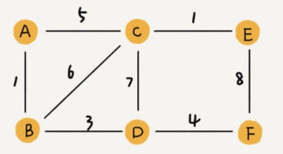
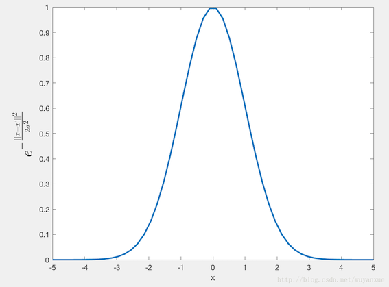
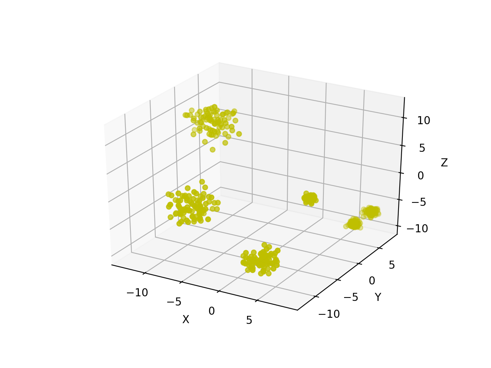
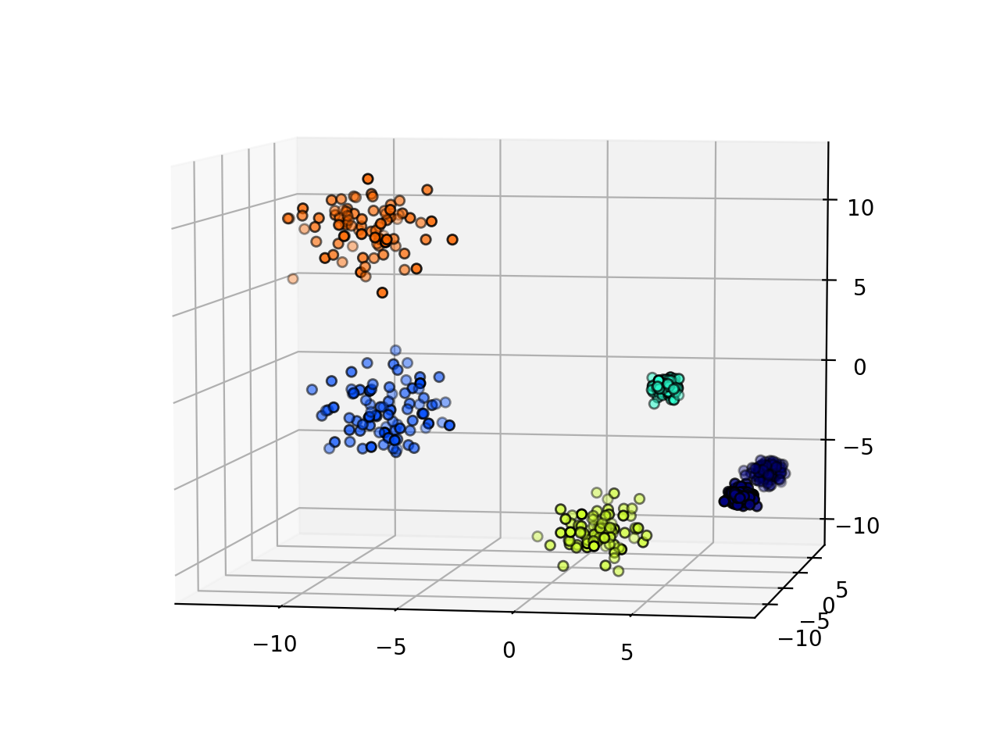

### 引言

在机器学习领域，有一类算法属于无监督学习算法，也就是聚类算法。在无监督学习中，目标属性是不存在的，也就是说不存在样本标签 $label$，我们是根据内部存在的数据特征，划分不同的类别，使得类别内的数据比较相似。

#### 聚类

聚类算法，它可以将数据点归结为一系列特定的组合。理论上归为一类的数据点具有相同的特性，而不同类别的数据点则具有各不相同的属性。在数据科学中聚类会从数据中发掘出很多分析和理解的视角，让我们更深入的把握数据资源的价值、并据此指导生产生活。聚类算法的基本思想可以归纳为：物以类聚，人以群分。

看看下面这张图，有各种各样的虫子和蜗牛，你试试将它们分成不同的组别？


一般来说我们可以将这些虫子分成四组：蜘蛛、蜗牛、蝴蝶/飞蛾、蜜蜂/黄蜂。如果对昆虫学有一定的了解，即使有成千上万只虫子我们也能将它们分开。但对于一台机器而言，需要根据这些样本的属性，通过计算样本之间的相似度，将相似度大的划分为一个类别。

常见的几类聚类算法有：

- K均值聚类
- 均值漂移聚类

- 密度聚类(DBSCAN)
- 高斯混合模型GMM聚类算法和最大期望EM算法
- 凝聚层次聚类算法
- 基于图的聚类

这些算法各有优劣，像K均值算法速度快，计算简便，但必须提前知道数据有多少类/组；DBSCAN算法不需要知道簇的数量，但需要确定距离半径$r$和圆内minPoints；层次聚类算法不需要知道有多少个簇 ，对于距离度量标准的选择并不敏感，但计算效率低等等。

谱聚类在最近几年变得受欢迎起来，主要原因就是它实现简单，聚类效果经常优于传统的聚类算法(如 $K -Means$ 算法)。

#### K-Means

K-Means算法的思想很简单，对于给定的样本集，按照样本之间的距离大小，将样本集划分为K个簇。让簇内的点尽量紧密的连在一起，而让簇间的距离尽量的大。

如果用数据表达式表示，假设簇划分为 $(C_1,C_2,\cdots,C_k)$，则我们的目标是最小化平方误差E：

​							$$E = \sum_{i=1}^k\sum_{x \in C_i} ||x - u_i||^2$$

其中$u_i$是簇 $C_i$ 的均值向量，有时也称为质心，表达式为：

​						$$u_i = \frac{1}{|C_i|}\sum_{x \in C_i} x$$

对于K-Means算法，首先要注意的是k值的选择，一般来说，我们会根据对数据的先验经验选择一个合适的k值，如果没有什么先验知识，则可以通过交叉验证选择一个合适的k值。

在确定了k的个数后，我们需要选择k个初始化的质心，就像上图b中的随机质心。由于我们是启发式方法，k个初始化的质心的位置选择对最后的聚类结果和运行时间都有很大的影响，因此需要选择合适的k个质心，最好这些质心不能太近。

然后计算每个对象与各个种子聚类中心之间的距离，把每个对象分配给距离它最近的聚类中心。聚类中心以及分配给它们的对象就代表一个聚类。一旦全部对象都被分配了，每个聚类的聚类中心会根据聚类中现有的对象被重新计算。这个过程将不断重复直到满足某个终止条件。终止条件可以是没有（或最小数目）对象被重新分配给不同的聚类，没有（或最小数目）聚类中心再发生变化，误差平方和局部最小。


### 谱和谱聚类

刚开始学习谱聚类的时候，给人的感觉就是这个算法看上去很难，但是当真正的深入了解这个算法的时候，其实它的原理并不难，但是理解该算法还是需要一定的数学基础的。如果掌握了谱聚类算法，会对矩阵分析，图论和降维中的主成分分析等有更加深入的理解。

#### 谱

前面讲解特征向量和特征值时，我们提到矩阵也有谱。矩阵的谱就是矩阵特征值的概念，是矩阵所固有的特性，所有的特征值形成了矩阵的一个频谱，每个特征值是矩阵的一个“谐振频点”。方阵的谱半径为最大的特征值，矩阵A的谱半径是矩阵 $A^TA​$ 的最大特征值。

#### 谱聚类

谱聚类是一种基于图论的聚类方法，它的主要思想是把所有的数据看做空间中的点，这些点之间可以用边连接起来。距离较远的两个点之间的边权重值较低，而距离较近的两个点之间的边权重值较高，通过对所有数据点组成的图进行切图，让切图后不同的子图间边权重和尽可能的低，而子图内的边权重和尽可能的高，从而达到聚类的目的。

概括来讲，谱聚类算法是**通过对样本数据的拉普拉斯矩阵的特征向量进行聚类，从而达到对样本数据聚类的目的。谱聚类可以理解为将高维空间的数据映射到低维，然后在低维空间用其它聚类算法（如KMeans）进行聚类**。实际上，谱聚类要做的事情其实就是将高维度的数据，以特征向量的形式简洁表达，属于一种降维的过程。本来高维度用k-means不好分的点，在经过线性变换以及降维之后，十分容易求解。

但是要完全理解这个算法的话，需要对图论中的无向图，线性代数和矩阵分析都有一定的了解。下面我们就从这些需要的基础知识开始，一步步学习谱聚类。

#### 无向权重图

由于谱聚类是基于图论的，因此我们首先学习下图的概念。对于一个图 $G$，我们一般用点的集合 $V$ 和边的集合 $E$ 来描述。即为 $G(V, E)$。其中 $V$ 即为我们数据集里面所有的点 $(v_1,v_2,\cdots,v_n)$。对于 $V$ 中的任意两个点，可以有边连接，也可以没有边连接。我们定义权重 $w_{ij}$ 为点 $v_i$ 和点 $v_j$ 之间的权重。由于我们是无向图，所以 $w_{ij} = w_{ji}$



对于有边连接的两个点 $v_i​$ 和 $v_j​$，$w_{ij} > 0​$,对于没有边连接的两个点 $v_i​$ 和 $v_j​$，$w_{ij} = 0​$。对于图中的任意一个点 $v_i​$，它的度 $d_i​$ 定义为和它相连的所有边的权重之和，即:

​							$$d_i = \sum_{j=1}^N w_{ij}$$

利用每个点度的定义，我们可以得到一个 $n \times n$ 的度矩阵 $D$,它是一个对角矩阵，只有主对角线有值，对应第 $i$ 行的第 $i$ 个点的度数，定义如下：

​							$$D = \begin{pmatrix} d_1 & \cdots & \cdots \\ \cdots & d_2 & \cdots \\ \vdots & \vdots & \ddots \\ \cdots & \cdots &d_n \end{pmatrix}$$

利用所有点之间的权重值，我们可以得到图的邻接矩阵 $W$，它也是一个 $n \times n$ 的矩阵，第 $i$ 行的第 $j$ 个值对应我们的权重 $w_{ij}$。

除此之外，对于点集 $V​$ 的的一个子集 $A \subset V​$，我们定义：

​							$$|A|:=子集A中点的个数​$$

​							$$ol(A):=∑_{i∈A}d_i$$

#### 相似矩阵

在上面我们讲到了邻接矩阵 $W​$, 它是由任意两点之间的权重值 $w_{ij}​$ 组成的矩阵。通常我们可以自己输入权重，但是在谱聚类中，我们只有数据点的定义，并没有直接给出这个邻接矩阵，下面来看看怎么得到这个邻接矩阵。

基本思想是，距离较远的两个点之间的边权重值较低，而距离较近的两个点之间的边权重值较高，不过这仅仅是定性，我们需要定量的权重值。一般来说，我们可以通过样本点距离度量的相似矩阵 $S$ 来获得邻接矩阵 $W$。

构建邻接矩阵 $W$ 的方法有三类。$\epsilon$- 邻近法，$K$ 邻近法和全连接法。

对于$\epsilon​$-邻近法，它设置了一个距离阈值 $\epsilon​$ ，然后用欧式距离 $s_{ij}​$ 度量任意两点 $x_i​$ 和 $x_j​$ 的距离。即相似矩阵的 $s_{ij} = ||x_i - x_j||^2​$,  然后根据 $s_{ij}​$ 和 $\epsilon​$ 的大小关系，来定义邻接矩阵 $W​$ 如下：

​						$$w_{ij} =\left  \{  \begin{aligned} 0 \ \ \ s_{ij} >\epsilon \\ \epsilon \ \ \  s_{ij} \leq \epsilon  \end{aligned} \right .​$$

从上式可见，两点间的权重要不就是 $\epsilon$ ,要不就是0，没有其他的信息了。距离远近度量很不精确，因此在实际应用中，我们很少使用 $\epsilon$-邻近法。

第二种定义邻接矩阵 $W$ 的方法是 $K$ 邻近法，利用 $KNN$ 算法遍历所有的样本点，取每个样本最近的 $k$ 个点作为近邻，只有和样本距离最近的k个点之间的 $w_{ij} >0 $。但是这种方法会造成重构之后的邻接矩阵 $W$ 非对称，我们后面的算法需要对称邻接矩阵。为了解决这种问题，一般采取下面两种方法之一：

　第一种 $K​$ 邻近法是只要一个点在另一个点的 $K​$ 近邻中，则保留 $s_{ij}​$

​						$$w_{ij} = w_{ji}= \begin{cases}  \ \ \ \ \ \ \ \ \ \ \ 0 \  \ \ \ \ \ \ \ \ \ \  \ x_i \notin KNN(x_j) \ and \  x_j \notin KNN(x_i)  \\ exp(\frac{||x_i - x_j||_2^2}{-2\sigma^2}) \ \ \  x_i \in KNN(x_j) \ or \ x_j \in KNN(x_i)  \end{cases}$$

第二种 $K​$ 邻近法是必须两个点互为 $K​$ 近邻中，才能保留 $s_{ij}​$

​						$$w_{ij} = w_{ji}= \begin{cases}  \ \ \ \ \ \ \ \ \ \ \ 0 \  \ \ \ \ \ \ \ \ \ \  \ x_i \notin KNN(x_j) \ or \  x_j \notin KNN(x_i)  \\ exp(\frac{||x_i - x_j||_2^2}{-2\sigma^2}) \ \ \  x_i \in KNN(x_j) \ and \ x_j \in KNN(x_i)  \end{cases}​$$

第三种定义邻接矩阵 $W​$ 的方法是全连接法，相比前两种方法，第三种方法所有的点之间的权重值都大于0，因此称之为全连接法。可以选择不同的核函数来定义边权重，常用的有多项式核函数，高斯核函数和Sigmoid核函数。最常用的是高斯核函数RBF，此时相似矩阵和邻接矩阵相同：

​						$$w_{ij} = s_{ij} = exp(\frac{||x_i - x_j||_2^2}{-2\sigma^2})​$$



在实际的应用中，使用第三种全连接法来建立邻接矩阵是最普遍的，而在全连接法中使用高斯径向核RBF是最普遍的。

#### 拉普拉斯矩阵

我们在前面第三小节中讲数据降维时，提到了拉普拉斯降维方法。它的定义很简单，拉普拉斯矩阵 $L = D - W​$。

$D$ 即为我们上面讲的度矩阵，它是一个对角矩阵。而 $W$ 是我们上面讲的邻接矩阵，它可以由我们上面降到的方法构建出。

拉普拉斯矩阵有一些很好的性质如下：

- 拉普拉斯矩阵是对称矩阵，这可以由 $D$ 和 $W$ 都是对称矩阵而得。

- 由于拉普拉斯矩阵是对称矩阵，则它的所有的特征值都是实数。

- 对于任意的向量 $f$ ,我们有:

  ​					$$f^TLf = \frac{1}{2} \sum_{ij}^{n} w_{ij}(f_i - f_j)^2$$

  这个利用拉普拉斯矩阵的定义很容易得到如下：

  ​					$$f^TLf = f^TDf - f^TWf = \sum_{i=1}^n d_if_i^2 - \sum_{i,j=1}^n w_{ij}f_if_j​$$

  ​					$$= \frac{1}{2} ()​$$

- 拉普拉斯矩阵是半正定的，且对应的n个实数特征值都大于等于0，即$0=λ1≤λ2≤\cdots≤λn, \ \ 0=λ1≤λ2≤\cdots≤λn$， 且最小的特征值为0，这个由性质3很容易得出。


### 谱聚类算法流程

谱聚类最常用的相似矩阵的生成方式是基于高斯核距离的全连接方式，得到的拉普拉斯矩阵提取特征值后，常用的聚类方法为 $K-Means​$。 

算法流程：

输入：样本集 $D = (x_1,x_2,\cdots,x_n)$，相似矩阵的生成方式, 降维后的维度 $k_1$, 聚类方法，聚类后的维度 $k_2$ ;

输出：簇划分 $C(c_1, c_2, \cdots,c_{k2}$;

- 基于高斯核距离的全连接方式生成相似度矩阵$S​$
- 根据相似矩阵$S​$构建邻接矩阵 $W​$，构建度矩阵 $D​$
- 计算出拉普拉斯矩阵 $L$
- 构建标准化后的拉普拉斯矩阵 $D^{-1/2}LD^{-1/2}$
- 计算 $D^{-1/2}LD^{-1/2}​$ 最小的 $k_1​$ 个特征值所各自对应的特征向量 $f​$
- 将各自对应的特征向量 $f$ 组成的矩阵按行标准化，最终组成 $n\times k_1$ 维的特征矩阵 $F​$
- 对 $F​$ 中的每一行作为一个 $k_1​$ 维的样本, 共 $n​$ 个样本。用输入的聚类方法进行聚类，聚类维数为 $k_2​$
- 得到簇划分 $C (c_1,c_2,\cdots,c_k)$

#### 谱聚类算法总结

谱聚类算法的主要优点有：

- 谱聚类只需要数据之间的相似度矩阵，因此对于处理稀疏数据的聚类很有效。这点传统聚类算法比如K-Means很难做到
- 由于使用了降维，因此在处理高维数据聚类时的复杂度比传统聚类算法好

谱聚类算法的主要缺点有：

- 如果最终聚类的维度非常高，则由于降维的幅度不够，谱聚类的运行速度和最后的聚类效果均不好。
- 聚类效果依赖于相似矩阵，不同的相似矩阵得到的最终聚类效果可能很不同。

### 应用

```python
# -*- coding: utf-8 -*-

import numpy as np
import matplotlib.pyplot as plt
import mpl_toolkits.mplot3d.axes3d as p3
from sklearn import datasets
from sklearn import metrics
from sklearn.cluster import SpectralClustering

#500 个样本  3个特征 6个中心  方差数据的离散程度
X, y = datasets.make_blobs(n_samples=500, n_features=3, centers=6, cluster_std=[1.4, 0.3, 1.4, 0.3, 0.4, 0.9],random_state=11)
xx, yy, zz = X[:, 0], X[:, 1], X[:, 2]
# 创建一个三维的绘图工程
ax = plt.subplot(111, projection='3d')
# 将数据点分成三部分画，在颜色上有区分度
# 绘制数据点
ax.scatter(xx, yy, zz, c='y')
# 坐标轴
ax.set_zlabel('Z')
ax.set_ylabel('Y')
ax.set_xlabel('X')
plt.show()

#为了区分 聚类成5个类
y_pred = SpectralClustering(n_clusters=5, gamma=0.1).fit_predict(X)
fig = plt.figure()
ax = p3.Axes3D(fig)
ax.view_init(7, -80)
for l in np.unique(y_pred):
    ax.scatter(X[y_pred == l, 0], X[y_pred == l, 1], X[y_pred == l, 2],color=plt.cm.jet(float(l) / np.max(y_pred + 1)),s=20, edgecolor='k')
plt.title(u'谱聚类')
plt.show()

```

实验图如下：

**数据分布图:** 

**谱聚类结果图：**


