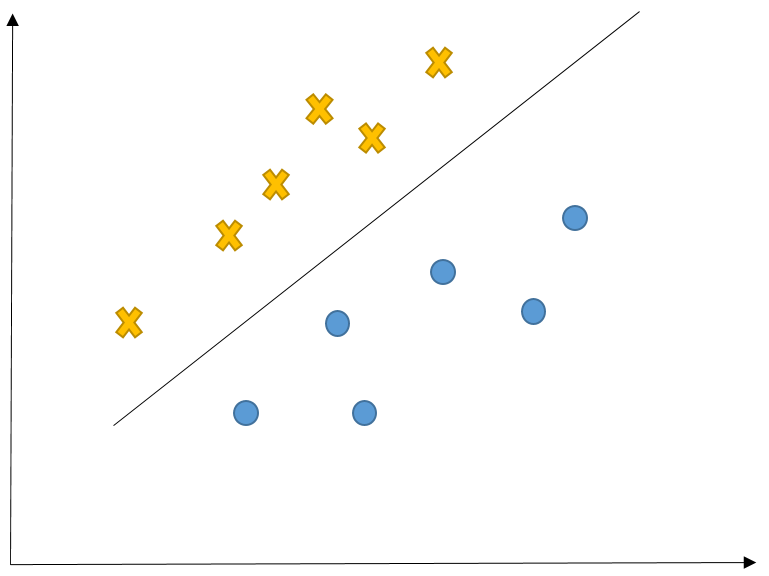
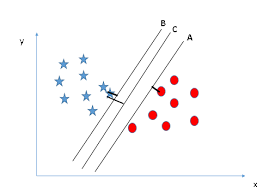
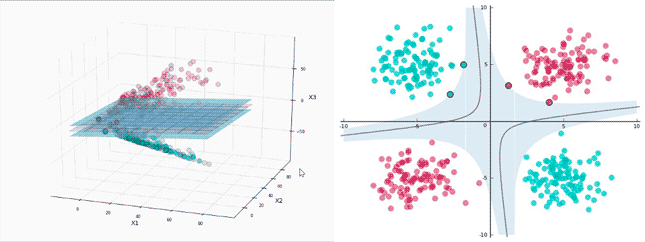
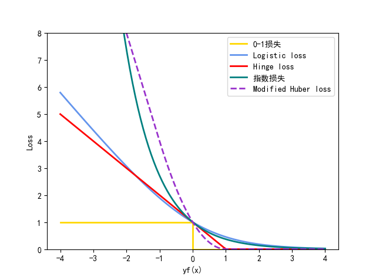
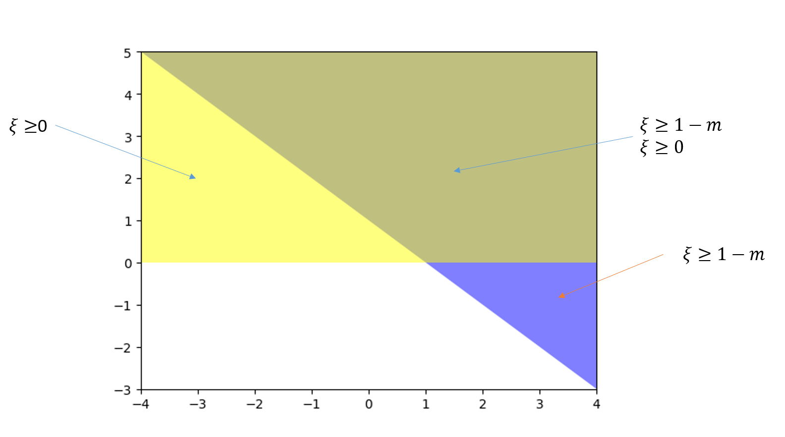
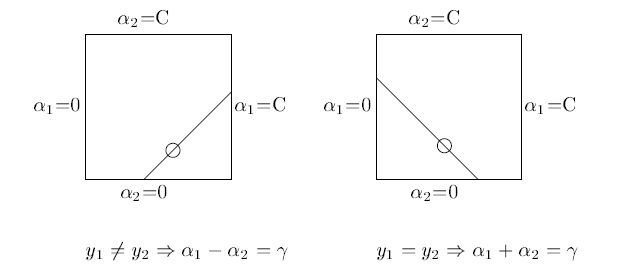

### 引言

SVM 诞生于上世纪九十年代，由于它良好的性能，自一诞生便席卷了机器学习领域，并牢牢压制了神经网络领域好多年，据说 LeNet5自1998年诞生，在后来的好长一段时间未火起来，最主要的原因就是 SVM 这货，因为 SVM 也能达到类似的效果甚至超过LeNet5， 而且比LeNet5 计算量小。曾几何时，SVM在神经网络研究和应用中几乎无所不在。SVM是几乎所有有关神经网络计算机视觉期刊会议离不开的重要组成。SVM的最大化分类边界理论不知迷倒了多少科研院所和高科技公司的研发人员，支持向量概念本身也衍生出一批批美妙的解释，让人如痴如醉，整整迷倒了一代科研人员。后来随着算力的增强与深度学习一次次在实验集上的经验表现，才慢慢研究人员变少。但是SVM有非常坚实的数学理论支撑在里面，学习此内容非常有助于深层网络的理论学习。

本节介绍SVM相关的概念，包括对偶问题推导，核函数分析，SMO算法及损失函数Hinge等价。

### 问题引入

$X$和$O$是两类样本
中间的直线就是一个分类函数，它可以将两类样本完全分开。



例如有一个线性函数
$g(\boldsymbol x)=\boldsymbol w^{T}\boldsymbol x+b$

取阈值为$0$，这样当有一个样本$\boldsymbol x_i$需要判别的时候，就看$g(\boldsymbol x_i)$的值。
若$g(\boldsymbol x_i)>0$，就判别为类别$O$
若$g(\boldsymbol x_i)<0$，则判别为类别$X$
$\boldsymbol w、\boldsymbol x、b$均可以是向量
中间那条直线的表达式是$g(\boldsymbol x)=0$，即$\boldsymbol w^{T}\boldsymbol x+b=0​$，我们也把这个函数叫做分类面

### 原问题

假设训练集线性可分，超平面为 $\boldsymbol w^{T}\boldsymbol x+b$，类别标签 $y \in \left \{ -1,+1 \right \}$，，是对于$\boldsymbol x$到超平面的距离即为$\frac{|\boldsymbol w^{T}\boldsymbol x+b|}{\left \|\boldsymbol w  \right \|}$

​						$ \left\{ \begin{matrix} y_{i}=+1 \quad \Leftrightarrow \quad \boldsymbol w^{T}\boldsymbol x_{i}+b > 0 \\ y_{i}=-1 \quad \Leftrightarrow \quad \boldsymbol w^{T}\boldsymbol x_{i}+b < 0  \end{matrix} \right. \xlongequal{通过对\boldsymbol w缩放} \left\{ \begin{matrix} y_{i}=+1 \quad \Leftrightarrow \quad \boldsymbol w^{T}\boldsymbol x_{i}+b \geq +1 \\ y_{i}=-1 \quad \Leftrightarrow \quad \boldsymbol w^{T}\boldsymbol x_{i}+b \leq-1  \end{matrix} \right. \xlongequal{推出} y_{i} \cdot \left( \boldsymbol w^{T}\boldsymbol x_{i}+b \right) \geq 1​$

满足$ y_{i} \cdot \left( \boldsymbol w^{T}\boldsymbol x_{i}+b \right) = 1 ​$的样本称为支持向量,所以两个异类支持向量到超平面的和为$\frac{2}{\left \|\boldsymbol w  \right \|}​$

所以可以优化问题可以写为
$$
\max_{\boldsymbol w,\boldsymbol b} \frac{2}{||\boldsymbol w||} \quad \Leftrightarrow \quad \min_{\boldsymbol w, b} \frac{1}{2} ||\boldsymbol w||^{2}\\
\text{s.t.  } y_{i} \cdot \left( \boldsymbol w^{T}\boldsymbol x_{i}+b \right) \geq 1
$$
将最优支持分类器用对偶问题表示一下：
$$
p^\ast =\min_{\boldsymbol w, b}\max_\alpha {\cal L(\boldsymbol w, \alpha, b)} \\\
{\cal L}(\boldsymbol w, \alpha, b) = \frac{1}{2}||\boldsymbol w||^2+\sum_i\alpha_i(1-y_i)(\boldsymbol w^T \boldsymbol x_i+b))
$$
其中，直接忽略了$h_i(\boldsymbol w)=0​$的约束，而$g_i(w,b)=1-y_{i}(\boldsymbol w^T \boldsymbol x_i+b) \leq 0, f(w)=\frac{1}{2}||\boldsymbol w ||^2​$


### 对偶问题

一般来说，将原始问题转化成对偶问题来求解。一是因为对偶问题往往比较容易求解，二是因为对偶问题引入了核函数，方便推广到非线性分类的情况。

我们看到，之前的原始问题，是
$$
p^\ast =\min_{\boldsymbol w, b}\max_\alpha {\cal L}(\boldsymbol w, \alpha, b)
$$
那么，定义其对偶问题：
$$
l^\ast =\max_\alpha\min_{\boldsymbol w,b}{\cal L}(\boldsymbol w, \alpha, b)
$$
接下去，求解对偶问题：

先求解
$$
\min_{\boldsymbol w,b}{\cal L}(\boldsymbol w, \alpha, b)
$$
分别求偏导，使其等于0，导出最小值：
$$
\begin{align}
& \nabla_\boldsymbol w{\cal L}(\boldsymbol w, \alpha, b) =w-\sum_{i}\alpha_iy_i\boldsymbol x_i=0 \\\
& \nabla_b{\cal L}(\boldsymbol w, \alpha, b) =\sum_{i}\alpha_iy_i=0
\end{align}
$$
得到：
$$
\boldsymbol w =\sum_{i}\alpha_iy_i\boldsymbol x_i \\\
\sum_{i}\alpha_iy_i = 0
$$
代入${\cal L}(\boldsymbol w, \alpha, b)​$，就可以得到最小值：
$$
\begin{align}
{\cal L}(\boldsymbol w, \alpha, b) &= \frac{1}{2}||\boldsymbol w||^2+\sum_i\alpha_i(1-y_i）(\boldsymbol w^T \boldsymbol x_i+b)) \\\
\min_{\boldsymbol w, b}{\cal L}(\boldsymbol w, \alpha, b) &={\sum_{i}\alpha_i-\frac{1}{2}\sum_{i}\sum_{j}\alpha_i\alpha_jy_iy_j(x_i \cdot x_j)}
\end{align}
$$
于是，求以下对偶问题最大化：
$$
\max_\alpha {\sum_{i}\alpha_i-\frac{1}{2}\sum_{i}\sum_{j}\alpha_i\alpha_jy_iy_j(x_i \cdot x_j)} \\\
\text{s.t.  } \sum_iy_i\alpha_i=0\\
\alpha_i \geq 0
$$
假设，对偶问题的解为：$\alpha^\ast =（\alpha_1^\ast ,\alpha_2^\ast , \ldots, \alpha_m^\ast ）​$，那么最终原始问题的解可以表示成：
$$
\boldsymbol w^\ast =\sum_{i=1}\alpha_i^\ast y_i\boldsymbol x_i
$$
在原始问题中，还有$b$未得到解决。先来观察一下约束项：
$$
g_i(\boldsymbol w,b)=1-y{(i)}(\boldsymbol w^T\boldsymbol x_i+b) \leq 0
$$





在数据中，只有少数的几个数据点，他们的函数距离为1（最小），也即$g_i(w,b)=0$，如图所示。

在整个数据集中，只有这些数据点对约束超平面起了作用，这些数据点被称为支持向量（*support vector*），其对应的$\alpha_i^\ast  \neq 0​$，而其他不是支持向量的数据点，没有对约束超平面起作用，其$\alpha_i^\ast =0​$。

此时，得到了$w^\ast ​$，而$b^\ast ​$的计算如下，找到一个数据点，其$\alpha_j^\ast  \neq 0​$(也就是支持向量，其函数间隔为1)，就能得到：
$$
y_j(\boldsymbol w^{*T}\boldsymbol x_j+b^\ast )=1
\Rightarrow
b^\ast =y_j-\sum_{i=1}\alpha_i^\ast y_i(\boldsymbol x_i \cdot \boldsymbol x_j)
$$

### 核函数

如下图所示，一维空间中的数据点 **X** 和 **O** 互相交杂，在一维空间中我们无法找到一个分界点进行划分，但是通过$\phi(x)=(x,\alpha x^2+\beta)$映射到二维空间后，很容易找到分界线将这些不同类型的点区分开来。




那么对于一个低维不可分的，将数据从低维空间映射到高维空间中，为分类提供了新的视角。

由$\boldsymbol w =\sum_{i}\alpha_i y_i\boldsymbol x_i​$ ,代入公式 $y=\boldsymbol w^T \boldsymbol x+b=\displaystyle\sum_{i}\alpha_i y_i (\boldsymbol x_i,\boldsymbol x)+b​$

那么做成高维空间后可以得到$y=\boldsymbol w^T \boldsymbol x+b=\displaystyle\sum_{i}\alpha_i y_i (\boldsymbol \phi(x_i),\boldsymbol \phi(x))+b$，就可以用线性SVM进行求解，通过映射函数，我们能从原始数据中（低维空间）抽象出所需的特征（高维空间），由低维空间向高维空间的转化很多时候非常的麻烦，有意思的是，无论是1维、10维、100维还是更高维的空间，其矢量点积的结果都是一个常数，那么有没有什么捷径，可以跳过维度转换的过程，通过相对简单的计算直接得到矢量积？答案就是核函数：

核函数$K(x_i,x_j)= \phi(x_i) \cdot\phi(x_j) $ 


核函数还可以理解为两个数据点的相似程度，两个向量的点乘越大相似度越大。

以高斯核为例$K(x,y)=e^{-\frac{\left \| x-y \right \|}{2\sigma^2}}$衡量的是向量$x$和$y$相似程度 ，$x=y$时，$K(x,y)=1$，$\left \| x-y \right \|\rightarrow \infty $,$K(x,y)=0$，所以根据公式$y=\displaystyle\sum_{i}\alpha_i y_i K(x_i,x)+b$，真实值跟某个支撑点离的越近，则整体贡献越大。

### 损失函数

我们从损失函数来看SVM公式

对于监督问题，损失函数$L(f(\boldsymbol x),y) $,用以衡量真实值$y$与预测值$f(x)$之间不一致的程度，回归问题$y-f(x)$的函数，分类问题为$yf(x)$的函数。对于二分类问题，$y\in \left \{ -1,+1 \right \}$,损失函数常表示为关于$yf(x)$的单调递减的形式，如下图具体损失函数的曲线

```python
import numpy as np
import matplotlib.pyplot as plt
plt.rcParams['font.sans-serif']=['SimHei']
plt.rcParams['axes.unicode_minus']=False

def modified_huber_loss(y_true, y_pred):
    z = y_pred * y_true
    loss = -4 * z
    loss[z >= -1] = (1 - z[z >= -1]) ** 2
    loss[z >= 1.] = 0
    return loss

xmin, xmax = -4, 4;lw = 2
x = np.linspace(xmin, xmax, 100)
plt.plot([xmin, 0, 0, xmax], [1, 1, 0, 0], color='gold', lw=lw,label=u"0-1损失")
plt.plot(x, np.log2(1 + np.exp(-x)), color='cornflowerblue', lw=lw,label="Logistic loss")
plt.plot(x, np.where(x < 1, 1 - x, 0), color='red', lw=lw,label="Hinge loss")
plt.plot(x, np.exp(-x), color='teal', lw=lw,label=u"指数损失")
plt.plot(x, modified_huber_loss(x, 1), color='darkorchid', lw=lw,linestyle='--', label="Modified Huber loss")
plt.ylim((0, 8))
plt.legend(loc="upper right")
plt.xlabel(r"yf(x)")
plt.ylabel("Loss")
plt.show()
```



带有L2正则项的Hinge损失优化问题如下：
$$
\min\limits_{\boldsymbol w, b} \left[ 
C \sum_{i=1}^n \max \left\{ 0, 1 - (\boldsymbol w^T\boldsymbol x_i) y_i \right\} 
+ \frac12 \|\omega\|^2_2 
\right] \ \ 
$$
为了与前面的SVM表达式对应，我们把L2正则项中的惩罚系数挪到前面的Hinge损失上了。Hinge损失函数有如下的等价定义：
$$
\max \{0, 1-m\} = 

\underset{
\begin{aligned}
s.t.& \ \xi \geq 1-m \\
& \xi \geq 0
\end{aligned}
}{\min \xi}
$$
右式可行域可以用下图所示：



所以可行域为上述两个相交区域，那么取最小值等价于Hinge损失曲线

利用上面的等价定义，我们可以重写带有L2正则项的Hinge损失优化问题为：
$$
\begin{aligned}
\min\limits_{\boldsymbol w, b, \xi}& \left[ 
C \sum_{i=1}^n \xi_i + \frac12 \|\omega\|^2_2 
\right] \\
s.t.& \  \xi_i \geq 1 - (\boldsymbol w^T\boldsymbol x_i)y_i , \ \forall i = 1, \ldots, n \\
& \xi_i \geq 0 , \ \forall i = 1, \ldots, n
\end{aligned}
$$
嗯，上式就是本文最开始给出的SVM优化问题了。

### SMO算法

SMO在整个二次规划的过程中也没干别的，总共干了两件事：

- 选取一对参数 $(\alpha_{i}, \alpha_{j})​$
- 固定$\alpha$向量的其他参数，将 $(\alpha_{i}, \alpha_{j})$代入表达式进行求最优解获得更新后的 $(\alpha_{i}, \alpha_{j})$

SMO不断执行这两个步骤直至收敛。

因为有约束$\sum \alpha_{i} y_{i} = 0$ 存在，实际上 $\alpha_{i}$和$ \alpha_{j}$关系也确定.,这两个值的和或者差是一个常数$$ \alpha_{i} y_{i} + \alpha_{i} y_{j} = C$$



所以虽然宣传上说是选择了一对，但还是选择了其中一个，将另一个写作关于它的表达式代入目标函数求解。

下面给出参数的具体求解步骤：

>  求解$\alpha$

优化目标：记$f(\alpha)={\displaystyle\sum_{i}\alpha_i-\frac{1}{2}\sum_{i}\sum_{j}\alpha_i\alpha_jy_iy_j(x_i \cdot x_j)} ​$，每次固定其他变量，只更新 $\alpha_{i}, \alpha_{j}​$，直到收敛

由 $(\sum \alpha_{i} y_{i} = 0)​$ 可得：$$ \alpha_{i} y_{i} + \alpha_{i} y_{j} = -\displaystyle \sum_{k \neq i \neq j}\alpha_{k} y_{k} = D ​$$

由 $(y_{i} \in \{-1,+1\}) $可得$y_{i} = \frac{1}{y_{i}}$，上式可进一步变为：$$ \alpha_{j} = (D-\alpha_{i}y_{i}) \cdot y_{j} $$

固定其他变量，将 $\alpha_{j} 代入 f(\alpha) ​$可得：

$$ f(\alpha) = A \alpha_{i}^{2} + B \alpha_{i} + E $$,二次凸优化问题，可以进行求解

>  求解 $w​$

求解出最优判别面的$ \alpha_{i}​$ 后，代入下式计算 $ \boldsymbol w = \sum_{i=1}^{M} \alpha_{i} y_{i} x_{i} ​$$

>  求解 $b​$

假设 $V ​$为支持向量的集合，对于支持向量 $x_{v}​$：$$ y_{v} \left( \displaystyle\sum_{i=1} \alpha_{i} y_{i} x_{i}^{T} x_{v} + b \right) = 1 ​$$

由上式可得：$$ b = \frac{1}{y_{v}} -\displaystyle \sum_{i=1} \alpha_{i} y_{i} x_{i}^{T} x_{v} = y_{v} - \sum_{i=1} \alpha_{i} y_{i} x_{i}^{T} x_{v} $$

通常在整个支持向量集合上求解 $$ b =\displaystyle \frac{1}{|V|} \sum_{v \in V} \left( y_{v} - \sum_{i=1} \alpha_{i} y_{i} x_{i}^{T} x_{v} \right) ​$$

>  支持向量

- 将 $ \boldsymbol w, b$代入  可得最终判别面：

  $$ \displaystyle \sum_{i=1} \alpha_{i} y_{i} x_{i}^{T} x + \frac{1}{|V|} \sum_{v \in V} \left( y_{v} - \sum_{i=1}^{M} \alpha_{i} y_{i} x_{i}^{T} x_{v} \right) $$


### 应用

下面以一个实时车辆识别的例子来说明整个算法流程

- 首先车辆<a href="https://s3.amazonaws.com/udacity-sdc/Vehicle_Tracking/vehicles.zip" rel="nofollow">车辆</a>与<a href="https://s3.amazonaws.com/udacity-sdc/Vehicle_Tracking/vehicles.zip" rel="nofollow">非车辆</a>示例标记的数据链接，在标记的训练集上提取出梯度直方图（HOG）特征
- 构建训练集到SVM分类器进行训练
- 在视频流上运用管道，逐帧用分类器搜索检测跟踪车辆

 <div align="center"><video src="assets/speed.mp4" height="" /></div>


```python

import cv2
import matplotlib.image as mpimg
import matplotlib.pyplot as plt
import numpy as np
import glob
from skimage.feature import hog
from sklearn.preprocessing import StandardScaler
import time
from sklearn.svm import LinearSVC
from sklearn.model_selection import train_test_split
from scipy.ndimage.measurements import label
from sklearn import svm
from sklearn.model_selection import GridSearchCV


images = glob.glob('Test_Images/*/*/*')
cars = []
notcars = []
for image in images:
    if 'non' in image:
        notcars.append(image)
    else:
        cars.append(image)
        
print(len(cars))
print(len(notcars))

def data_look(car_list, notcar_list):
    data_dict = {}
    data_dict["n_cars"] = len(car_list)
    data_dict["n_notcars"] = len(notcar_list)
    example_img = mpimg.imread(car_list[0])
    data_dict["image_shape"] = example_img.shape
    data_dict["data_type"] = example_img.dtype
    return data_dict
    
data_info = data_look(cars, notcars)

# 随机选择示例
car_ind = np.random.randint(0, len(cars))
notcar_ind = np.random.randint(0, len(notcars))
car_image = mpimg.imread(cars[car_ind])
notcar_image = mpimg.imread(notcars[notcar_ind])

# 定义HOG特征
def get_hog_features(img, orient, pix_per_cell, cell_per_block, vis=False, feature_vec=True):
    if vis == True:
        features, hog_image = hog(img, orientations=orient, pixels_per_cell=(pix_per_cell, pix_per_cell),
                                  cells_per_block=(cell_per_block, cell_per_block), transform_sqrt=False, 
                                  visualise=vis, feature_vector=True)
        return features, hog_image
    else:      
        features = hog(img, orientations=orient, pixels_per_cell=(pix_per_cell, pix_per_cell),
                       cells_per_block=(cell_per_block, cell_per_block), transform_sqrt=False, 
                       visualise=vis, feature_vector=feature_vec)
        return features

def bin_spatial(img, size=(32, 32)):
    color1 = cv2.resize(img[:,:,0], size).ravel()
    color2 = cv2.resize(img[:,:,1], size).ravel() 
    color3 = cv2.resize(img[:,:,2], size).ravel() 

    return np.hstack((color1, color2, color3))

def color_hist(img, nbins=32, bins_range=(0, 256)):
    channel1_hist = np.histogram(img[:,:,0], bins=nbins, range=bins_range)
    channel2_hist = np.histogram(img[:,:,1], bins=nbins, range=bins_range)
    channel3_hist = np.histogram(img[:,:,2], bins=nbins, range=bins_range)
    hist_features = np.concatenate((channel1_hist[0], channel2_hist[0], channel3_hist[0]))
    return hist_features

def extract_features(imgs, color_space='RGB', spatial_size=(32, 32),
                        hist_bins=32, orient=9, 
                        pix_per_cell=8, cell_per_block=2, hog_channel=0,
                        spatial_feat=True, hist_feat=True, hog_feat=True):
    features = []
    for file in imgs:
        file_features = []
        image = mpimg.imread(file)
        if color_space != 'RGB':
            if color_space == 'HSV':
                feature_image = cv2.cvtColor(image, cv2.COLOR_RGB2HSV)
            elif color_space == 'LUV':
                feature_image = cv2.cvtColor(image, cv2.COLOR_RGB2LUV)
            elif color_space == 'HLS':
                feature_image = cv2.cvtColor(image, cv2.COLOR_RGB2HLS)
            elif color_space == 'YUV':
                feature_image = cv2.cvtColor(image, cv2.COLOR_RGB2YUV)
            elif color_space == 'YCrCb':
                feature_image = cv2.cvtColor(image, cv2.COLOR_RGB2YCrCb)
        else: feature_image = np.copy(image)      
        if spatial_feat == True:
            spatial_features = bin_spatial(feature_image, size=spatial_size)
            file_features.append(spatial_features)
        if hist_feat == True:
            hist_features = color_hist(feature_image, nbins=hist_bins)
            file_features.append(hist_features)
        if hog_feat == True:
            if hog_channel == 'ALL':
                hog_features = []
                for channel in range(feature_image.shape[2]):
                    hog_features.append(get_hog_features(feature_image[:,:,channel], 
                                        orient, pix_per_cell, cell_per_block, 
                                        vis=False, feature_vec=True))
                hog_features = np.ravel(hog_features)        
            else:
                hog_features = get_hog_features(feature_image[:,:,hog_channel], orient, 
                            pix_per_cell, cell_per_block, vis=False, feature_vec=True)
            file_features.append(hog_features)
        features.append(np.concatenate(file_features))
    return features

#截取宽度
def slide_window(img, x_start_stop=[None, None], y_start_stop=[None, None], 
                    xy_window=(64, 64), xy_overlap=(0.5, 0.5)):
    if x_start_stop[0] == None:
        x_start_stop[0] = 0
    if x_start_stop[1] == None:
        x_start_stop[1] = img.shape[1]
    if y_start_stop[0] == None:
        y_start_stop[0] = 0
    if y_start_stop[1] == None:
        y_start_stop[1] = img.shape[0]
    xspan = x_start_stop[1] - x_start_stop[0]
    yspan = y_start_stop[1] - y_start_stop[0]
    nx_pix_per_step = np.int(xy_window[0]*(1 - xy_overlap[0]))
    ny_pix_per_step = np.int(xy_window[1]*(1 - xy_overlap[1]))
    nx_buffer = np.int(xy_window[0]*(xy_overlap[0]))
    ny_buffer = np.int(xy_window[1]*(xy_overlap[1]))
    nx_windows = np.int((xspan-nx_buffer)/nx_pix_per_step) 
    ny_windows = np.int((yspan-ny_buffer)/ny_pix_per_step) 
    window_list = []
    for ys in range(ny_windows):
        for xs in range(nx_windows):
            startx = xs*nx_pix_per_step + x_start_stop[0]
            endx = startx + xy_window[0]
            starty = ys*ny_pix_per_step + y_start_stop[0]
            endy = starty + xy_window[1]
            window_list.append(((startx, starty), (endx, endy)))
    return window_list

def draw_boxes(img, bboxes, color=(0, 0, 255), thick=6):
    imcopy = np.copy(img)
    for bbox in bboxes:
        cv2.rectangle(imcopy, bbox[0], bbox[1], color, thick)
    return imcopy

def single_img_features(img, color_space='RGB', spatial_size=(32, 32),
                        hist_bins=32, orient=9, 
                        pix_per_cell=8, cell_per_block=2, hog_channel=0,
                        spatial_feat=True, hist_feat=True, hog_feat=True, vis=False):    
    img_features = []
    if color_space != 'RGB':
        if color_space == 'HSV':
            feature_image = cv2.cvtColor(img, cv2.COLOR_RGB2HSV)
        elif color_space == 'LUV':
            feature_image = cv2.cvtColor(img, cv2.COLOR_RGB2LUV)
        elif color_space == 'HLS':
            feature_image = cv2.cvtColor(img, cv2.COLOR_RGB2HLS)
        elif color_space == 'YUV':
            feature_image = cv2.cvtColor(img, cv2.COLOR_RGB2YUV)
        elif color_space == 'YCrCb':
            feature_image = cv2.cvtColor(img, cv2.COLOR_RGB2YCrCb)
    else: feature_image = np.copy(img)      
    if spatial_feat == True:
        spatial_features = bin_spatial(feature_image, size=spatial_size)
        img_features.append(spatial_features)
    if hist_feat == True:
        hist_features = color_hist(feature_image, nbins=hist_bins)
        img_features.append(hist_features)
    if hog_feat == True:
        if hog_channel == 'ALL':
            hog_features = []
            for channel in range(feature_image.shape[2]):
                hog_features.append(get_hog_features(feature_image[:,:,channel], 
                                    orient, pix_per_cell, cell_per_block, 
                                    vis=False, feature_vec=True))
            hog_features = np.concatenate(hog_features)
        else:
            if vis == True:
                hog_features, hog_image = get_hog_features(feature_image[:,:,hog_channel], 
                                    orient, pix_per_cell, cell_per_block, 
                                    vis=True, feature_vec=True)
            else:
                
                hog_features = get_hog_features(feature_image[:,:,hog_channel], orient, 
                        pix_per_cell, cell_per_block, vis=False, feature_vec=True)
        img_features.append(hog_features)

    if vis == True:
        return np.concatenate(img_features), hog_image
    else:
        
        return np.concatenate(img_features)

def search_windows(img, windows, svc, scaler, color_space='RGB', 
                    spatial_size=(32, 32), hist_bins=32, 
                    hist_range=(0, 256), orient=9, 
                    pix_per_cell=8, cell_per_block=2, 
                    hog_channel=0, spatial_feat=True, 
                    hist_feat=True, hog_feat=True):

    on_windows = []
    for window in windows:
        test_img = cv2.resize(img[window[0][1]:window[1][1], window[0][0]:window[1][0]], (64, 64))      
        features = single_img_features(test_img, color_space=color_space, 
                            spatial_size=spatial_size, hist_bins=hist_bins, 
                            orient=orient, pix_per_cell=pix_per_cell, 
                            cell_per_block=cell_per_block, 
                            hog_channel=hog_channel, spatial_feat=spatial_feat, 
                            hist_feat=hist_feat, hog_feat=hog_feat)
        test_features = scaler.transform(np.array(features).reshape(1, -1))
        prediction = svc.predict(test_features)
        if prediction == 1:
            on_windows.append(window)
    return on_windows

def visualize(fig, rows, cols, imgs, titles):
    for i, img in enumerate(imgs):
        plt.subplot(rows, cols, i+1)
        plt.title(i+1)
        img_dims = len(img.shape)
        if img_dims < 3:
            plt.imshow(img, cmap='hot')
            plt.title(titles[i])
        else:
            plt.imshow(img)
            plt.title(titles[i])
            

t=time.time()
test_cars = cars #np.array(cars)[random_idxs]
test_notcars = notcars #np.array(notcars)[random_idxs]

color_space = 'YCrCb' # Can be RGB, HSV, LUV, HLS, YUV, YCrCb
orient = 10  # HOG orientations
pix_per_cell = 8 # HOG pixels per cell
cell_per_block = 2 # HOG cells per block
hog_channel = 'ALL' # Can be 0, 1, 2, or "ALL"e
spatial_size = (32, 32) # Spatial binning dimensions
hist_bins = 64    # Number of histogram bins
spatial_feat = True # Spatial features on or off
hist_feat = True # Histogram features on or off
hog_feat = True # HOG features on or off

car_features = extract_features(test_cars, color_space=color_space, 
                        spatial_size=spatial_size, hist_bins=hist_bins, 
                        orient=orient, pix_per_cell=pix_per_cell, 
                        cell_per_block=cell_per_block, 
                        hog_channel=hog_channel, spatial_feat=spatial_feat, 
                        hist_feat=hist_feat, hog_feat=hog_feat)
notcar_features = extract_features(test_notcars, color_space=color_space, 
                        spatial_size=spatial_size, hist_bins=hist_bins, 
                        orient=orient, pix_per_cell=pix_per_cell, 
                        cell_per_block=cell_per_block, 
                        hog_channel=hog_channel, spatial_feat=spatial_feat, 
                        hist_feat=hist_feat, hog_feat=hog_feat)

print(time.time()-t, 'Seconds to compute features....')


X = np.vstack((car_features, notcar_features)).astype(np.float64)                        
X_scaler = StandardScaler().fit(X)
scaled_X = X_scaler.transform(X)
y = np.hstack((np.ones(len(car_features)), np.zeros(len(notcar_features))))
rand_state = np.random.randint(0, 100)
X_train, X_test, y_train, y_test = train_test_split(
    scaled_X, y, test_size=0.2, random_state=rand_state)

svc = LinearSVC()
t=time.time()
svc.fit(X_train, y_train)
t2 = time.time()
print(round(t2-t, 2), 'Seconds to train SVC...')
print('Test Accuracy of SVC = ', round(svc.score(X_test, y_test), 4))


def convert_color(img, conv='RGB2YCrCb'):
    if conv == 'RGB2YCrCb':
        return cv2.cvtColor(img, cv2.COLOR_RGB2YCrCb)
    if conv == 'BGR2YCrCb':
        return cv2.cvtColor(img, cv2.COLOR_BGR2YCrCb)
    if conv == 'RGB2LUV':
        return cv2.cvtColor(img, cv2.COLOR_RGB2LUV)
    
def find_cars(img, scale):
    
    draw_img = np.copy(img)
    heatmap = np.zeros_like(img[:,:,0])
    img = img.astype(np.float32)/255

    img_tosearch = img[ystart:ystop,:,:]
    ctrans_tosearch = convert_color(img_tosearch, conv='RGB2YCrCb')
    if scale != 1:
        imshape = ctrans_tosearch.shape
        ctrans_tosearch = cv2.resize(ctrans_tosearch, (np.int(imshape[1]/scale), np.int(imshape[0]/scale)))
        
    ch1 = ctrans_tosearch[:,:,0]
    ch2 = ctrans_tosearch[:,:,1]
    ch3 = ctrans_tosearch[:,:,2]
    
    nxblocks = (ch1.shape[1] // pix_per_cell) - 1
    nyblocks = (ch1.shape[0] // pix_per_cell) - 1 
    nfeat_per_block = orient*cell_per_block**2
    
    window = 64
    nblocks_per_window = (window // pix_per_cell) - 1
    cells_per_step = 2  
    nxsteps = (nxblocks - nblocks_per_window) // cells_per_step
    nysteps = (nyblocks - nblocks_per_window) // cells_per_step
    hog1 = get_hog_features(ch1, orient, pix_per_cell, cell_per_block, feature_vec=False)
    hog2 = get_hog_features(ch2, orient, pix_per_cell, cell_per_block, feature_vec=False)
    hog3 = get_hog_features(ch3, orient, pix_per_cell, cell_per_block, feature_vec=False)
    
    
    for xb in range(nxsteps):
        for yb in range(nysteps):
            ypos = yb*cells_per_step
            xpos = xb*cells_per_step
            # Extract HOG for this patch
            hog_feat1 = hog1[ypos:ypos+nblocks_per_window, xpos:xpos+nblocks_per_window].ravel() 
            hog_feat2 = hog2[ypos:ypos+nblocks_per_window, xpos:xpos+nblocks_per_window].ravel() 
            hog_feat3 = hog3[ypos:ypos+nblocks_per_window, xpos:xpos+nblocks_per_window].ravel() 
            hog_features = np.hstack((hog_feat1, hog_feat2, hog_feat3))
            xleft = xpos*pix_per_cell
            ytop = ypos*pix_per_cell
            subimg = cv2.resize(ctrans_tosearch[ytop:ytop+window, xleft:xleft+window], (64,64))
          
            spatial_features = bin_spatial(subimg, size=spatial_size)
            hist_features = color_hist(subimg, nbins=hist_bins)

            test_features = X_scaler.transform(np.hstack((spatial_features, hist_features, hog_features)).reshape(1, -1))    
            test_prediction = svc.predict(test_features)
            if test_prediction == 1:
                xbox_left = np.int(xleft*scale)
                ytop_draw = np.int(ytop*scale)
                win_draw = np.int(window*scale)
                cv2.rectangle(draw_img,(xbox_left, ytop_draw+ystart),(xbox_left+win_draw,ytop_draw+win_draw+ystart),(0,0,255),6) 
                img_boxes.append(((xbox_left, ytop_draw+ystart), (xbox_left+win_draw, ytop_draw+win_draw+ystart)))
                heatmap[ytop_draw+ystart:ytop_draw+win_draw+ystart, xbox_left:xbox_left+win_draw ] +=1
                
    return draw_img, heatmap


def apply_threshold(heatmap, threshold):
    heatmap[heatmap <= threshold] = 0
    return heatmap

def draw_labeled_bboxes(img, labels):
    for car_number in range(1, labels[1]+1):
        nonzero = (labels[0] == car_number).nonzero()
        nonzeroy = np.array(nonzero[0])
        nonzerox = np.array(nonzero[1])
        bbox = ((np.min(nonzerox), np.min(nonzeroy)), (np.max(nonzerox), np.max(nonzeroy)))
        cv2.rectangle(img, bbox[0], bbox[1], (0,100,255), 6)
    return img
def process_images(img):    
    out_img, heat_map = find_cars(img, scale)
    labels = label(heat_map)
    draw_img = draw_labeled_bboxes(np.copy(img), labels)
    return draw_img

from moviepy.editor import VideoFileClip
from IPython.display import HTML

Project_output = 'project_video_out.mp4'
clip1 = VideoFileClip("project_video.mp4")
white_clip = clip1.fl_image(process_images) 
get_ipython().magic(u'time white_clip.write_videofile(Project_output, audio=False)')


HTML("""
<video width="960" height="540" controls>
  <source src="{0}">
</video>
""".format(Project_output))

```

