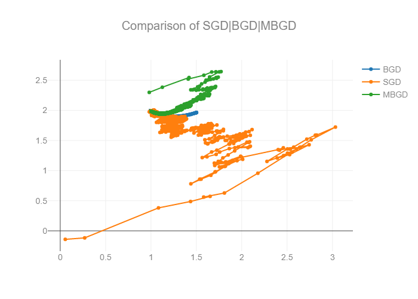

### 引言

本节介绍在线学习的一些基本形式及应用，首先提出梯度下降的几个方式，然后给出一般的迭代算法的统一框架，最后以FTRL进行分析，规约为统一的迭代框架等。

### 梯度下降三种形式

首先我们看一下GD下降的三种变形BGD,SGD,MBGD,

给定训练集$S=\{(\boldsymbol{x_{i}},y_{i});i=1, \ldots, m\ , \boldsymbol{x_{i} \in \mathbb{R}^{n}}\} $，设目标损失函数为$l(w, x, y)$，待优化参数 ：$w$,学习率$\alpha$

- BGD

  采用整个训练集的数据
  $$
  w_{t+1}=w_{t}-\frac{\alpha}{m}\sum_{i=0}^{m-1}\alpha_{w_{t}}\nabla_{w_{t}}l(w_{t}, x_i, y_i)
  $$
  我们每一次的参数更新都用到了所有的训练数据（比如有m个，就用到了m个），如果训练数据非常多的话，**是非常耗时的**

- SGD

  采用对每个样本进行更新
  $$
  w_{t+1}=w_{t}-\alpha\nabla_{w_{t}}l(w_{t}, x_i, y_i)
  $$
  随机梯度下降是通过每个样本来迭代更新一次，但是，SGD伴随的一个问题是噪音较BGD要多，***使得SGD并不是每次迭代都向着整体最优化方向***

- MBGD

  对$n$个训练集进行更新
  $$
  w_{t+1}=w_{t}-\frac{\alpha}{n}\sum_{i=0}^{n-1}\nabla_{w_{t}}l(w_{t}, x_i, y_i)
  $$

上面两种梯度下降法可以看出，其各自均有优缺点，那么能不能在两种方法的性能之间取得一个折衷呢？**训练过程比较快，而且也要保证最终参数训练的准确率，**而这正是MBGD的初衷

因为对于在线学习方法，稀疏性问题需要特别关注：每次在线学习一个新 instance 的时候，优化方向并不一定是全局最优，不容易产生稀疏解，而简单截断又可能将从全局看不该稀疏掉的特征变为零。所以这里以 L1 正则为基础。

上面的结论可以通过下面的实验图进行说明 。



### 梯度下降优化算法框架

- 当前梯度：$ g_t = \nabla f(w_t) $

- 根据历史梯度计算当前一阶与二阶动量：$m_t = M_1(g_1,g_2,...,g_t) ;\  V_t = M_2(g_1,g_2,...,g_t) $

- 计算下降梯度：$\nabla=\frac{m_{t}}{\sqrt{V_t}}$

- $w^{(t+1)}=w^{(t)}-\alpha\nabla$

  

1. SGD

   $m_t = g_t$

   > SGD 的缺点在于收敛速度慢，可能在鞍点处震荡

2. Momentum
   $$m_t = \beta \cdot m_{t-1} + (1-\beta)\cdot g_t $$

   > 参数更新方向不仅由当前的梯度决定，也与此前累积的下降方向有关。
   > 参数中那些梯度方向变化不大的维度可以加速更新，并减少梯度方向变化较大的维度上的更新幅度。
   > 由此产生了加速收敛和减小震荡的效果

3. AdaGrad
   $V_t = \sum\limits^t_{i=1} g^2_i$

   > 一般为了避免分母为0，会在分母上加一个小的平滑项
   >
   > 参数更新越频繁，二阶动量越大，学习率越小，可能会提前结束学习过程

4. AdaDelta
   $$  V_t = \beta \cdot V_{t-1} + (1-\beta) \cdot g_t^2  $$

   > 避免了二阶动量持续累积、导致训练过程提前结束的问题

5. Adam
   $m_t = \beta_1 \cdot m_{t-1} + (1-\beta_1)\cdot g_t \  \\V_t = \beta_2 \cdot V_{t-1} + (1-\beta_2) \cdot g_t^2  $

   > 前者控制一阶动量，后者控制二阶动量

### FTRL推导

#### 提出意义

​	在Online learning的场景，SGD不能带来稀疏解。**类似ctr预估的模型的特征空间在亿级别，好的公司在百亿级别，不能训练出稀疏解即代表没有办法实际使用模型**。举个具体的例子，比如搜索公司做网页排序的时候，数据量超级大，往往训练集跟特征都到百亿规模，一般每个sample的特征也达到几千个左右，如果稀疏解，百亿的参数最后计算，可能往往只有几千万个特征有值，其实的特征都被正则掉了，那么一个sample参与计算的从几千个降至几百个，类似降维，对整个计算有很大的意义。

​	如何保持正则稀疏之后 有非常高的精度，成了整个优化学习领域非常有研究的课题。幸运的是，学术界和工业界都在研究能学习出高精度且稀疏的模型。先从最简单的想法开始，既然SGD不能直接得到稀疏解，我们可以将小于一定阈值的weight置为0，但由于online是一个样本过来就训练，那么就有可能因为训练不充分导致了weight小，这样简单截断损失很大。随后FOBOS、RDA、FTRL等算法提出，其中RDA是微软10年的工作，FTRL是google的H. Brendan McMahan 3年的工作，FTRL结合了FOBOS高精度以及RDA较好的稀疏性的特点。

#### 表示形式

FTRL算法是Google在2013年的一篇论文《Ad Click Prediction: a View from the Trenches》中提到的参数在线学习算法，论文中提到该算法用在了Google的搜索广告在线学习系统中。因为算法比较容易理解且工程实现不复杂，业内诸多公司都有尝试并取得了不错的收益。　现在FTRL是一个online learning的框架，能解决的问题绝不仅仅是LR，已经成了一个通用的优化算子，比如TensorFlow的optimizer中都包含了FTRL

进行$w_{t+1}​$迭代更新的时代 ，用以下式子求$argmin​$得到方向 ，而非$w_{t}-\alpha\nabla​$，后面我们证明公式等价。

$令f(w)= \displaystyle \sum_{s=1}^tg_{s}w+\frac{1}{2} \displaystyle \sum_{s=1}^t\sigma_{s}\left \| w-w_{s} \right \|_{2}^{2}+\lambda_{1}\left \| w \right \|+\frac{1}{2}\lambda_{2}\left \| w \right \|^{2}\\ =
 \displaystyle \sum_{s=1}^tg_{s}w+\frac{1}{2} \displaystyle \sum_{s=1}^t\sigma_{s}(w^{T}w-2w^{T}w_{s}+w_{s}^{T}w_{s})+\lambda_{1}\left \| w \right \|+\frac{1}{2}\lambda_{2}\left \| w \right \|^{2} \\=\displaystyle (\sum_{s=1}^tg_{s}-\sum_{s=1}^t\sigma_{s}w_{s})w+\frac{1}{2}(\sum_{s=1}^t\sigma_{s}+\lambda_{2})w^{T}w+\lambda_{1}\left \| w \right \|+const \\ =
z_{t}^{T}w+\frac{1}{2}(\frac{1}{\eta_{t}}+\lambda_{2})w^{T}w+ \lambda_{1}\left \| w \right \|+const  \qquad①$

其中$g_i$是$f(w)$在点$w_i$的次梯度（或者梯度）


#### 权重值计算

定义 $z_{t-1}=\displaystyle \sum_{s=1}^{t-1}g_{s}-\sum_{s=1}^{t-1}\sigma_{s}w_{s}​$

$\therefore z_{t}=\displaystyle \sum_{s=1}^{t-1}g_{s}+g_{t}-(\sum_{s=1}^{t-1}\sigma_{s}w_{s}+\sigma_{t})=z_{t-1}+g_{t}-(\frac{1}{ \eta_{t}}-\frac{1}{\eta_{t-1}})w_{t}​$

①求导可得 $z_{t}+(\frac{1}{\eta_{t}}+\lambda_{2})w+\lambda_{1}\partial\left \| w \right \|=0$，其中 $\eta_{t}+\lambda_{2} >0 $

$\partial\left \| w \right \|=\begin{cases}   1 &{w>0}\\-1&{w>0} \end{cases}​$

1. 当$|z_{ti}|<\lambda_{1}$时，

   $\begin{cases}  w_{i}>0 &{w_{i}=\frac{-z_{i}-\lambda_{1}}{\frac{1}{\eta_{t}}+\lambda_{2}}<0 }\\  w_{i}<0 &{w_{i}=\frac{-z_{i}+\lambda_{1}}{\frac{1}{\eta_{t}}+\lambda_{2}}>0} \end{cases}​$ 不成立，所以 $w_{i}=0​$

2. $z_{ti}>\lambda_{1}​$,采用同样的方法，得$w_{i}<0​$,$w_{i}=\frac{-z_{i}+\lambda_{1}}{\frac{1}{\eta_{t}}+\lambda_{2}}​$

3. $z_{ti}<\lambda_{1}$,采用同样的方法，得$w_{i}>0$,$w_{i}=\frac{-z_{i}-\lambda_{1}}{\frac{1}{\eta_{t}}+\lambda_{2}}$

#### 与标准迭代算法一致

FTRL算法是正则项为$D$的SGD算法

①SGD: $w_{t+1}=w_{t} -  \eta_{t}g_{t}​$

②FTRL: $w_{t+1}=\arg\underset{w}{\min}（ \displaystyle \sum_{s=1}^tg_{s}w+\frac{1}{2} \displaystyle \sum_{s=1}^t\sigma_{s}\left \| w-w_{s} \right \|_{2}^{2}+\lambda_{1}\left \| w \right \|）​$

令$\lambda_{1}=0$  $f(w)=\arg\underset{w}{\min}（ \displaystyle \sum_{s=1}^tg_{s}w+\frac{1}{2} \displaystyle \sum_{s=1}^t\sigma_{s}\left \| w-w_{s} \right \|_{2}^{2}+\lambda_{1}\left \| w \right \|）$

$f(w)​$是一个凸函数，求极值得

$\frac{\partial f(w)}{\partial w}=\displaystyle \sum_{s=1}^tg_{s}+\displaystyle \sum_{s=1}^t\sigma_{s}(w-w_{s})=0$

得到$\displaystyle \sum_{s=1}^tg_{s}+\displaystyle \sum_{s=1}^t\sigma_{s}(w_{t+1}-w_{s})=0$

$ \displaystyle \sum_{s=1}^t\sigma_{s}w_{t+1}= \displaystyle \sum_{s=1}^t(\sigma_{s}w_{s}-g_{s})$,$\because  \displaystyle \sum_{s=1}^t\sigma_{s}$定义为$\frac {1}{\eta_{t}}$

$\therefore  $

$\begin{cases}  \frac {1}{\eta_{t}}w_{t+1}= \displaystyle \sum_{s=1}^t(\sigma_{s}w_{s}-g_{s}) \\ \frac {1}{\eta_{t-1}}w_{t}= \displaystyle \sum_{s=1}^{t-1}(\sigma_{s}w_{s}-g_{s}) \end{cases}\Rightarrow  \frac {1}{\eta_{t}}w_{t+1}-\frac {1}{\eta_{t-1}}w_{t}=\sigma_{t}w_{t}-g_{t}=(\frac {1}{\eta_{t}}-\frac{1}{\eta_{t-1}})w_{t}-g_{t}$

同乘$\eta_{t}$ 得$w_{t+1}=w_{t}-\eta_{t}g_{t}$


接下来，实验各种迭代算法表现

```python
from matplotlib import cm
from mpl_toolkits.mplot3d import Axes3D
import matplotlib.pyplot as plt
import numpy as np
import tensorflow as tf

def cost_func(x=None, y=None):
    if not x:
        x = tf.placeholder(tf.float32, shape=[None, 1])
    if not y:
        y = tf.placeholder(tf.float32, shape=[None, 1])
    return x, y, f(x, y)

def f(x, y):
    return 100*tf.square(x)+tf.square(y)

plt.ion()
fig = plt.figure(figsize=(3, 2), dpi=300)
ax = fig.add_subplot(111, projection='3d')
plt.subplots_adjust(left=0, bottom=0, right=1, top=1, wspace=0, hspace=0)
params = {'legend.fontsize': 3,
          'legend.handlelength': 3}
plt.rcParams.update(params)
plt.axis('off')

x, y, z = cost_func()

x_val = y_val = np.arange(-1.5, 1.5, 0.005, dtype=np.float32)
x_val_mesh, y_val_mesh = np.meshgrid(x_val, y_val)
x_val_mesh_flat = x_val_mesh.reshape([-1, 1])
y_val_mesh_flat = y_val_mesh.reshape([-1, 1])
with tf.Session() as sess:
    z_val_mesh_flat = sess.run(z, feed_dict={x: x_val_mesh_flat, y: y_val_mesh_flat})
z_val_mesh = z_val_mesh_flat.reshape(x_val_mesh.shape)
levels = np.arange(-10, 1, 0.05)
ax.plot_wireframe(x_val_mesh, y_val_mesh, z_val_mesh, alpha=.5, linewidths=0.4, antialiased=True)
ax.plot_surface(x_val_mesh, y_val_mesh, z_val_mesh, alpha=.4, cmap=cm.coolwarm)
plt.draw()

x_i = 0.1
y_i = 1.0

x_var, y_var = [], []
for i in range(7):
    x_var.append(tf.Variable(x_i, [1], dtype=tf.float32))
    y_var.append(tf.Variable(y_i, [1], dtype=tf.float32))

cost = []
for i in range(7):
    cost.append(cost_func(x_var[i], y_var[i])[2])

ops_param = np.array([
                     ['Adadelta', 50.0, 'b'],
                     ['Adagrad', 0.10, 'g'],
                     ['Adam', 0.05, 'r'],
                     ['Ftrl', 0.5, 'c'],
                     ['GD', 0.01, 'm'],
                     ['Momentum', 0.01, 'y'],
                     ['RMSProp', 0.02, 'k']
                     ])

ops = []
ops.append(tf.train.AdadeltaOptimizer(float(ops_param[0, 1])).minimize(cost[0]))
ops.append(tf.train.AdagradOptimizer(float(ops_param[1, 1])).minimize(cost[1]))
ops.append(tf.train.AdamOptimizer(float(ops_param[2, 1])).minimize(cost[2]))
ops.append(tf.train.FtrlOptimizer(float(ops_param[3, 1])).minimize(cost[3]))
ops.append(tf.train.GradientDescentOptimizer(float(ops_param[4, 1])).minimize(cost[4]))
ops.append(tf.train.MomentumOptimizer(float(ops_param[5, 1]), momentum=0.95).minimize(cost[5]))
ops.append(tf.train.RMSPropOptimizer(float(ops_param[6, 1])).minimize(cost[6]))

xlm = ax.get_xlim3d()
ylm = ax.get_ylim3d()
zlm = ax.get_zlim3d()
ax.set_xlim3d(xlm[0] * 0.5, xlm[1] * 0.5)
ax.set_ylim3d(ylm[0] * 0.5, ylm[1] * 0.5)
ax.set_zlim3d(zlm[0] * 0.5, zlm[1] * 0.5)
azm = ax.azim
ele = ax.elev + 40
ax.view_init(elev=ele, azim=azm)

with tf.Session() as sess:
    sess.run(tf.global_variables_initializer())
    last_x, last_y, last_z = [], [], []
    plot_cache = [None for _ in range(len(ops))]
    steps = 100
    for iter in range(steps):
        for i, op in enumerate(ops):
            _, x_val, y_val, z_val = sess.run([op, x_var[i], y_var[i], cost[i]])

            if plot_cache[i]:
                plot_cache[i].remove()
            plot_cache[i] = ax.scatter(x_val, y_val, z_val, s=3, depthshade=True, label=ops_param[i, 0], color=ops_param[i, 2])
            if iter == 0:
                last_z.append(z_val)
                last_x.append(x_i)
                last_y.append(y_i)
            ax.plot([last_x[i], x_val], [last_y[i], y_val], [last_z[i], z_val], linewidth=0.5, color=ops_param[i, 2])
            last_x[i] = x_val
            last_y[i] = y_val
            last_z[i] = z_val
        if iter == 0:
            legend = np.vstack((ops_param[:, 0], ops_param[:, 1])).transpose()
            plt.legend(plot_cache, legend)
        plt.savefig('fig/' + str(iter) + '.png')
        print('iteration: {}'.format(iter))
        plt.pause(0.0001)


```


