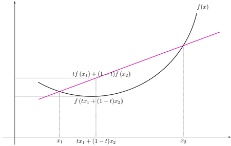

### 引言

本节介绍介绍凸相关的概念，包括凸优化定义,凸函数优化结果与性质， 具体的几个凸优化问题，拉格朗日条件及KKT条件等。

## 凸优化概述

#### 凸优化定义

凸优化是一大类特殊的优化问题，要求目标函数和约束函数都是凸函数的一类优化问题，

如下定义：
$$
\min_xf(x) \\g_i(x) \leq 0,\\ h_i(x) =0
$$
其中$f(x)、g_i(x) 、h_i(x)$都是凸函数 

研究定义于凸集中的凸函数最小化问题，在优化求解中局部最优解是全局最优解的特性奠定了优化问题里面的重要地位。如果对于业务问题，通过数学建模，归约为凸优化问题的话，能使相应问题得到彻底解决。

很多非凸优化或者$NP-hard​$问题可以近似转为为$P​$的凸优化问题。例如在一些场景中，可以近似利用Duality 或者 Relaxation转化为凸优化。

#### 重要性

虽然现实生活中的绝大多数问题确确实实是非凸的，但是并不妨碍凸优化问题在许多问题上大展身手。往细说，比如线性回归，范数逼近，插值拟合，参数估计以及许多几何问题都可以采用凸优化。往大了说，在通信，机器学习，统计，金融等设计优化、决策的领域，凸优化都是非常有效的手段。机器学习中很多优化问题都要通过凸优化来求解。


## 凸优化知识体系

- **凸集**，定义目标函数和约束函数的定义域。
- **凸函数**，定义优化相关函数的凸性限制。
- **凸优化**，中心内容的标准描述。
- **凸优化问题求解**，核心内容。相关算法，梯度下降法、牛顿法、内点法等。
- **对偶问题**，将一般优化问题转化为凸优化问题的有效手段，求解凸优化问题的有效方法。

> 凸集

称集合$S \subseteq \mathbf R^n $ 为一个凸集，如果对于 $\forall x,y\in S,0 \leq \lambda\leq1$，必有$\lambda x+(1-\lambda)y \in $S

下面介绍一个怎么找一个二维凸包的算法Graham Scan，假定给$N$个点，找出包含这$N$个点的最小的凸包

```python
#Graham Scan
import numpy as np
import matplotlib.pyplot as plt
import matplotlib.animation as animation  

fig=plt.figure()  
def RightTurn(p1, p2, p3):
    if (p3[1]-p1[1])*(p2[0]-p1[0]) >= (p2[1]-p1[1])*(p3[0]-p1[0]):
        return False
    return True

def update_line(L):
    plt.clf()
    plt.plot(P[:,0],P[:,1],".r") 
    plt.plot(L[:,0],L[:,1], 'b-', picker=5)  

def GrahamScan(P):
    for i in range(2,len(P)):
        L_upper.append(P[i])
        while len(L_upper) > 2 and not RightTurn(L_upper[-1],L_upper[-2],L_upper[-3]):
            del L_upper[-2]
        yield np.array(L_upper)
    for i in range(len(P)-3,-1,-1):
        L_lower.append(P[i])
        while len(L_lower) > 2 and not RightTurn(L_lower[-1],L_lower[-2],L_lower[-3]):
            del L_lower[-2]
        yield np.array(L_upper + L_lower)

N=50       
P = [(np.random.randint(-300,300),np.random.randint(-300,300)) for i in range(N)]
P.sort()            
P = np.array(P)     
L_upper = [P[0], P[1]]
L_lower = [P[-1], P[-2]]   
ani = animation.FuncAnimation(fig, update_line, GrahamScan(P))  
ani.save('convex.gif', dpi=80, writer='imagemagick')
```


> 凸函数

集合$S \subseteq \mathbf R^n $ 为凸集,称$f:S\to R$为凸函数，如果对于 $\forall x,y\in S,0 \leq \lambda\leq1$，必有$f(\lambda x+(1-\lambda)y)\leq \lambda f(x)+(1-\lambda)f(y)$



因此，凸函数的几何含义是：函数任意两点$A1​$和$A2​$之间的部分位于弦$A1A2​$的下方或曲线任一点切线上方，不严谨一个说法：割线始终位于两点间函数曲线的上方


#### 定理1 凸函数的一阶特征

$S \subseteq \mathbf R^n ​$ 为凸集,称$f:S\to R​$为凸函数 $\Leftrightarrow​$ $\forall x,y \in S, f(y)\geq f(x)+\nabla^{T}f(x)(y-x) ​$

证明：必要性：
$$
\begin{align}
& \forall x,y \in S,\lambda \in(0,1)\\
& f(\lambda y+(1-\lambda)x)=f(x+\lambda(y-x))\\
& f(x)+\lambda\nabla^{T}f(x)(y-x)+o(\lambda\left \|  y-x\right \|)\\
& \leq \lambda f(y)+(1-\lambda)f(x) \\
& 同除\lambda有 f(x)+\nabla^{T}f(x)(y-x)+\frac{o(\lambda\left \|  y-x\right \|)}{\lambda}\leq f(y) \\
& \Rightarrow f(x)+\nabla^{T}f(x)(y-x) \leq f(y)
\end{align}
$$


​	   充分性：
$$
\begin{align}
&\forall x,y \in S,\lambda \in(0,1)\Rightarrow z=\lambda x+(1-\lambda)y \\
&f(x)\geq f(z)+\nabla^{T}f(z)(x-z)\\
& f(y)\geq f(z)+\nabla^{T}f(z)(y-z)\\
& \lambda f(x)+(1-\lambda)f(y)\geq f(z)+\lambda \nabla^{T}f(z)(x-z)+(1- \lambda)\nabla^{T}f(z)(y-z)\\ 
& = f(z)+\nabla^{T}f(z)(\lambda x+(1-\lambda)y-\lambda z-(1-\lambda)z)\\
& =f(z) \\
& 所以 \lambda f(x)+(1-\lambda)f(y)\geq f(\lambda x+(1-\lambda)y)
\end{align}
$$
凸函数一阶可微时具有的性质，下面给出该性质的几何解释

<div align="center">


</div>


看上图，凸函数$f(x)​$，在函数$f(x)​$上取一点$(x, f(x))​$做曲线的切线，切线的斜率为$k​$，可以看出对于凸函数$f(x)​$来说，切线始终是凸函数$f(x)​$的下界，我们看点$A、B​$，$B​$是曲线上一点，$A​$点是切线上一点，且$A、B​$的横坐标都为$y​$，则$B​$点的纵坐标始终大于$A​$点的纵坐标，于是便可得到上述性质：

​		$f(y)\geq f(x)+\nabla^{T}f(x)(y-x)$

当$y$不断逼近$x$时，则上式等号成立

#### 定理2 凸函数的二阶特征

$S \subseteq \mathbf R^n $ 为凸集,称$f:S\to R$为凸函数 $\Leftrightarrow$ $\forall x \in S,\nabla^{2}f(x)$半正定，即对于 $\forall y\in \mathbf R^n,y^{T} \nabla^{2}f(x)y\geq0$

证明： 必要性：$\forall p\in \mathbf R^n$，取$\lambda>0,\forall x\in S $,

​		$f(x+\lambda p)=f(x)+\lambda\nabla^{T}f(x)p+\frac{1}{2}\lambda^{2}\nabla^{2}f(x)p+o(\lambda\left \|  p\right \|^{2})\\
\geq f(x)+\lambda\nabla^{T}f(x)p \qquad 根据一阶特征\\
\Rightarrow p^{T}\nabla^{2}f(x)p+\frac{o(\lambda^2\left \|  p\right \|^{2})}{\frac{1}{2}\lambda^2}\geq0 \\ \Rightarrow p^{T}\nabla^{2}f(x)p​$

​	    充分性：设$\forall x,y \in S​$,则中值定理

​		$f(y)=f(x)+\nabla^{T}f(x)(y-x)+\frac{1}{2}(y-x)^{T}\nabla^{2}f(x)(y-x)\\
   \geq f(x)+\nabla^{T}f(x)(y-x)$

​	根据一阶特征，得到 $f$是凸函数

#### 定理3 凸函数局部最优解都是全局最优解

证明：设$x​$是局部最优解，而不是全局最优解，所以存在一个可行解，使得$f(x)>f(y)​$。并且有 $\forall z\in \left \{ \left \| x-z \right \| \right \} \leq R,f(z)\geq f(x)​$，

设$z=\theta y+(1-\theta)x，\theta=\frac{R}{2\left \|x-y  \right \|}​$

$\left \|x-z  \right \|\\=\left \| x-(\frac{R}{2\left \|x-y  \right \|}y+(1-\frac{R}{2\left \|x-y  \right \|})x)    \right \| \\ =\frac{R}{2}\leq R$

由凸函数定义$f(z)=f(\theta y+(1-\theta)x)\leq \theta f(y)+(1-\theta) f(x) <f(x)$

与局部最估解相矛盾

我们观察下面两幅图，形象感受一下为什么凸优化问题的局部最优解是全局最优解，

(1) 从下图可以看出当函数不是凸函数时，当对非凸函数f(x)进行最优化时，便可能得到局部最优解，无法获得全局最优解

(2) 从下图可以看出当目标函数可行域是非凸时，则此时对函数进行优化时也可能错过全局最优解

<div align="center">


</div>


> 凸优化几类问题

#### 线性规划

$$
\min_x c^{T}x \\Ax=b\\ x\geq0
$$


#### 二次规划

$$
\min_x c^{T}x+\frac{1}{2}x^{T}Qx \\Ax=b\\ x\geq0
$$


#### 半定规划


$$
\min_x C\cdot X \\A_{i} \cdot X=b_{i}\\ X \succeq 0
$$


#### 锥规划

$$
\min_x c^{T}x \\D(x)+d \in K\\ Ax=b
$$


#### 拉格朗日对偶性

为了解决上述的**凸优化问题**，我们引入拉格朗日乘子法*Lagrange Multiplier*来解决这个问题。

将约束最优化问题（原始问题）
$$
\min_xf(x) \\g_i(x) \leq 0,\\ h_i(x) =0
$$
构建拉格朗日乘子：
$$
{\cal L}(x, \alpha, \beta) = f(x)+\sum_i\alpha_ig_i(x)+\sum_i\beta_ih_i(x)
$$
这里要求$\alpha_i \geq0​$,又因为$g_i(x)\leq0,h_i(x)=0​$，所以${\cal L}(x, \alpha, \beta)\leq f(x)​$ 

即${\cal L}$取值是函数$f(x)$的下界。

称函数${\cal L}$为原问题的***Lagrange函数***，$\alpha,\beta$为原问题的***Lagrange乘子***。

对公式（1)两边同时最小化$x​$

$g(\alpha,\beta)=\underset{x} \min {\cal L}(x, \alpha, \beta) \leq\underset{x} \min f(x)=p^*​$  

称$g(\alpha,\beta)​$为原问题的***Lagrange对偶函数***

进一步，我们想知道$p^*​$最好的下界是什么，可以表述为以下问题

​					$\underset{\alpha_i>0, \beta} \max g(\alpha,\beta)​$     


定义：
$$
\theta_p(x) = \max_{\alpha_i>0, \beta}{\cal L}(x, \alpha, \beta)
$$
观察$\theta_p(x)​$：

1. 如果$g_i(x)>0​$，那么$\theta_p(x)=+\infty​$（因为$\alpha​$可以取任意大值）。
2. 如果$h_i(x) \neq 0​$，那么$\theta_p(x)=+\infty​$（因为$\beta​$可以取$+\infty/-\infty​$）。

所以，在满足约束的情况下，$\theta_p(x)=f(x)​$，$\underset{x} \min \theta_p(x)=\underset{x}\min f(x)​$，因为使得${\cal L}(x, \alpha, \beta)​$最大的方法，就是其他所有项全是0。那么，可以得出这样的结论：
$$
\theta_p(x)=\begin{cases}
f(x), &\text{满足约束} \\\
\infty, &\text{不满足约束}
\end{cases}
$$
因此，在满足条件的情况下，$\underset{x} \min\theta_p(x)​$等价于$\underset{x} \min f(x)​$。

所以等价于$\underset{\alpha_i>0, \beta} \max g(\alpha,\beta) = \underset{\alpha_i>0, \beta} \max \underset{x} \min {\cal L}(x, \alpha, \beta)  \leq  \underset{x} \min f(x) \leq \underset{x} \min\theta_p(x)= \underset{x} \min\underset{\alpha_i>0, \beta} \max{\cal L}(x, \alpha, \beta) ​$

即$\underset{\alpha_i>0, \beta} \max \underset{x} \min {\cal L}(x, \alpha, \beta) \leq \underset{x} \min\underset{\alpha_i>0, \beta} \max{\cal L}(x, \alpha, \beta)​$    ①

如果①式等式成立，那么称之为强对偶性，由上面结论，强对偶性发生情况下，$\alpha_ig_i(x)=0$ 这条性质称为**互补松弛性** ， ①式还有一个形象的描述：**“宁为凤尾，不做鸡头”** 。


#### KKT 条件

设 $ x^* \in \mathbb{R}^{n},\alpha^* \in \mathbb{R}^{m}, \beta^* \in \mathbb{R}^{r} ​$，下列条件为KKT条件：

1. (主可行)  $g_i(x^*) \leq 0​$
2. (对偶可行) $\alpha_i^* \geq0​$
3. (互补松弛性) $\alpha_i^*g_i(x^*)=0 $
4. (拉格朗日梯度) $∇_x{\cal L}(x^*, \alpha^*, \beta^*)=0$

定理：对于凸优化问题，有$x^*​$原始最优，$\alpha^*,\beta^*​$对偶最优，且有强对偶性$\Leftrightarrow ​$ 满足KKT条件。

证明：

$\Rightarrow ​$ 1，2，3根据上面推论易得，

对于4，$\underset{x} \min\underset{\alpha_i>0, \beta} \max{\cal L}(x, \alpha, \beta)​$,因为 $\alpha^*,\beta^*​$对偶最优，所以$x^*​$为$\underset{x} \min{\cal L}(x, \alpha^*, \beta^*)​$的最优解，显然成立。

$\Leftarrow $如果存在$x^*,\alpha^*,\beta^*$满足KKT条件

由拉格朗日梯度可以得

那么$g(\alpha^*,\beta^*)
\\=\underset{x} \min{\cal L}(x, \alpha^*, \beta^*)
\\=\underset{x} \min f(x)+\sum_i\alpha_i^*g_i(x)+\sum_i\beta_i^*h_i(x)
\\=f(x^*)+\sum_i\alpha_i^*g_i(x^*)+\sum_i\beta_i^*h_i(x^*)
\\=f(x^*)$  

第一和第二个等式是由定义获得，第三个等式是根据KKT条件中4，第三个等式是根据KKT条件中3，已证。


综上所述，对于任何一个凸优化问题，如果原问题不容易求解，我们可以转化为对偶问题解决，可喜的是，下节SVM正好符合此条件，这节课，我们从凸优化出发，介绍了凸优化的一些性质，为后续求解各类问题奠定了基础。