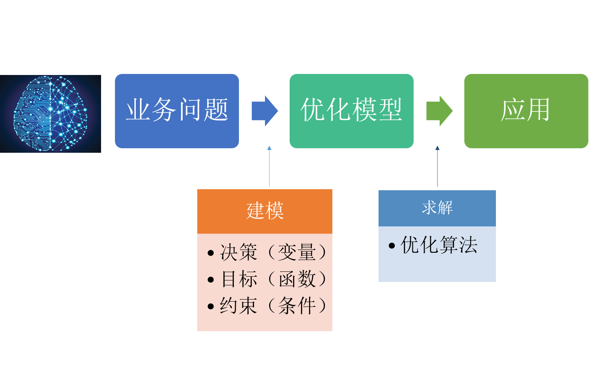
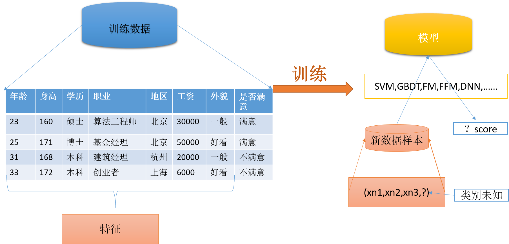
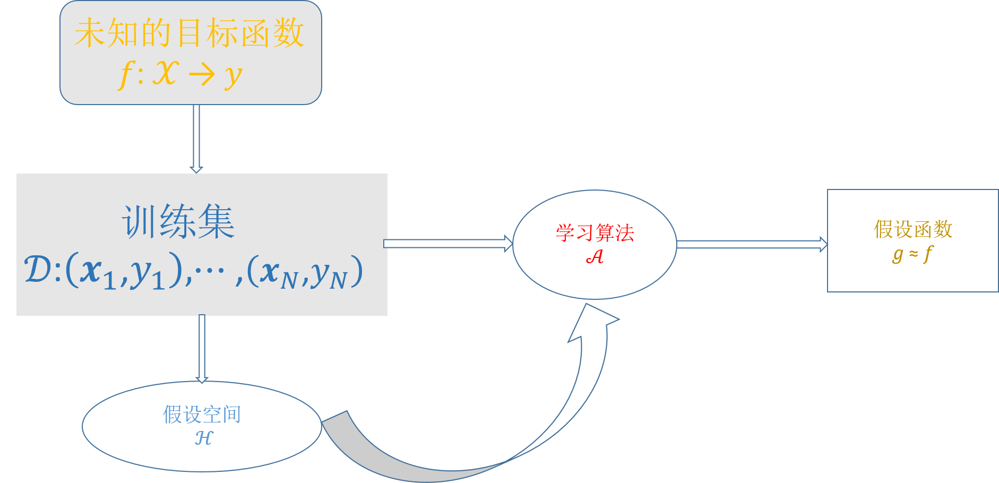
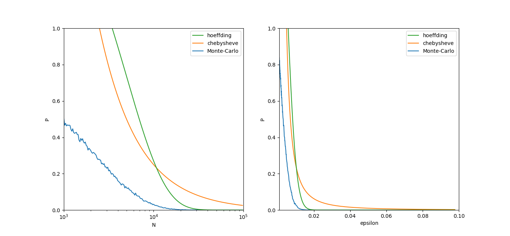
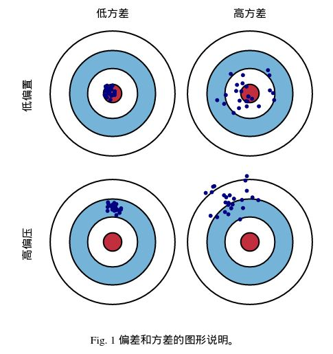
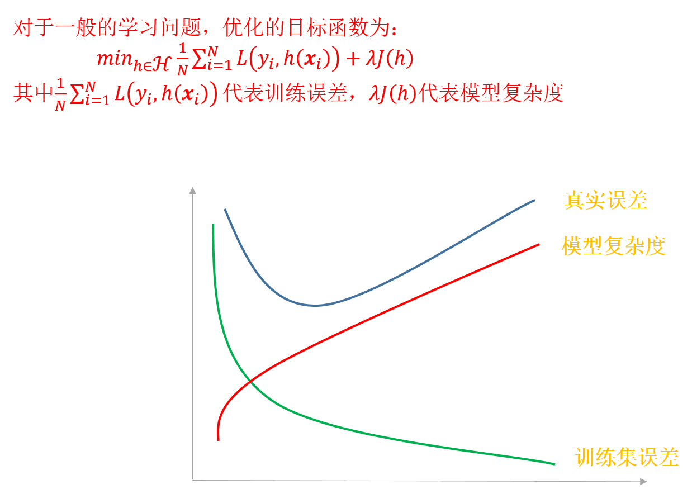
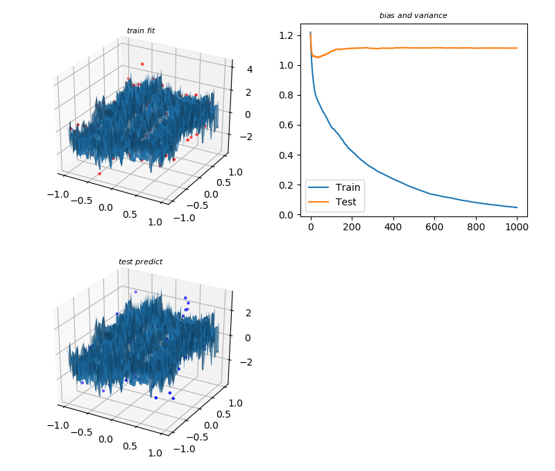
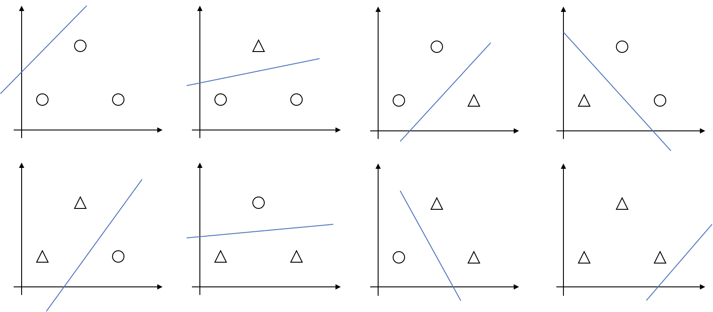

### 引言

本节介绍优化理论基本知识，包括机器学习到优化规约，泛化基础理论，VC维等基础知识 

### 优化问题概述与历史

优化问题是指在一定约束条件下最大化或最小化某一目标函数的问题，其变量可能是连续或离散的；研究这类问题的数学性质、求解算法和具体实现以及应用这些算法。一般是从建模到求解，然后再到决策，然后需要一套算法来求解。 如下图所示流程。



早在17世纪,英国科学家Newton发明微积分的时代,就已提出极值问题,后来又出现Lagrange乘数法.1847年法国数学家Cauchy研究了函数值沿什么方向下降最快的问题，提出最速下降法.，优化的历史比AI要长的多，但AI和机器学习又给了优化很大机会，底层的东西都是靠优化。

互联网的发展这么多年，数据大到一定程度以后，人为直接做规则已经远远超出能力之外，只能用数据量化来进行建模优化，用数学的方程、公式来描述它，然后进行决策，变成了一个优化问题。例如常用的搜索、推荐、广告、无人驾驶、物流、电商等底层优化算法起到了至关重要的作用。同样在国防领域、经济金融领域、交通领域，也可以根据实际的业务场景进行建模，优化各个流程环节，犹如邓爷爷所说“科学技术是第一生产力”，这种后台的优化在社会各个流程环节都做出过优秀的案例

### 机器学习转化为优化问题

#### 机器学习简述

以下面监督学习流程为例，讲述机器学习的流程



如上图所示，婚恋网站根据线上实际的介绍相亲对象的反馈，个性化的给男士或者女士介绍自己最合适的对象，根据历史相亲的实际情况，用年龄、身高、学历、工资等等当做特征来构造训练集，然后灌倒模型里面。来一批新人后，用模型来预测分数，介绍给相应的用户，提高了用户的体验。


#### 机器学习数学定义

机器学习本质就是根据给一堆数据$\{(\boldsymbol{x_{i}},y_{i});i=1, \ldots, N\ , \boldsymbol{x_{i} \in \mathbb{R}^{n}}\}$，能用算法$\mathcal{A}$发现在某个假设空间$\mathcal{H}$求出最佳的参数模型，用得到的模型$g$来预测新的数据,使得逼近未知的函数$f$，可以用下面这个图来表示。



下面考虑机器学习最常用的分类学习的场景：

**符号定义**：

| 符号                                                         | 意义                                                         |
| ------------------------------------------------------------ | ------------------------------------------------------------ |
| $(\boldsymbol x,y)  \overset{\text{i.i.d}}{\sim} P_{\boldsymbol x,y}$ | 服从某个未知分布$P$的输入输出对（特征、目标）                |
| $S = \{(\boldsymbol{x_{i}},y_{i});i=1, \ldots, n\} $,        | 训练集$S$,各实例间相互独立                                   |
| $\{h:\mathcal{X}\rightarrow \mathcal{Y}\mid h\in \mathcal{H}\}$ | 函数空间（模型空间）,模型的参数从这个函数空间选取            |
| $ \hat{R}_{n}(h) =\frac{1}{n}\displaystyle \sum_{i=1}^n \ell(h(\boldsymbol{x_{i}}),y_i)= \frac{1}{n} \sum_{i=1}^n \mathbf{1}\{h(\boldsymbol{x_{i}})\ne y_i\}$ | 经验误差,描述了模型对训练集的拟合程度                        |
| $ R(h) =\mathbb{E}[ \ell(h(\boldsymbol{x}),y)]= P_{(x,y)\sim P_{\boldsymbol x,y}}\mathbf{1}(h(\boldsymbol x)\ne y) $ | 泛化误差，描述了对真实分布 $P_{\boldsymbol x,y}$的拟合程度， |
| $\ell(h(\boldsymbol x),y) $                                  | $\begin{cases}   \mathbf{1}\{h(\boldsymbol{x})\ne y\} &{分类问题} \\ (h(\boldsymbol{x})- y)^{2} &{回归均方误差}\\-logP(y\mid\boldsymbol x) & {回归对数似然损失} \end{cases}$ |

经验误差可以从训练集中获得，泛化误差即真实情况下模型的误差，当train出来一个model之后，parameters已经定了下来。然后用新构造的数据集去test这个network。 泛化误差就是test的时候的误差。

对于监督学习问题，很显然目标是最小化泛化误差，可是并没有办法获知($P_{\boldsymbol x,y}$是未知的），所以实际过程中，我们还是优化经验误差

实际上采用经验风险最小化的策略，

> $\hat h=  \operatorname*{argmin}_{h\in \mathcal{H}}  \hat{R}_{n}(h)​$，(优化目标)
>
> $h^* = \operatorname*{argmin}_{h\in \mathcal{H}} R(h)​$ （逼近目标）

换句话说，$h^*​$是能力_上限_，但是 $\hat h​$ 为实际表现。


#### 监督学习转化为优化问题

对于几乎所有机器学习算法，无论是有监督学习、无监督学习，还是强化学习，最后一般都归结为求解最优化问题。那这个到底是怎么来的呢？大家有时候对于$w,x$具体的表示多维空间可能没有一个很直观的结果感受，下面的归约可以给大家一个例子

给定训练集$S=\{(\boldsymbol{x_{i}},y_{i});i=1, \ldots, m\ , \boldsymbol{x_{i} \in \mathbb{R}^{n}}\} ​$，选取什么损失函数，利用什么迭代算法，就显为重要。

下面以损失函数为平方损失函数，假设空间为线性空间，其它类似

 $min \displaystyle\sum_{i=1}^{m}(y_{i}-(w_{1}x_{1}+\cdots +w_{n}x_{n}  ))^{2}\\\Rightarrow min \displaystyle\sum_{i=1}^{m}\alpha_{i}w_{i}+ \displaystyle \sum_{i=1}^m\sum_{j=1}^{m}w_{i}w_{j}\beta_{ij}+\gamma​$​

其中$\alpha_{i},\beta_{ij},\gamma$都为常数，如果把$w$当做$x$，那么就可以写成求$f(x)$的最优解

故可以写为$\underset {x\in R^n}{min}  f(x)$,转化不含约束的求解

机器学习中几乎所有的问题到最后都能归结到一个优化问题，即求解损失函数的最小值。

### 优化问题的分类

最优化问题分为有约束优化问题与无约束优化问题。  

1. 无约束优化问题
        $\min f(x)$
2. 有约束优化问题
        $\min f_0(x)$
        s.t. $f_i(x) \le 0, i=1,2,...,m$ 
        s.t. $h_i(x) = 0, i=1,2,...,p$
    一般把带约束问题转化为无约束优化问题进行求解。比如拉格朗日乘子法：
       $\min L(x,\lambda,v) = f_0(x) + \displaystyle \sum_{i=1}^m \lambda_if_i(x) + \displaystyle \sum_{i=1}^p v_i h_i(x)$

### 泛化基本理论

对于机器学习，最重要的是训练集得到的模型是否对新数据起作用。但是目标函数$f$未知，仅仅依靠有限的训练集$D$，如何保证训练得到的模型是足够理想、确实是逼近目标函数的呢？毕竟大多数情况下，可选的目标函数集合有无穷多，根据以下霍夫丁不等式可以证明，一定存在这样的函数，使得模型误差超过某个值的概率小于特定的上限范围。

> $P(|\hat{R}_{n}(h^*)-R(h^*)|\geq\epsilon)\leq2e^{-2n\epsilon^{2}}​$


为了证明霍夫丁不等式，接下来会依次证明以下不等式和引理。

```flow
op1=>operation: 马尔科夫不等式
op2=>operation: 切比雪夫不等式
op3=>operation: 霍夫丁引理
op4=>operation: 霍夫丁不等式
e=>end

op1(right)->op2(right)->op3(right)->op4(right)-> e
```

#### 定理1 马尔科夫不等式

对于一个非负随机变量$X$,那么$\mathbb{P}(X>\epsilon)\leq\frac{E(X)}{\epsilon},\forall \epsilon>0$

证明：$X{\sim}p(x)$,那么$E(x)=\int_{0}^{+\infty }xp(x)dx\\\geq\int_{a}^{+\infty }xp(x)dx\\ \geq a\int_{a}^{+\infty }p(x)dx \\=a\mathbb{P}(X>\epsilon)$

​		

####  定理2 切比雪夫不等式

$X​$是一个随机变量，$E[X]=\mu​$，$Var[X]=\sigma^{2}​$。则$\forall\epsilon >0​$,$\mathbb{P}\left (|X-\mu|\geqslant \epsilon \right )\leq \frac{\sigma^{2}}{\epsilon^{2}}​$

证明：不妨设$X\sim p(x)$,$左边=\int _{|X-E(X)|\geq \epsilon}p(x)dx\\\leq \int _{|X-E(X)|\geq \epsilon}\frac{(X-E(X))^2}{\epsilon^2}p(x)dx\\\\\leq \frac{1}{\epsilon^2}\int_{-\infty }^{-\infty}(X-E(X))^2 p(x)dx\\=右边$


####  引理1 霍夫丁引理

$X$是一个随机变量，$E[X]=0$，$a<X<b$,那么$\forall\lambda >0$,

$E(e^{\lambda X})\leq e^{\frac{\lambda ^{2}(b-a)^{2} }{8}}$

证明：

​	显然$f(x)=e^{\lambda x}$是个凸函数，所以对于$\forall \alpha \in (0,1)$, $f(x)\leq\alpha f(a)+(1-\alpha) f(b)$

​	令$\alpha =\frac {b-x} {b-a}$,则

​	$e^{\lambda x} \leq \frac {b-x} {b-a}e^{\lambda a}+\frac{x-a} {b-a}e^{\lambda b},\forall x \in[a,b]$

​	两边取期望

​	$E(e^{\lambda x}) \leq \frac {b-E(X)} {b-a}e^{\lambda a}+\frac{E(X)-a} {b-a}e^{\lambda b}$

​	由 $E(X)=0$

​	得$E(e^{\lambda x}) \leq \frac {b} {b-a}e^{\lambda a}-\frac{a} {b-a}e^{\lambda b}$

​      			  $\xlongequal[p=\frac{-a} {b-a} ]{\Delta }(1-p)e^{\lambda a}+pe^{\lambda b}​$

  			  $\xlongequal[h=\lambda (b-a) ]{\Delta }(1-p)e^{-hp}+pe^{h(1-p)}​$

​			$=e^{-hp+ln(1-p+pe^{h})}$

​	故可需证$-hp+ln(1-p+pe^{h}) \leq \frac {h^{2}} {8} ,h>0$

​	令$g(h)=-hp+ln(1-p+pe^{h}) \leq \frac {h^{2}} {8}$,h>0

​	则${g}'(h)=-p+\frac {pe^{h}}{1-p+pe^{h}}-\frac{h}{4}$

​	   ${g}''(h)=\frac{(1-p)pe^{h}}{(1-p+pe^{h})^{2}}-\frac{1}{4}$

​                      $\leq \frac{1}{\frac{pe^{h}}{1-p}+\frac{1-p}{pe^{h}}+2}-\frac{1}{4}\leq0$

​	可得到以下条件${g}''(h)\leq0 \rightarrow({g}'(h)\downarrow;{g}'(0)=0 \rightarrow g(h)\downarrow,g(0)=0$

​	所以不等式成立

####  定理3 霍夫丁不等式

假设$X_{1},\cdots ,X_{n}$ 是相互独立的随机变量，$a_{i} \leq  X_{i} \leq b_{i}$，令$S_{n}=\sum_{i=1}^{n}X_{i}$，则对于$\forall  \epsilon>0$，

​		$P(|S_{n}-E(S_{n})|\geq \epsilon)\leq 2e^{\frac {-2\epsilon^{2}} {\sum_{i=1}^{n}(b_{i}-a_{i})^{2}}}$

证明：

​	$P(S_{n}-E(S_{n})\geq \epsilon)=P(e^{\lambda (S_{n}-E(S_{n})}\geq e^{\lambda \epsilon})$

​				       	  $\leq \frac{E(e^{\lambda(S_{n}-E(S_{n})})} {e^{\lambda \epsilon}}$

​	由于$X_{1},\cdots ,X_{n}$ 相互独立

​	$E(e^{\lambda(S_{n}-E(S_{n})})=E(e^{\lambda\sum_{i=1}^{n}(X_{i}-E(X_{i})})$

​				   $= \displaystyle\prod_{i=1}^{n}E(e^{\lambda(X_{i}-E(X_{i})})$, 令$Y_{i}=X_{i}-E(X_{i})$，由霍夫丁引理，

​			          $\leq  \displaystyle\prod_{i=1}^{n}e^{\frac{\lambda ^{2}(b_{i}-a_{i})^{2} } {8}}$

​	所以$P(S_{n}-E(S_{n})\geq \epsilon) \leq e^{-\lambda\epsilon+\frac{\lambda^{2}}{8}\sum_{i=1}^{n}(b_{i}-a_{i})^{2}} \forall \lambda>0$

 	当$\lambda=\frac {4\epsilon}{ \displaystyle\sum_{i=1}^{n}(b_{i}-a_{i})^{2}}$，右式达到最小值，代入即证结论。


定义：二项分布

设n是正整数，$0<p<1​$，则称${c_{n}^{k}p^{k}(1-p)^{n-1};k=0,...,n}​$为参数的分布记为n,p的二项分布，记为$binom(n,p)​$

注：E独立重复n次，E只有$A,\bar{A}，P(A)=p \in (0,1)$

n=1时，称binom(1,p)为二点分布，$P(X=x)=p^{x}(1-p)^{1-x},x=0,1$，记为Ber(p)

$X_{i}\overset{\text{i.i.d}}{\sim} Ber(p)$，那么$a_{i}=0,b_{i}=1$，则$S_{n}{\sim}binom(n,p)，E(S_{n})=np $

则根据定理$P(| \displaystyle\sum_{i=1}^{n}X_{i}-np|\geq n\epsilon)\leq2e^{\frac{-2(n\epsilon)^{2}} {\sum_{i=1}^{n}1}}$

​		即$P(|\frac{1}{n} \displaystyle\sum_{i=1}^{n}X_{i}-p|\geq \epsilon)\leq 2e^{-2n\epsilon^{2}}$


对于分类问题：

$n \hat{R}_{n}(h) {\sim}binom(n,R(h))，\mathbb{E}[ \hat{R}_{n}(h)]=R(h)=\mu,\sigma=R(h)(1-R(h))/n$,

切比雪夫不等式上限$P(|\hat{R}_{n}(h)-R(h)|\geq\epsilon)\leq\frac{1}{4n\epsilon^2}$

霍夫丁不等式上限$P(|\hat{R}_{n}(h)-R(h)|\geq\epsilon)\leq2e^{-2n\epsilon^{2}}$

假设函数空间有限，那么

$\begin{split} P(\forall h\in  \mathcal{H}, |R(h)-\hat{R}_{n}(h)|\le \epsilon) &= 1 -P(\exists h\in  \mathcal{H}, |R(h)-\hat{R}_{n}(h)|>\epsilon) \\ &\ge 1- \sum_{i=1}^{|\mathcal{H}|} P(|R(h)-\hat{R}_{n}(h)|>\epsilon) \\ &\ge 1-2|\mathcal{H}|e^{-2n\epsilon^{2}} \end{split}$

令

$2|\mathcal{H}|e^{-2n\epsilon^{2}} =\delta$,则$\sqrt{\frac{1}{2n}\log\frac{2\mathcal{H}}{\delta}}$

故存在至少 $1-\delta$ 的概率有

$P\left(\forall h \in \mathcal{H}, |R(h)-\hat{R}_{n}(h)|\le \sqrt{\frac{1}{2n}\log\frac{2|\mathcal{H}|}{\delta}}\right) \ge 1- \delta$


为了让读者有更好的不等式之间的形象感受，接下来会蒙特卡洛方法画出马尔科夫与切比雪夫的上限，给出在大数定律下结论

```python
from scipy import stats
import numpy as np
import matplotlib.pyplot as plt

fig = plt.figure()
ax_n = fig.add_subplot(121)
ax_e = fig.add_subplot(122)

p = 0.3
N_n = np.array(np.power(10, np.arange(3, 5, 0.01)), dtype=np.int32)
epsilon_n = 0.01
P_n = np.zeros(N_n.shape)
size = 8000
i = 0
for n in N_n:
    X = stats.binom.rvs(n, p, size=size)
    P_n[i] = np.count_nonzero(np.abs(X / n - p) > epsilon_n) *1.0/ size
    print(P_n[i])
    i += 1
 
chebysheve_n= 1 / (4 * N_n * epsilon_n * epsilon_n)
hoeffding_n = 2 * np.exp(-2 * N_n * epsilon_n * epsilon_n)

ax_n.plot(N_n, P_n, label="Monte-Carlo")
ax_n.plot(N_n, chebysheve_n, label="chebysheve")
ax_n.plot(N_n, hoeffding_n, label="hoeffding")
handles, labels = ax_n.get_legend_handles_labels()
ax_n.legend(handles[::-1], labels[::-1])
ax_n.set_xscale('log')
ax_n.set_xlim(10 ** 3, 10 ** 5)
ax_n.set_ylim(0, 1)
ax_n.set_xlabel("N")
ax_n.set_ylabel("P")

N_e = 10000
epsilon_e = np.power(10, np.arange(-3, -1, 0.01))
P_e = np.zeros(epsilon_e.shape)
i = 0
for e in epsilon_e:
    X = stats.binom.rvs(N_e, p, size=size)
    P_e[i] = np.count_nonzero(np.abs(X / N_e - p) > e) / size
    i += 1

chebysheve_e = 1 / (4 * N_e * epsilon_e * epsilon_e)
hoeffding_e = 2 * np.exp(-2 * N_e * epsilon_e * epsilon_e)

ax_e.plot(epsilon_e, P_e, label="Monte-Carlo")
ax_e.plot(epsilon_e, chebysheve_e, label="chebysheve")
ax_e.plot(epsilon_e, hoeffding_e, label="hoeffding")
handles, labels = ax_e.get_legend_handles_labels()
ax_e.legend(handles[::-1], labels[::-1])
ax_e.set_xlim(10 ** -3, 10 ** -1)
ax_e.set_ylim(0, 1)
ax_e.set_xlabel("epsilon")
ax_e.set_ylabel("P")

plt.show()
```

两个图分别为随$N​$和$\epsilon​$变化上限发生的变化。



#### 偏差、方差、泛化

偏差：描述的是预测值的期望与真实值之间的差距，偏差越大，越偏离真实数据
方差：预测值的方差，描述的是预测值的变化范围，离散程度，也就是离预测值期望值的距离，方差越大，数据的分布越分散

概念上理解比较抽象，下面我们通过下面一个例子来理解一下偏差和方差



如上图，我们假设一次射击就是一个机器学习模型对一个样本进行预测，射中红色靶心位置代表预测准确，偏离靶心越远代表预测误差越大。偏差则是衡量射击的蓝点离红圈的远近，射击位置即蓝点离红色靶心越近则偏差越小，蓝点离红色靶心越远则偏差越大；方差衡量的是射击时手是否稳即射击的位置蓝点是否聚集，蓝点越集中则方差越小，蓝点越分散则方差越大。

上一小节我们从概率论角度来给出泛化的一些理论解释，接下来，从另一个角度定义偏差和方差，对模型的泛化能力作出解释。

假设存在某未知函数$ h^*$， 观测到训练集$S = \{(\boldsymbol{x_{i}},y_{i});i=1, \ldots, n\} $，现要寻找拟合 $h^*$的一个函数 $\hat h$。
我们用均方差来衡量$ h $的拟合程度： $E[( h^*-\hat{h})^2]$, $y$为真实数据，$y^{'}$为观察数据
有如下推导
$E\left [ (h^*-y)^{2}\right ]
\\=E\left [ (h^* -\hat{h}+\hat{h}-y)^{2}\right]
\\=E\left [ (h^* -\hat{h})^{2}\right]+E\left [ (\hat{h} -y)^{2}\right] +2E\left [(h^* -\hat{h})(\hat{h}-y)\right]
\\=E\left [ (h^* -\hat{h})^{2}\right]+E\left [ (\hat{h} -y)^{2}\right]
\\=E\left [ (h^* -\hat{h})^{2}\right]+E\left [ (\hat{h} -y^{'}+y^{'}-y)^{2}\right]
\\=E\left [ (h^* -\hat{h})^{2}\right]+E\left [ (\hat{h} -y^{'})^{2}\right]+E\left [ (y^{'}-y)^{2}\right]+2E\left [ (\hat{h} -y^{'})(y^{'}-y)\right]
\\=E\left [ (h^* -\hat{h})^{2}\right]+ (\hat{h} -y^{'})^{2}+E\left [ (y^{'}-y)^{2}\right]
\\=variance+bias+noise
\\variance=E\left [ (h^* -\hat{h})^{2}\right]
\\bias= (\hat{h} -y^{'})^{2}
\\noise=E\left [ (y^{'}-y)^{2}\right]$

其中的 noise 是函数 $f​$ 本身的性质，可以看作一个常量；variance 和 bias 即方差和偏差，可以看出：$h​$ 越复杂，方差越大，同时由于可以对训练数据的刻画更细致，偏差减小。即模型的泛化能力(泛化误差)是由偏差、方差与数据噪声之和

所以一般在实际的机器学习训练中，都会在正则项来避免模型复杂度变大，如以下所示



```python
import numpy as np
from matplotlib import pyplot as plt
from mpl_toolkits.mplot3d import Axes3D
from sklearn.model_selection import train_test_split
from xgboost import XGBRegressor

axes = []
fig = plt.figure(figsize=(8, 8))
axes.append(fig.add_subplot(2, 2, 1, projection="3d"))
axes.append(fig.add_subplot(2, 2, 2))
axes.append(fig.add_subplot(2, 2, 3, projection="3d"))
fig.subplots_adjust(left=0.05, bottom=0.05, right=0.95, top=0.95, wspace=0.2, hspace=0.2)

m=100
sample=300
np.random.seed(1)
x = 2 * (np.random.random(sample) - 0.5)
y = 2 * (np.random.random(sample) - 0.5)

def f(x, y):
    return np.sin(x + y)+np.random.normal(0,1,sample)

z = f(x, y)
X, Y = np.column_stack((x.flatten(),y.flatten())), z.flatten()

mn = np.min(X, axis=0)
mx = np.max(X, axis=0)
X_mesh,Y_mesh = np.meshgrid(np.linspace(mn[0], mx[0], m), np.linspace(mn[1], mx[1], m))

seed = 7
test_size = 0.33
X_train, X_test, y_train, y_test = train_test_split(X, Y, test_size=test_size, random_state=seed)
model = XGBRegressor(random_state=0,n_estimators=1000)
eval_set = [(X_train, y_train), (X_test, y_test)]
model.fit(X_train, y_train, eval_metric=["rmse"], eval_set=eval_set, verbose=True)

axes[0].set_title(r"$train\ fit\ $", fontsize=8)
axes[0].scatter(X_train[:, 0], X_train[:, 1], y_train,marker='.',c='r')
axes[0].plot_surface(X_mesh, Y_mesh, model.predict(np.column_stack((X_mesh.flatten(),Y_mesh.flatten()))).reshape(m,m), alpha=0.7)

results = model.evals_result()
epochs = len(results['validation_0']['rmse'])
x_axis = range(0, epochs)
axes[1].plot(x_axis, results['validation_0']['rmse'], label='Train')
axes[1].plot(x_axis, results['validation_1']['rmse'], label='Test')
axes[1].legend()
axes[1].set_title(r"$bias\ and\ variance$", fontsize=8)

axes[2].set_title(r"$test\ predict\ $", fontsize=8)
axes[2].scatter(X_test[:, 0], X_test[:, 1], y_test,marker='.',c='b')
axes[2].plot_surface(X_mesh, Y_mesh, model.predict(np.column_stack((X_mesh.flatten(),Y_mesh.flatten()))).reshape(m,m), alpha=0.7)
plt.show()
```



上面的一个小例子说明，用gbdt随着迭代的次数越多，在训练集中误差越来越小，在测试集中误差先变小，然后到一定程度会，会逐渐变大，说明泛化能力在中间某一个阶段满足最优条件，


对于一般的训练集，函数空间跟训练集在什么关系下，误差能保持在一定的范围内，我们有以下小推论：

给定$|\cal H| = k$，给定$\delta, \gamma$，为了保证：
$$
\varepsilon({\hat h}) \leq \varepsilon(h) + 2\gamma
$$
的概率不小于$1-\delta$，那么$m$需要满足：
$$
m \geq \frac{1}{2\gamma^2}\log \frac{2k}{\delta} = O(\frac{1}{\gamma^2}\log \frac{k}{\delta})
$$
假如$\cal H$是以$d$个实数为参数的(比如为了解决*n*个特征的分类问题，*d*就等于*n+1*)，而在计算机中，实数多以64位浮点数保存，d个实数就需要64d位来存储，那么$\cal H$的整个假设空间大小就为$2^{64d}$，也即$k=2^{64d}$，那么：
$$
m \geq O(\frac{1}{\gamma^2}\log \frac{k}{\delta}) = O(\frac{d}{\gamma^2}\log \frac{1}{\delta})
$$
最直观的解释就是$m​$与假设类的参数数量几乎是成正比的。

#### VC 维

定义**Shatter（分散）**：给定一个由$d$个点构成的集合：$S=\lbrace x_{1}, \ldots, x_{n} \rbrace$，我们说一个假设类$\cal H$能够**分散(shatter)**一个集合$S$，如果$\cal H$能够实现对$S$的任意一种标记方式，也即，对$S$的任意一种标记方式，我们都可以从$\cal H$中找到对应的假设来进行分割。
举例而言，如果${\cal H} = \lbrace \text{linear classification in 2D} \rbrace$(二维线性分类器的集合)，对于二维平面上的三个点，有8种标记方式：



那么，蓝线所代表的线性分类器，都能完成对它们的标记，所以称$\cal H$能够分散平面上三个点所构成的集合。但是对于平面上四个点，就有存在以下这种情况，没有任何的线性分类器能够实现这种标记：


------

定义**Vapnik-Chervonenkis dimension（VC维）**：假设集$\cal H$的**VC维**，写成$VC({\cal H})$，指的是能够被$\cal H$分散的最大集合的大小。
举例而言，如果$\cal H$是所有二维线性分类器构成的集合，那么$VC(\cal H) = 3$。当然并不是说$\cal H$要能分散所有三个点构成的集合，只要有某个三个点构成的集合能被$\cal H$分散即可，比如下面这种标记方式，$\cal H$就无法实现，但是我们还是称$VC(\cal H) = 3​$。


有一个推论：

$VC({\text{linear classification of n D}}) = n + 1​$

VC-维 衡量模型复杂度。我们知道现在deep learning很强大，一个原因就是模型够复杂能逼近任意的函数（其实浅层的神经网络就可以做到这一点）。因为模型太复杂了所以需要喂大量的数据给deep model，不然就会over-fitting

------

定理：给定假设集合$\cal H$，令$VC({\cal H})=d$，那么，对于任意的$h \in {\cal H}$：
$$
|\varepsilon(h)-{\hat \varepsilon}(h)| \leq O(\sqrt{\frac{d}{m} \log \frac{m}{d} + \frac{1}{m} \log \frac{1}{\delta}})
$$
的概率不小于$1 - \delta​$，以及
$$
\varepsilon({\hat h}) \leq \varepsilon(h^\ast) + 2 \gamma, \gamma = O(\sqrt{\frac{d}{m} \log \frac{m}{d} + \frac{1}{m} \log \frac{1}{\delta}})
$$
的概率不小于$1-\delta$。


引理：为了保证$\varepsilon({\hat h}) \leq \varepsilon(h ^ \ast) + 2 \gamma$至少在$1 - \delta$的概率下成立，应该满足：
$$
m = O_{\gamma, \delta}(d)
$$
$O_{\gamma, \delta}(d)$指的是，在固定$\gamma, \delta$的情况下，与$d$线性相关。

也即，$m$必须与$\cal H​$的VC维保持一致，也可以这么理解，为了使泛化误差和训练误差近似，训练样本数目必须和模型的参数数量成正比。

------

在SVM中，给定数据集，如果只考虑半径R以内的点，以及间隔至少为$\gamma​$的线性分类器构成的假设类，那么：
$$
VC({\cal H}) \leq \lceil \frac{R^2}{4\gamma^2} \rceil + 1
$$
也就说明，$\cal H​$ 的VC维上限，并不依赖于数据集中点$x​$的维度，换句话说，虽然点可能位于无限维的空间中，但是如果只考虑那些具有较大函数间隔的分类器所组成的假设类，那么VC维就存在上界。

所以SVM会自动尝试找到一个具有较小VC维的假设类，所以它不会过拟合（模型参数不会过大）


这节我们先从机器学习形式出发，给出一些基本概念，把大部分机器学习问题规约为优化问题，然后证明机器学习在数据方面有效性理论（概率上界与泛化误差），接着给出VC维概念，给出如何在理论上选取函数空间的必要性。可能理论比较多，多谢大家阅读。