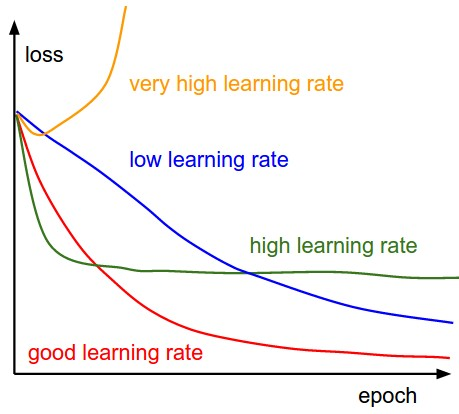

### 引言

本节介绍优化理论的几种算法，首先提出机器学习转化为优化算法后正则的一些基础知识，然后提出迭代算法的统一结构，最后我们以最基本的梯度下降算法，牛顿法与共轭梯度法来进行展开，给出优化算法的基础知识等。

### $L1$与$L2$正则

#### 从图形角度

为了防止过拟合，通常会在损失函数后面增加惩罚项 L1 正则或者 L2 正则：

- **L1 正则化**是指权值向量 w 中各个元素的绝对值之和，通常表示为$\left \| w \right \|_1$；
- **L2 正则化**是指权值向量 w 中各个元素的平方和然后再求平方根，通常表示为$\left \| w \right \|_2$。

其中，**L1 正则**可以产生**稀疏性**，即让模型部分特征的系数为 0。这样做有几个好处：首先可以让模型简单，**防止过拟合**；还能**选择有效特征**，提高性能。

如上图：最优解出现在损失函数的等值线和约束函数 L1 相切的地方，即凸点，而菱形的凸点往往出现在坐标轴上（系数 $w^1$ 或 $w^2$ 为 0），最终产生了稀疏性。

**L2 正则**通过构造一个所有参数都比较小的模型，**防止过拟合**。但 L2 正则不具有稀疏性，原因如下图，约束函数 L2 在二维平面下为一个圆，与等值线相切在坐标轴的可能性就小了很多。

#### 从概率角度

在最大似然估计中，假设权重$\boldsymbol w$是未知的参数，则对数似然损失函数为

$-logP(y\mid\boldsymbol x;\boldsymbol w)​$

假设$y\sim N(\boldsymbol w\boldsymbol x,\sigma^{2})​$的高斯分布

则$l(w)=-log(\displaystyle  \prod_{i=0}^nP(y\mid\boldsymbol x;\boldsymbol w))\\
            =-log(\displaystyle  \prod_{i=0}^n \frac{1}{\sqrt{2\pi}\sigma}e^{-\frac{(y_{i}-\boldsymbol w \boldsymbol x_{i})^{2}}{2\sigma^{2}}})\\
            =\frac{1}{2\sigma^{2}}\displaystyle \sum_{i=1}^{n}(y_{i}-\boldsymbol w \boldsymbol x_{i})^{2}+C$

在最大后验估计中，将权重$w$看作随机变量，则有

$P(\boldsymbol w\mid\boldsymbol x,y)\\
=\frac{P(\boldsymbol w,\boldsymbol x,y)}{P(\boldsymbol x,y)}\\
=\frac{P(y\mid \boldsymbol x,\boldsymbol w)P(\boldsymbol x|\boldsymbol w)P(\boldsymbol w)}{P(\boldsymbol x,y)} \\ 
\propto P(y\mid \boldsymbol x,\boldsymbol w)P(\boldsymbol w)$

上述式子$\boldsymbol x$与$\boldsymbol w$无关的，因此$P(x\mid \boldsymbol w)=P(x)$可以认为是一个常数，

而$P(Y\mid \boldsymbol x,\boldsymbol w)$并不是一个常数，在$\boldsymbol x$已知的情况下，不同的$\boldsymbol w$,$y$不同

所以 $\boldsymbol w_{MAP}= logP(y\mid \boldsymbol x,\boldsymbol w)P(\boldsymbol w)= logP(y\mid \boldsymbol x,\boldsymbol w)+logP(\boldsymbol w)$

若假设$w_{i} $为先验分布均值为0的高斯分布，即$ w_{i} \sim \frac{1}{\sqrt{2\pi}\sigma}e^{-\frac{w^{2}_{i}}{2\sigma^{2}}} $，则

$logP(\boldsymbol w)=log\displaystyle  \prod_{i=0}^nP(w_{i})\\
=log\displaystyle  \prod_{i=0}^n  \frac{1}{\sqrt{2\pi}\sigma}e^{-\frac{w^{2}_{i}}{2\sigma^{2}}}\\
=-\frac{1}{2\sigma^{2}}\displaystyle \sum_{i=0}^n w^{2}_{i}+C$

若假设$w_{i} $为先验分布均值为0，参数为$\alpha$的Laplace分布，即$w_{i} \sim \frac{1}{\sqrt{2\alpha}}e^{-\frac{|w_{i}|}{\alpha}} $，则

$logP(\boldsymbol w)=log\displaystyle  \prod_{i=0}^nP(w_{i})\\
=log\displaystyle  \prod_{i=0}^n  \frac{1}{\sqrt{2\alpha}}e^{-\frac{|w_{i}|}{\alpha}}\\
=-\frac{1}{\alpha}\displaystyle \sum_{i=0}^n |w_{i}|+C$

- $L1$ 正则化可通过假设权重$\boldsymbol w$的先验分布为拉普拉斯分布，由最大后验概率估计导出；

- $L2$ 正则化可通过假设权重 $\boldsymbol w$的先验分布为高斯分布，由最大后验概率估计导出。

  

### 迭代算法的结构

给定初始点$x_{0}​$

1. 确定搜索方向$d_{k}$,按照一定规则构造$f$在$x_{k}$点处的下降方向为搜索方向 
2. 先好方向后，确定步长因子$\alpha_{k}​$
3. 令$x_{k+1}=x_{k}+\alpha_{k}d_{k}$
   - [ ] 若$x_{k+1}$满足某种终止条件，停止迭代，得到近似最优解
   - [ ] 否则，重复以上步骤

一个好的算法则有$\left \{ x_{k} \right \}$稳定接近局部极小值$x^{*}$领域，然后迅速收敛于$x^{*}$

优化算法的迭代主要受两个因素影响，一个是***学习率***，一个是***方向***

#### 学习率

|            | 学习率 大                  | 学习率 小                  |
| ---------- | -------------------------- | -------------------------- |
| 学习速度   | 快                         | 慢                         |
| 使用时间点 | 刚开始训练时               | 一定轮数过后               |
| 副作用     | 1.易损失值爆炸；2.易振荡。 | 1.易过拟合；2.收敛速度慢。 |

这里$\alpha $是学习率，有的地方也可以叫步长，如果学习率太小，会导致网络loss下降非常慢，如果学习率太大，那么参数更新的幅度就非常大，就会导致网络收敛到局部最优点，或者loss直接开始增加，如下图所示

下面以GD算法为基础，提出***牛顿法***与***共轭梯度下降法***

### 梯度下降

设第$k​$次迭代值为$x_k​$，$f(x)​$在$x_k​$附近一阶泰勒展开：

$f(x)=f(x_{k})+∇f(x_{k})(x-x_{k})+o(\left \| x-x_{k} \right \|)​$  ①

记$x-x_{k}=\lambda_k \alpha$，当$\lambda_k$固定后，由cauchy不等式

$|∇f(x_{k})\alpha|\leq\left \| ∇f(x_{k}) \right \|  \left \|\alpha \right \|$

当且仅当$\alpha=-∇f(x_{k}) $，值最小,***所以$∇f(x_{k}) $，即梯度负方向 是局部下降最快方向***

第$k+1$次迭代值$x_{k+1}$:

$x_{k+1}=x_{k}+\lambda_k(-∇f(x_{k}))$

$\lambda _k$是步长，$f(x_{k}+\lambda_kp_k)=\underset {\lambda≥0}{min} \ f(x_{k}+\lambda (-∇f(x_{k})))$

***几何意义***：

对于公式①，把$f(x_{k})$及$x_{k}$看成常量,这相当于关于$x$的一次函数:

当步长足够小时,找原函数的最低点,相当于找这条直线的最低点

### 牛顿法

设第$k​$次迭代值为$x_k​$，$f(x)​$在$x_{k}​$附近二阶泰勒展开：

$f(x)=f(x_{k})+∇f(x_{k})(x-x_{k})+\frac{1}{2}(x-x_{k})^T∇^2f(x_{k})(x-x_{k})+o(\left \| x-x_{k} \right \|)​$   ②

极小值，令$∇f=0$,两边作用梯度算子

对二阶泰勒展开作用一个梯度算子

$∇f(x_{k})+∇^2f(x_{k})(x-x_{k})=0$

第$k+1$次迭代值$x_{k+1}$:

$x_{k+1}\leftarrow x_{k}-\lambda_k((∇^2f(x_{k}))^{-1}∇f(x_{k}))$

步长跟梯度下降一样

***几何意义***：

对于公式②，把$f(x_{k})​$及$x_{k}​$看成常量,这相当于关于$x​$的抛物线:

当步长足够小时,找原函数的最低点,相当于找这条抛物线的最低点

**牛顿法**也是求解**无约束最优化**问题常用的方法，**最大的优点是收敛速度快**。

从本质上去看，**牛顿法是二阶收敛，梯度下降是一阶收敛，所以牛顿法就更快**。**通俗地说**，比如你想找一条最短的路径走到一个盆地的最底部，梯度下降法 每次只从你当前所处位置选一个坡度最大的方向走一步，牛顿法在选择方向时，不仅会考虑坡度是否够大，还会考虑你走了一步之后，坡度是否会变得更大。所以， 可以说牛顿法比梯度下降法看得更远一点，能更快地走到最底部。

或者从几何上说，**牛顿法就是用一个二次曲面去拟合你当前所处位置的局部曲面，而梯度下降法是用一个平面去拟合当前的局部曲面**，通常情况下，二次曲面的拟合会比平面更好，所以牛顿法选择的下降路径会更符合真实的最优下降路径。

### 共轭梯度法

梯度下降更新过程简单，收敛速度慢；牛顿法收敛速度快，但更新过程复杂。共轭梯度法是介于GD与Newton之间的一种优化方法，有相对简单的更新规则，且收敛比较快。此流程可以不使用目标函数的一阶导数信息

共轭意味着正交，每一次参数更新都是沿着正交的搜索方法。

在很多优化的地方，要求求解$A^{-1}b​$,如凸优化$f(x)=\frac{1}{2}x^{T}Ax-b^{T}x​$或者求解线性方程组$Ax=b​$时，

下面介绍共轭梯度的概念与理论

定义： 共轭向量

称$u,v$这两个向量关于对称正定矩阵共轭

$\left ( u,v \right )_{A}=(Au,v)=(u,Av)=u^{T}Av=0$

***定理1：***向量组$X=\left \{x_{1},\cdots ,x_{n}  \right \} $,对于$\forall i,x_{i}\neq0,\forall i\neq j,x_{i}Ax_{j}=0$，则$X$为空间$R^{n}$的基向量

证明：假设$X$不是基向量，那么存在$\left \{ \alpha_{1},\alpha_{2},\cdots,\alpha_{n} \right \}$，使得$\displaystyle \sum_{i=1}^{n} \alpha_{i}x_{i}=0$,对于$\forall k\in{1,2,\cdots,n}$，得$\displaystyle \sum_{i=1}^{n} \alpha_{i}x_{i}Ax_{k}=0\Rightarrow \alpha_k x^{T}_{k}Ax_{k}=0$，因为$A$正定，所以对于$\forall \alpha_{k}=0$,矛盾

***定理2：***设$P=\left \{p_{1},\cdots ,p_{n}  \right \} $为一组共轭向量，假设$Ax=b$有线性解析解，可以用以下公式表示

$x=\displaystyle \sum_{i=1}^{n} \frac{p^{T}_{i}bp_{i}}{p^{T}_{i}Ap_{i}}$

证明：因为$P$是线性空间的基，如果线性方程组有解，那么可以表示为

​			$x=\displaystyle \sum_{i=1}^{n} \alpha_{i}p_{i}\\
\Rightarrow Ax=\displaystyle \sum_{i=1}^{n} \alpha_{i}Ap_{i}\\
\Rightarrow p^{T}_{k}Ax=\displaystyle \sum_{i=1}^{n} \alpha_{i}p^{T}_{k}Ap_{i} \\
\Rightarrow p^{T}_{k}b=\alpha_{k}p^{T}_{k}Ap_{k}​$

得$x=\displaystyle \sum_{i=1}^{n} \alpha_{i}p_{i}=\displaystyle \sum_{i=1}^{n} \frac{p^{T}_{i}bp_{i}}{p^{T}_{i}Ap_{i}}$

对于下面二次凸优化问题，我们进行梯度求解

$f(x)=\frac{1}{2}x^{T}Ax-b^{T}x\\
\frac{\partial f(x)}{\partial x}=Ax-b​$

设$r_{k}=b-Ax_{k}$为第$k$次残差

设梯度下降每次的方向是$p_{k}$

假设第一次优化方向为初始方向

​	$p_1=r_b=Ax_1$

每次优化的方向与之前优化方向正交，可采用下面Gram-Schmidt方法进行向量正交化进行向量正交化，可求出$\lambda​$的相应值

​		$p_{k}=r_{k}-\displaystyle \sum_{i=1}^{k-1}\lambda_{i}p_{i}\\
​                     p^{T}_{j}Ap_{k}=p^{T}_{j}Ar_{k}-\displaystyle \sum_{i=1}^{k-1}\lambda_{i}p^{T}_{j}Ap_{i}\\
​                    p^{T}_{j}Ar_{k}-\lambda_{j}p^{T}_{j}Ap_{j} =0\\
​                   \Rightarrow \lambda_{i}=\frac{p^{T}_{i}Ar_{k}}{p^{T}_{i}Ap_{i}}​$

每一步梯度下降的方向即为$p_{k}$,步长更新公式：$x_{k+1}=x_{k}+\alpha_{k}p_{k}$,其中$\alpha_{k}$为更新步长

由$\frac{\partial f(x_{k+1})}{\partial \alpha_{k}}=0\\
    \frac{1}{2}(x_{k}+\alpha_{k}p_{k})^{T}A(x_{k}+\alpha_{k}p_{k})-b^{T}(x_{k}+\alpha_{k}p_{k})\\
  \Rightarrow p_{k}^{T}A(x_{k}+\alpha_{k}p_{k})-b^Tp_{k}=0\\
 \Rightarrow \alpha_{k}=\frac{p_{k}^{T}(b-Ax_{k})}{p_{k}^{T}Ap_{k}}​$

***几何意义***：

共轭梯度每次寻找的方向都是正交方向，迭代的步长在方向确定以后，寻找最优的下降方向

***计算优势***：

共轭梯度法不必计算**Hessian**矩阵，只计算目标函数值和梯度，大大所见了计算时间与存储空间。

