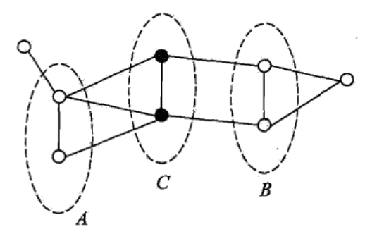
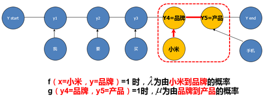

### 引言

前几章主要是介绍的概念多一些，本节介绍CRF（Conditional Random Field） 线性链条件随机场。

# 基本概念

判别模型（discriminative model）和生成模型（generative model）

我们在前几章一直没有介绍判别模型和生成模型，在本节的开头我们简单介绍下什么判别模型和什么是生成模型。

> 生成模型是所有变量的全概率模型，而判别模型是在给定观测变量值前提下目标变量条件概率模型。
>
> 生成模型能够用于模拟模型中任意变量的分布情况，
>
> 判别模型只能根据观测变量得到目标变量的采样。
>
> 判别模型不对观测变量的分布建模，因此它不能够表达观测变量与目标变量之间更复杂的关系。
>
> 生成模型更适用于无监督的任务，如分类和聚类。

生成式模型举例

- 朴素贝叶斯
- K近邻(KNN)
- 混合高斯模型
- 隐马尔科夫模型(HMM)
- 贝叶斯网络
- 马尔科夫随机场(Markov Random Fields)
- 深度信念网络(DBN)

 判别式模型举例

- 线性回归(Linear Regression)
- 逻辑斯蒂回归(Logistic Regression)
- 神经网络(NN)
- 支持向量机(SVM)
- 高斯过程(Gaussian Process)
- 条件随机场(CRF)
- CART(Classification and Regression Tree)

好了，正式课程开始。

条件随机场

> 条件随机场(Conditional random Field, CRF)是给定一组输入随机变量条件下另一组输出随机变量的条件概率分布模型。

我们在介绍条件随机场之前，会介绍一些基本概念，例如概率无向图，成对马尔可夫性等基本概念。在介绍完这些概念后，我们通过一个分词的例子重点介绍下条件随机场。

各种小概念隆重登场啦。

成对马尔可夫性

> 设$u​$和$v​$是无向图$G​$中任意两个没边变连接的结点，结点$u​$和$v​$分别对应随机变量$Y_u​$和$Y_v​$。其他所有节点为o，对应的而随机变量组是$Y_o​$。成对马尔可夫性是，给定的随机变量组$Y_o​$的条件下随机变量$Y_u​$和$Y_v​$是条件独立的。
>
> $P(Y_u,Y_v|Y_o)=P(Y_u|Y_o)P(Y_v|Y_o)​$

局部马尔可夫性

> 设v∈V是G中任意一个节点，W是与v有边连接的所有结点，O是v，W以外的其他所有节点。v表示的随机变量是$Y_v$，W表示的随机变量是$Y_w$，O表示的随机变量是$Y_o$。局部马尔可夫性是在给定随机变量组$Y_w$的条件下随机变量$Y_v$与随机变量$Y_o$是独立的。
>
> $P(Y_v,Y_O|Y_W)=P(Y_v|Y_W)P(Y_O|Y_W)​$

全局马尔可夫性

> A,B是G中被C分开的任意节点集合。全局马尔科夫性是指给定$ Y_c$ 条件下$ Y_A $和 $Y_B$ 是条件独立的，即$P(Y_A,Y_B|Y_C)=P(Y_A|Y_C)P(Y_B|Y_C)$

概率图模型

> 定义：概率无向图模型 probabilistic graphical model ，是由图表示的概率分布。设有联合概率分布$P(Y)$  ,由无向图$G=(V, E)$表示, V表示边，E表示节点。图G中，节点V表示随机变量，边E表示随机变量之间的关系。如果联合概率分布满足成对，局部或全局马尔可夫性，就称此联合概率分布为概率无向图模型，或马尔科夫随机场。

团与最大团

> 无向图$G$中任意两个结点均有边的连接的结点子集称为团(clique)。若C是无向图G的一个团，并且不能再加进任何一个G的结点使其成为一个更大的团，则称此C为最大团(maximal clique)

上图中由2个结点组成的团有5个{Y1, Y2}, {Y1, Y3},{Y3, Y2},{Y3, Y4},{Y2, Y4}。有2个最大团{Y1, Y2, Y3}, {Y2, Y3, Y4}。而{Y1, Y2, Y3, Y4}不是最大团。

概率无向图的因子分解

> 将概率无向图模型的联合分布表示为最大团上的随机变量的函数的乘积的操作，称为概率无向图模型的因子分解(fractorzation)。

给定无向图，设其无向图为$G$，$C$为$G$上的最大团，$Y_c$表示$C$对应的随机变量。那么概率无向图模型的联合概率分布P(Y)等于图中所有最大团上的函数的乘积形式，即

$P(Y)=\frac{1}{Z}\prod_c{Ψ_C(Y_C)}​$，其中$Z=\sum_r{\prod_c{Ψ_C(Y_C)}}​$

${Ψ_C}$是C上严格的正函数。

# CRF概述

CRF（conditional random field）条件随机，是指在给定**观测序列**条件下，计算**状态序列**的条件概率分布模型。

观测序列是用户可以观测到的序列，可以认为是机器学习中输入变量X，而状态序列是我们需要模型预测的序列，可以认为是要预测的标签序列label。

首先我们通过槽值提取任务的例子来了解下CRF模型中的一些基本概念。槽值提取（slot filling）是一个序列标注任务，可以用CRF建模。可以简单把槽值提取理解为识别某个词是哪种类型的过程。接下来的例子会帮助我们理解什么是CRF模型以及什么是槽值提取。

​							*图：**CRF**槽值提取序列标注例子*

在上图中，我们期望CRF模型根据“我/要/买/小米/手机”观测序列（X），识别出“O/O/O/品牌词/产品词”这样一个状态序列（Y）。即识别出小米是品牌词，手机是产品词。这里的“品牌词”、“产品词”就是一个槽，而“小米”“手机”是对应的槽值，将槽值“小米”“手机”与槽“品牌词”“产品词”对应上就是槽值提取任务。其中“我”对应T1时刻，“要”对应T2时刻，以此类推。（其中用“/”来分割各个分词结果以及预测值，O代表other。）

CRF条件随机场可以用概率图的方式来表示。以下是CRF条件随机场对应的概率图：

​								*图：* *CRF概率图*

在上图中：y1、y2、y3、y4、y5表示状态序列，“我”“要”“买”“小米”“手机”是观测序列。y1结点到y2结点之间的边（即各个状态结点之间的边）表示转移概率， “我”结点到y1结点的边（即各个观测结点和状态结点之间的边）表示观测概率。

CRF模型的训练过程就是求解转移概率和观测概率的过程；CRF模型预测就是通过这2个概率来计算最短路径。接下来我们介绍下CRF模型及其训练方法和预测。

## 1.1CRF模型：

$$
\text{L}=P\left( y|x \right) =\frac{\exp \sum_t{\left( \sum_i{\lambda _if_i\left( x,y_t \right) +\sum_j{\mu _jg_j\left( x,y_t,y_{t-1} \right)}} \right)}}{Z\left( x \right)}
$$

该公式是CRF条件随机场对应的假设函数，$P(y|x)​$表示在输入为观测序列的条件下（这个是不是很眼熟，它就是条件概率，对没错，在机器学习中这个公式会经常出现在假设函数的定义中），输出为某个状态序列的条件概率。例如P(”O/O/O/品牌/产品”|”我/要 买/小米/手机”)。分子表示概率图中各个最大团概率的乘积；分母是归一化因子。（无向图中任何两个结点均有边连接的结点子集称为团。最大团就是不能在加入任何一条边的团。）

​								*图：**CRF**公式示例图*

上图中整个图的概率等于该图中各个最大团对应随机变量概率的乘积。我们以红色方框中的子图来举例：该图的团是{结点“小米”,y4结点}的子图和{结点y4,结点y5}的子图，同时这两个子图都是最大团，而{结点“小米”, y4, y5}不是最大团，因为结点“小米”与y5没有边。对于红色方框中的子图概率为P(品牌|我/要/买/小米)*P(产品|品牌)。

其中$\lambda$表示由小米到品牌的概率，$\mu$表示由产品到品牌的概率。

**1.2** **模型训练**

CRF条件随机场模型的训练是求解转移概率和观测概率的过程。其采用L-BFGS方式来求解。（L-BFGS是求解优化问题的有效方法之一，有关L-BFGS详细介绍可以参考《统计学习方法》）

同时我们第三章重点讲优化问题，大家可以后续详细看第三章内容。

**1.3** **模型预测**

当通过L-BFGS求出转移概率和观测概率之后如何预测呢？我们采用**Viterbi**算法 **（动态规划算法）**来预测**。**条件随机场的预测问题是给定条件随机场p(y|x)和观测序列X，求条件概率最大的状态序列Y，即对观测序列进行标注。我们通过Viterbi算法选择概率最大的那条路径。Viterbi可以理解为采用动态规划求最短路径。

下面通过一个简单的例子说明下viterbi算法的计算过程。

例如：观测序列为“小米/ 手机”，我们要预测的状态序列为“品牌/产品”（小米是T1时刻，手机是T2时刻）。从T1时刻到T2，一共有4条路。在这个例子中我们假设从11结点转移到22结点的概率最大，在T1时刻到11结点的路径最大概率和到12结点的路径最大概率相同。到T2时刻一共有4条路径，每个路径的概率值见下图。

其中$\delta$表示到当前节点的路径最大概率值，g表示转移概率。

T2时刻手机应该预测为品牌还是产品？在求T2时刻的最大概率路径时我们采用Viterbi来求解。过程如下：

T2时刻一共有4条路径可以选择，即11结点到21节点，11结点到22结点，12结点到21结点，12结点到22结点，其中11结点到22结点的概率最大因为从11结点（小米是品牌结点）到22结点（手机是产品结点）概率最大，同时T1时刻各个结点的路径最大概率相同，所以通过Viterbi算法选择概率最大的一条路径是：“小米是品牌”11结点，到“手机是产品”22结点路径。T2时刻的概率最大值等于T1时刻概率最大值（即11结点的概率最大值）加上由11结点到22结点的概率值。

接下来我们会详细介绍下CRF的一个重要应用：分词。

**二、分词**

在自然语言理解中，为了更好的理解用户意图，我们需要有准确的分词模型。分词模型就是采用CRF条件随机场训练的。

以下是原有Stanford中文分词模型在购物语句上的分词结果：

帮/我/妈/买/一 个/**美的**/洗衣机

我们使用Stanford 开源分词工具包来进行分词模型的训练。该工具包提供了分词模型训练以及预测的方法。之所以选择Stanford工具包主要是因为其提供了一整套NLP解决方案，包括模板匹配、分词、词性标注、NER、句法树等中文模型。

接下来本节从模型的训练数据、特征两个方面介绍stanford分词工具。

我们也简单训练了自己的分词模型，我们的训练数据来自于Chinese tree bank 8.0公开的测评数据。

分词特征的设计是Stanford 分词工具包的一大亮点。它加入了大量的特征工程，既有离散特征也有连续特征。

**离散特征**包括：Char类型特征、各种Char类型的unigram/bigram特征；描述词性特点的特征：Unicode类型特征、Shape String类型特征；字典先验特征；以及以上各种特征的组合。

**连续特征**包括：字向量特征，word2vec预训练的字向量。

| **特征**         | **说明**                                       |
| ---------------- | ---------------------------------------------- |
| Char类型特征     | Char（-1, 0, 1）                               |
| Unicode类型特征  | 字符对应的Unicode类型(CONTROL,CURRENCY_SYMBOL) |
| Shape String特征 | 代表digit，date, letter，特殊字符（-#$%&'*）   |
| 字典先验特征     | 字典的开头、中间、结尾                         |
| 字向量特征       | Word2vec生成的字典特征                         |

 

以下详细介绍各个类型特征：Char类型特征、字典先验特征。

**Char类型特征举例**：Char特征有unigram、bigram以及对应组合三种大类型特征。

| **Unigram**特征 | **说明**     | **Bigram**特征 | **说明**        |
| --------------- | ------------ | -------------- | --------------- |
| C               | 当前词       | C   + C2       | 当前词+下一个词 |
| C2              | 下一个时刻词 | C   +C3        | 当前词+下两个词 |
| P               | 前一个时刻词 | C+P            | 前一个词+当前词 |
| P2              | 前两个时刻词 |                |                 |

 

还是以“我要买小米手机”为例，在T4时刻“小”对应Char特征如下：

|        | **列** | **C** **特征** | **C2** **特征** | **P** **特征** | **P2**特征 | **C+C2** | **C+P** |
| ------ | ------ | -------------- | --------------- | -------------- | ---------- | -------- | ------- |
| T1     | 我     |                |                 |                |            |          |         |
| T2     | 要     |                |                 |                |            |          |         |
| T3     | 买     |                |                 |                |            |          |         |
| **T4** | **小** | 小             | 米              | 买             | 要         | 小+米    | 小+买   |
| T5     | 米     |                |                 |                |            |          |         |
| T6     | 手     |                |                 |                |            |          |         |
| T7     | 机     |                |                 |                |            |          |         |

 

**字典先验特征**：该特征需要准备字典，通过字典先验知识来帮助分词模型更好地分词。字典先验特征主要包括某个char是字典的开头，中间还是结尾。

| **特征**             |
| -------------------- |
| 当前词是不是字典开头 |
| 当前词是不是字典中间 |
| 当前词是不是字典结尾 |

 

继续以“我要买小米手机”为例，因为“小”和“米”组成的“小米”在字典中存在，且“小”是某个词的开头，“米”是某个词的结尾，所以在T4/T5时刻“小”“米”对应字典特征如下（1代表是、0代表非）：

|        | **列** | **字典开头** | **字典中间** | **字典结尾** |
| ------ | ------ | ------------ | ------------ | ------------ |
| T1     | 我     |              |              |              |
| T2     | 要     |              |              |              |
| T3     | 买     |              |              |              |
| **T4** | **小** | 1            | 0            | 0            |
| T5     | 米     | 0            | 0            | 1            |
| T6     | 手     |              |              |              |
| T7     | 机     |              |              |              |

 

经过模型训练数据准备，添加模型特征后，我们训练了自己的分词模型。评测方法采用SIGHAN backoff2005提供的评测脚本工具进行评测。

以下是对各大分词系统在数据集上的评测结果（数值代表F1-score）： 

| **分词模型**   | **Ctb 8.0** |
| -------------- | ----------- |
| Stanford CRF   | 0.951       |
| 中科院ICT-CLAS | 0.887       |
| 哈工大LTP      | 0.913       |
| 清华ThuLac     | 0.904       |

从上图中可以看到开源的stanford CRF中文分词模型效果非常好。

## 2.2分词后处理

分词的后处理包括以下几部分：

•         处理外国人名。例如，乔治・华盛顿

•         处理时间， 比分等。 例如， 10:30, 3:0

•         处理百分比。 例如， 60%

•         处理小数点。 例如， 3.1415

•         处理千位分隔符。 例如， 1，000

在这里我们就不介绍CRF对应的代码了。如果对CRF的具体实现感兴趣，可以参考CRF++以及李航老师撰写的《统计学习方法》对应章节。

