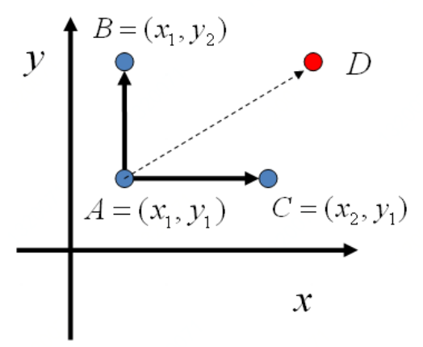
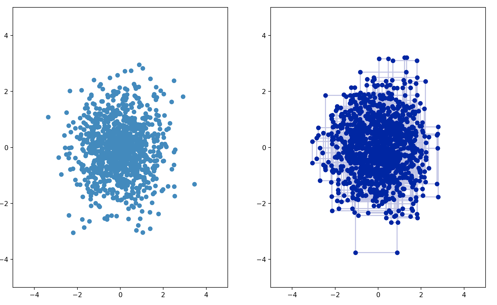
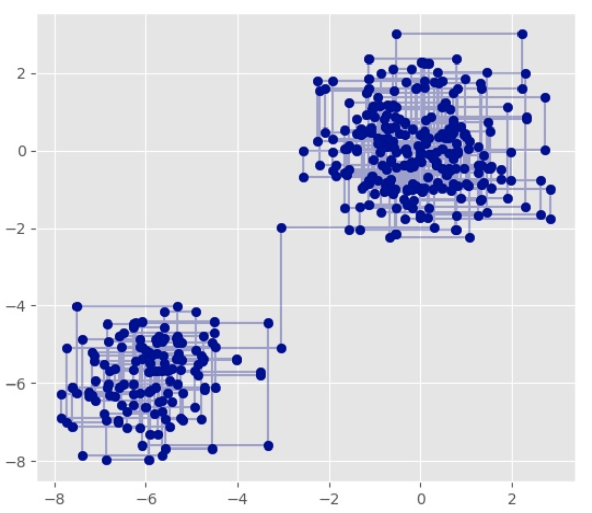
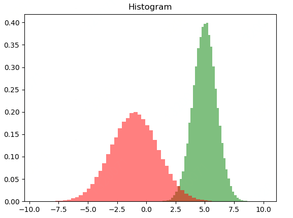

### 引言

上节我们介绍了大数定理以及蒙特卡罗抽样方法，本节介绍另一个抽样方法-Gibbs Sampling。

吉布斯采样（Gibbs sampling）是统计学中用于马尔科夫蒙特卡罗（MCMC）的一种算法，用于在难以直接采样时从某一多变量概率分布中近似抽取样本序列。该序列可用于近似联合分布、部分变量的边缘分布或计算积分（如某一变量的期望值）。某些变量可能为已知变量，故对这些变量并不需要采样。

该算法的名称源于约西亚·威拉德·吉布斯，由斯图尔特·杰曼与唐纳德·杰曼兄弟于1984年提出。


### 知识点回顾

在上一篇中，我们讲到了细致平稳条件：如果非周期马尔科夫链的状态转移矩阵$P$和概率分布$\pi(i)$对于所有的$i,j$满足：
$$
\pi(i)P(i,j) = \pi(j)P(j,i)
$$
则称概率分布$\pi(i)$是状态转移矩阵$\pi(i)$的平稳分布。

在上一节的M-H采样中我们通过引入接受率使细致平稳条件满足。

但M-H采样存在一个小问题，Metropolis-Hastings采样是从指定分布中进行采样的一个统一的框架，但是采样的效率依赖于指定的分布的选择，若是选择的不好，会使得接受率比较低，大量的采样被拒绝，影响到整体的收敛速度。

Gibbs采样是Metropolis-Hastings采样算法的特殊形式，即找到一个已知的分布，使得接受率$\alpha$=1。这样每次采样都会被接受，可以提高MCMC的收敛速度。

### Gibbs抽样

现在我们换一个思路。

我们先看二维的情形，假设有一个概率分布$p\left( x,y \right)​$，我们考察x坐标相同的两个点$A(x1, y1)​$，  $B(x1, y2)​$，我们发现
$$
p\left( x_1,y_1 \right) p\left( y_2|x_1 \right) =p\left( x_1 \right) p\left( y_1|x_1 \right) p\left( y_2|x_1 \right)
$$

$$
p\left( x_1,y_2 \right) p\left( y_1|x_1 \right) =p\left( x_1 \right) p\left( y_2|x_1 \right) p\left( y_1|x_1 \right)
$$

由于等式右边相等，所以我们得到
$$
p\left( x_1,y_1 \right) p\left( y_2|x_1 \right) =p\left( x_1,y_2 \right) p\left( y_1|x_1 \right)
$$
基于上面等式，我们发现，在$x=x1​$这条平行于y轴的直线上，如果使用条件分布$p(y|x1)​$做为任何两点之间的转移概率，那么任何两点之间的转移满足细致平稳条件。这真是太开心了，本世纪重大发现。

同样，如果我们在$y=y1​$这条直线上任意取两个点$A(x1, y1)​$和$C(x2, y1)​$，也会有如下等式：
$$
p\left( x_1,y_1 \right) p\left( x_2|y_1 \right) =p\left( x_2,y_1 \right) p\left( x_1|y_1 \right)
$$



于是我们可以如下构造平面上任意两点之间的状态转移概率矩阵$Q$：
$$
P\left( A\rightarrow B \right) =\pi \left( y_B|x_1 \right) \;\;if\;x_A=x_B=x_1
$$

$$
P\left( A\rightarrow C \right) =\pi \left( y_C|y_1 \right) \;\;if\;y_A=y_C=y_1
$$

$$
P\left( A\rightarrow D \right) =0\;\;if\;\text{其他}
$$

有了上面这个状态转移矩阵，我们很容易验证平面上的任意两点，满足细致平稳条件：
$$
P\left( X \right) P\left( X\rightarrow Y \right) =P\left( Y \right) P\left( Y\rightarrow X \right)
$$
于是这个二维空间的马尔科夫链将收敛到细致平稳分布$p\left( x,y \right)$。我们称这个算法是**Gibbs Sampling算法**，由物理学家Gibbs首先给出的。这个算法在现代贝叶斯分析中占据重要的地位。

#### 二维Gibbs抽样算法

1.输入平稳分布$P(x, y)​$，设定状态转一次阈值$n_1​$, 需要的样本数$n_2​$
2.随机初始化$X, Y​$
3.对于$t=0,1,2,3​$...循环采样

$y_1=y_{0+1} = P(y_1|x_0)$
$x_1=x_{0+1} = P(x_1|y_{0+1})=P(x_1|y_1)$

$y_2=y_{1+1} = P(y_2|x_1)$
$x_2=x_{1+1} = P(x_2|y_{1+1})=P(x_2|y_2)$

$y_3=y_{2+1} = P(y_3|x_2)$
$x_3=x_{2+1} = P(x_3|y_{2+1})=P(x_3|y_3)$

以上循环$t​$次。

即

$y_{t+1} = P(y_{t+1}|x_t)$
$x_{t+1} = P(x,y_{t+1})$
通过以上方法得到一系列样本点，这样就可以收敛到$p(x, y)​$对应的分布。

**通俗点说，就是通过$x_{t-1}​$前一时刻的值，来预测$x_{t}​$当前时刻的值**

**好像还可以在总结下：Gibbs Sampling其实是每次只对一个维度的变量进行采样，固定住其他维度的变量，然后迭代，可以看做是Metropolis-Hastings的特例，它的接受率一直是1.**

以下就是类似的采样结果：




以上采样过程中，如图所示，马氏链的转移只是轮换的沿着坐标轴$x$轴和$y$轴做转移，于是得到样本$(x_0,y_0),(x_0,y_1),(x_1,y_1),(x_1,y_2),(x_2,y_2)​$。

马氏链收敛后，最终得到的样本就是$ p(x,y)​$的样本,当然这些样本并不独立，但是我们此处要求的是采样得到的样本符合给定的概率分布，并不要求独立。

同样的，在以上算法中，坐标轴轮换采样不是必须的，可以在坐标轴轮换中引入随机性，这时候转移矩阵$Q​$中任何两个点的转移概率中就会包含坐标轴选择的概率，而在通常的 Gibbs Sampling 算法中，坐标轴轮换是一个确定性的过程，也就是在给定时刻$t​$，在一根固定的坐标轴上转移的概率是 1。

#### 多维Gibbs抽样算法

那么有的同学会问，刚才介绍的只是$p(x,y)$的分布函数的采样过程，那如果是多维的分布函数我们如何使用Gibbs 抽样呢？答案是和二维情况相同。

对于多维的情况$x_1,x_2,…, x_n​$，我们可以把 Gibbs Smapling 算法从采样二维的$p(x,y)​$推广到采样$n​$维的$p(x_1,x_2,⋯,x_n)​$我们简单写下如下公式：

随机初始化$x^{(0)}=q(x)​$

for i=1, 2, 3, …., $n$ :

​    $x_1^{(i)}=p(X_1=x_1|X_2=x_2^{i-1},X_2=x_2^{i-1},…,X_n=x_n^{i-1})$

​    $x_2^{(i)}=p(X_2=x_2|X_1=x_1^{i-1},X_3=x_3^{i-1},…,X_n=x_n^{i-1})$

​    $x_3^{(i)}=p(X_3=x_3|X_1=x_1^{i-1},X_2=x_2^{i-1},…,X_n=x_n^{i-1})$

​    ….

​    $x_n^{(i)}=p(X_n=x_n|X_1=x_1^{i-1},X_2=x_2^{i-1},…,x_{n-1}^{i-1})$

通过以上方法就可以得到概率分布$p(x_1,x_2,⋯,x_n)$

至此，Gibbs抽样方法我们就介绍完了。

同学们是不是感觉Gibbs抽样比MCMC抽样简单多了。是的，Gibbs抽样有那么一点点简单。



**例题：**

假设从二项正态分布中进行采样,  假设$\Theta =\left ( \theta _1,\theta _2 \right )​$且$\Theta \sim Norm\left (\mu ,\Sigma  \right )​$,  

 其中$\mu =\left ( \mu _1,\mu _2 \right )$, 例如$\mu =\left (2,3 \right )$

 $\Sigma =\begin{pmatrix} {\sigma}^2_1 & {\rho}\sigma_1\sigma_2  \\  \rho\sigma_1\sigma_2  & {\sigma}^2_2 \end{pmatrix}=\begin{pmatrix} 1 & 1  \\  1  & 4 \end{pmatrix}​$

采样过程中的状态概率转移条件为：

$p(\theta _1|\theta_2)\sim Norm\left ( \mu _1+\rho \sigma_1/\sigma_2\left ( \theta _2-\mu _2 \right ), \sqrt{1-\rho ^2} \sigma_1^2\right )$

$p(\theta _2|\theta_1)\sim Norm\left ( \mu _2+\rho\sigma_2/\sigma_1 \left ( \theta _1-\mu _1 \right ), \sqrt{1-\rho ^2} \sigma_2^2\right )$


Gibbs抽样流程流程如下：

1.初始化时间$t=1$

2.设置$u=(u1,u2)$的值，并初始化初始状态$Θ^{(t)}=u$

3.重复以下的过程： 

令$t=t+1$

3.1对每一维：$i=1,2 $

3.2 $\theta _1^{\left ( t \right )}\sim Norm\left ( \mu _1+\rho \left ( \theta _2-\mu _2 \right ), \sqrt{1-\rho ^2} \right )$

3.3 $\theta _2^{\left ( t \right )}\sim Norm\left ( \mu _2+\rho \left ( \theta _1-\mu _1 \right ), \sqrt{1-\rho ^2} \right )$


以下是代码示例：

```python
from mpl_toolkits.mplot3d import Axes3D
from scipy.stats import multivariate_normal
import random
import math

import matplotlib.pyplot as plt


samplesource = multivariate_normal(mean=[5,-1], cov=[[1,0.5],[0.5,2]])

def p_yx(x, m1, m2, s1, s2):
    return (random.normalvariate(m2 + rho * s2 / s1 * (x - m1), math.sqrt(1 - rho ** 2) * s2**2))

def p_xy(y, m1, m2, s1, s2):
    return (random.normalvariate(m1 + rho * s1 / s2 * (y - m2), math.sqrt(1 - rho ** 2) * s1**2))

N = 5000
K = 20
x_res = []
y_res = []
z_res = []
m1 = 5
m2 = -1
s1 = 1
s2 = 2

rho = 0.5
y = m2

for i in range(N):
    for j in range(K):
        x = p_xy(y, m1, m2, s1, s2)
        y = p_yx(x, m1, m2, s1, s2)
        z = samplesource.pdf([x,y])
        x_res.append(x)
        y_res.append(y)
        z_res.append(z)

num_bins = 50
plt.hist(x_res, num_bins, normed=1, facecolor='green', alpha=0.5)
plt.hist(y_res, num_bins, normed=1, facecolor='red', alpha=0.5)
plt.title('Histogram')
plt.show()
```





由于Gibbs采样在高维特征时的优势，目前我们通常意义上的MCMC采样都是用的Gibbs采样。当然Gibbs采样是从M-H采样的基础上的进化而来的，同时Gibbs采样要求数据至少有两个维度，一维概率分布的采样是没法用Gibbs采样的,这时M-H采样仍然成立。

有了Gibbs采样来获取概率分布的样本集，有了蒙特卡罗方法来用样本集模拟求和，他们一起就奠定了MCMC算法在大数据时代高维数据模拟求和时的作用。MCMC系列就在这里结束吧。

### Gibbs和MCMC的关系

Gibbs Sampling是Metropolis Hastings算法的一个特例。

Gibbs采样是一种特殊的马尔可夫链算法，常被用于解决包括矩阵分解、张量分解等在内的一系列问题，也被称为交替条件采样（alternating conditional sampling），其中，“**交替**”一词是指Gibbs采样是一种迭代算法，并且相应的变量会在迭代的过程中交替使用，除此之外，加上“**条件**”一词是因为Gibbs采样的核心是贝叶斯理论，围绕先验知识和观测数据，以观测值作为条件从而推断出后验分布。


MH算法利用了马尔可夫链的细致平衡，从而获得了联合分布的采样。

有了联合分布的采样我们就可以得到边缘分布，而这在贝叶斯推断中求后验分布有重要作用。

### Gibbs抽样的应用

著名的主题模型LDA就是用Gibbs抽样实现的。