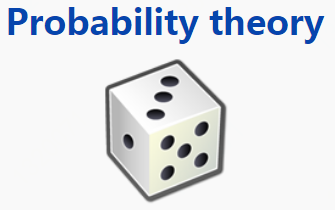

### 引言



本节介绍大数定理和蒙特卡罗抽样方法

我们都知道事件发生的频率具有稳定性，即随着试验次数的增加，事件发生的频率逐渐稳定与某个常数。在实践中人们还认识到大量测量值的算术算数平均值也具有稳定性。这种稳定性就是我们要讨论的大数定律的客观背景。

大数定理研究的是随机现象统计规律性的一类定理，当我们大量重复某一相同的实验的时候，其最后的实验结果可能会稳定在某一数值附近。就像抛硬币一样，当我们不断地抛，抛个上千次，甚至上万次，我们会发现，正面或者反面向上的次数都会接近一半。除了抛硬币，现实中还有许许多多这样的例子，像掷骰子，最著名的实验就是泊松抛针实验。这些实验都像我们传达了一个共同的信息，那就是大量重复实验最终的结果都会比较稳定。那稳定性到底是什么？怎样去用数学语言把它表达出来？这其中会不会有某种规律性？是必然的还是偶然的？

这一系列问题其实就是大数定理要研究的问题。很早的时候，人们其实就发现了这一规律性现象，也有不少的数学家对这一现象进行了研究，这其中就包括伯努利（后来人们为了纪念他，都认为他是第一个研究这一问题的人，其实在他之前也早有数学家研究过）。伯努利在1713年提出了一个极限定理，当时这个定理还没有名称，后来人们称这个定理为伯努利大数定理。因此概率论历史上第一个有关大数定理的极限定理是属于伯努利的，它是概率论和数理统计学的基本定律，属于弱大数定律的范畴。

好了，历史讲完了。我们本节会介绍大数定理相关知识，之后会我们介绍马尔科夫链、蒙特卡罗抽样方法等。

### 相关定理

我们先介绍三个与大数定理有关的定理，之后我们会引出大数定理公式。

#### **定理一（切比雪夫定理的特殊情况）**

设随机变量$X_1, X_2,…,X_n,...$相互独立，且具有相同的数学期望和方差：$E(X_k)=\mu$，$D(x_k)=\sigma ^2(k=1,2,3,…)$。设前$n$个随机变量的算术平均为$\bar{X}=\frac{1}{n}\sum_{k=1}^{n} X_k$

则对于任意的正数$\varepsilon​$, 有

$\lim_{n\to\infty}P\left \{  |\bar{X}-\mu|<\varepsilon\right \} \\ =\lim_{n\to\infty}P\left \{  |\frac{1}{n}\sum_{k=1}^{n}X_k-\mu|<\varepsilon\right \}=1​$

定理一表明$\bar{X}=\frac{1}{n}\sum_{k=1}^{n} X_k​$接近于数学期望$E(X_1)=E(X_2)=…=E(X_k)=\mu​$，即当$n​$无限增加时所有随机变量都趋近于一个常数。


#### **定理二（伯努利大数定理）**

设$n_A$是$n$次独立重复试验中事件A发生的次数，$p$是事件$A$在每次试验中发生的概率，则对于任意正数$\varepsilon>0$，有

$\lim_{n\to\infty}P\left \{  |\frac{n_A}{n}-\mu|<\varepsilon\right \}=1​$

或$\lim_{n\to\infty}P\left \{  |\frac{n_A}{n}-p|>=\varepsilon\right \}=0$

说明：$\frac{n_A}{n}$表示概率，上面的定理说明$p=\frac{n_A}{n}$


#### **定理三(辛钦定理)**

设随机变量$X_1, X_2,…,X_n,...​$相互独立，服从同一分布，且具有数学期望$E(x_k)=\mu(k=1,2,…)​$，则对于任意正数$\varepsilon​$，有

$\lim_{n\to\infty}P\left \{  |\frac{1}{n}\sum_{k=1}^{n} X_k-\mu|<\varepsilon\right \}=1​$

 说明：上面的定理说明期望等于$\frac{1}{n}\sum_{k=1}^{n} X_k$


#### **大数定理（law of large numbers)定义**

设随机变量$X_1,X_2,...,X_n​$相互独立，且是独立同分布的随机变量，记它们的期望均值为$\mu​$。它们的方差记为$\sigma​$。则对任意给定的$\varepsilon​$>0，有
$$
\lim_{n\rightarrow \infty}P\left( |\bar{X}_n-\mu |\geq \varepsilon \right) =0
$$
这个式子指出了当$n​$很大时，$\bar{X}_n​$接近$\mu​$的确切含义。这里的“接近”是概率上的，也就是说虽然概率非常小，但还是有一定的概率出现意外情况（例如上面的式子中概率大于$\varepsilon​$）。只是这样的可能性越来越小，这样的收敛性，在概率论中叫做$\bar{X}_n​$依概率收敛于$\mu​$。


说了这么多定理，我们下面通过一个小程序，来看看大数定理的一个真实的例子。以抛硬币为例，当抛硬币的次数很大时，那么正面朝上和反面朝上的概率是相同。如下图所示


上图中x轴表示抛硬币的次数，y轴表示正反面的比值。上图非常直观，我们可以看到，当抛硬币的次数越来越大，正反面的概率就都是0.5了。但是当抛硬币的次数很小时，正反面的概率不是0.5。

以下是对应的概率实现。

```python
import random
import matplotlib.pyplot as plt

def flip_plot(minExp, maxExp):
    """
    Assumes minExp and maxExp positive integers; minExp < maxExp
    Plots results of 2**minExp to 2**maxExp coin flips
    """
    # 两个参数的含义，抛硬币的次数为2的minExp次方到2的maxExp次方，也就是一共做了(2**maxExp - 2**minExp)批次实验，每批次重复抛硬币2**n次

    ratios = []
    xAxis = []
    for exp in range(minExp, maxExp + 1):
        xAxis.append(2**exp)
    for numFlips in xAxis:
        numHeads = 0 # 初始化，硬币正面朝上的计数为0
        for n in range(numFlips):
            if random.random() < 0.5:  # random.random()从[0, 1)随机的取出一个数
                numHeads += 1  # 当随机取出的数小于0.5时，正面朝上的计数加1
        numTails = numFlips - numHeads  # 得到本次试验中反面朝上的次数
        ratios.append(numHeads/float(numTails))  #正反面计数的比值
    plt.title('heads/tails Ratios')
    plt.xlabel('numbers')
    plt.ylabel('heads/tails')
    plt.plot(xAxis, ratios)
    plt.hlines(1, 0, xAxis[-1], linestyles='dashed', colors='r')
    plt.show()

flip_plot(4, 16)
```


大数定律很重要，因为它“说明”了一些随机事件均值的长期稳定性。人们发现，在重复试验中，随着试验次数的增加，事件发生的频率趋于一个稳定值；人们同时也发现，在对物理量的测量实践中，测定值的算术平均也具有稳定性。

比如，我们向上抛一枚硬币，硬币落下后哪一面朝上是偶然的，但当我们上抛硬币的次数足够多后，达到上万次甚至几十万几百万次以后，我们就会发现，硬币每一面向上的次数约占总次数的二分之一，亦即偶然之中包含着必然。

### 大数定理的应用

世界上最成功投资大师有两类：一类是以巴菲特为代表的价值投资派，另一类是以西蒙斯为代表的量化投资派。巴菲特的投资思路是低价拿好股，并且长期持有。这表面上看起来和大数定理没什么关系，但长期持有其实就是在利用大数定理。好公司每天都在赚钱，明天的公司就比昨天的公司价值多了一些。所以持有优质公司，本身就是一个正和游戏。长期参与正和游戏，当然会源源不断的赚钱了。而西蒙斯更是直接用的大数定理。他利用各种数学模型，发现市场上的正和游戏的机会，大量的参与。每次参与交易的期望收益都是正的（但并不保证每一次都是盈利的），长期参与这样的游戏，最终也是稳稳的获利了。

哈哈，有点扯远了。上面介绍了大数定理，接下来我们介绍下大数定理的应用：包括马尔可夫链，蒙特卡罗方法，MCMC抽样。

#### 马尔科夫链

以下讲解给定一个概率分布$P\left( X \right)$，我们如何生成它的样本。大家可以想想，我们如何生成均匀分布，二项分布，多项式分布，高斯分布等概率分布对应的样本。

为了解决这个我们需要介绍下马尔科夫链以及蒙特卡罗方法。


本节介绍马尔科夫链。

我们先举一个例子。假设人有三种情绪（正、中、负），某一个人当前各个情绪的概率为$[0.3, 0.6, 0.1]$，以及各个情绪之间的状态转移概率为：
$$
\left( \begin{matrix}
	0.5&		0.3&		0.2\\
	0.2&		0.4&		0.4\\
	0.1&		0.3&		0.6\\
\end{matrix} \right)
$$
则我们可以计算每轮之后，三种情绪的概率，如下表：

第一轮后各个情绪的概率为$[0.3, 0.6, 0.1]* \left( \begin{matrix}
0.5&		0.3&		0.2\\
0.2&		0.4&		0.4\\
0.1&		0.3&		0.6\\
\end{matrix} \right)​$

第N轮各个情绪的概率为$[0.3, 0.6, 0.1]*\left( \begin{matrix}
0.5&		0.3&		0.2\\
0.2&		0.4&		0.4\\
0.1&		0.3&		0.6\\
\end{matrix} \right)^n​$

| 第N轮 | 正       | 中       | 负       |
| ----- | -------- | -------- | -------- |
| 1     | 0.28     | 0.36     | 0.36     |
| 2     | 0.248    | 0.336    | 0.416    |
| 3     | 0.2328   | 0.3336   | 0.4336   |
| 4     | 0.22648  | 0.33336  | 0.44016  |
| 5     | 0.223928 | 0.333336 | 0.442736 |
| 6     | 0.222905 | 0.333334 | 0.443762 |
| 7     | 0.222495 | 0.333333 | 0.444171 |
| 8     | 0.222331 | 0.333333 | 0.444335 |
| 9     | 0.222266 | 0.333333 | 0.444401 |
| 10    | 0.22224  | 0.333333 | 0.444427 |


我们发现从第7轮开始，情绪的分布就稳定不变了。

这个是偶然的吗？我们再来做一组实验：我们假设初始状态为[0.1, 0.3, 0.6]，但状态转移概率不变$\left( \begin{matrix}
0.5&		0.3&		0.2\\
0.2&		0.4&		0.4\\
0.1&		0.3&		0.6\\
\end{matrix} \right)$，则结果如下：

| 第N轮 | 正       | 中       | 负       |
| ----- | -------- | -------- | -------- |
| 1     | 0.17     | 0.33     | 0.5      |
| 2     | 0.201    | 0.333    | 0.466    |
| 3     | 0.2137   | 0.3333   | 0.453    |
| 4     | 0.21881  | 0.33333  | 0.44786  |
| 5     | 0.220857 | 0.333333 | 0.44581  |
| 6     | 0.221676 | 0.333333 | 0.444991 |
| 7     | 0.222004 | 0.333333 | 0.444663 |
| 8     | 0.222135 | 0.333333 | 0.444532 |
| 9     | 0.222187 | 0.333333 | 0.444479 |
| 10    | 0.222208 | 0.333333 | 0.444458 |


我们发现不论初始状态是多少，最后都收敛到稳定的状态[0.222, 0.333, 0.444]。具体程序可以参见附录1.

以下是**马尔科夫链**的定义：
$$
P(X_{t+1}=x|X_t,X_{t-1},...)=P(X_{t+1}=x|X_t)
$$


如果一个非周期的马尔科夫链具有状态转移概率矩阵$ P$，并且它的任何两个状态是连通的，那么$\lim_{n\rightarrow \infty}P_{ij}^{n}$存在并且与$ i​$无关，我们有：

1.
$$
\lim_{n\rightarrow \infty}P_{ij}^{n}=\pi \left( j \right)
$$
2.
$$
\lim_{n\rightarrow \infty}P^n=\left( \begin{matrix}
	\pi \left( 1 \right)&		\pi \left( 2 \right)&		...&		\pi \left( j \right)&		...\\
	\pi \left( 1 \right)&		\pi \left( 2 \right)&		...&		\pi \left( j \right)&		...\\
	...&		...&		...&		...&		...\\
	\pi \left( 1 \right)&		\pi \left( 2 \right)&		...&		\pi \left( j \right)&		...\\
	...&		...&		...&		...&		...\\
\end{matrix} \right)
$$
3.
$$
\pi \left( j \right) =\sum_{i=0}^{\infty}{\pi}\left( i \right) P_{ij}
$$
4.$\pi​$是方程$\pi​$的唯一非负解，其中：
$$
\pi =\left[ \pi \left( 1 \right) ,\pi \left( 2 \right) ,...,\pi \left( j \right) ,... \right] \;\;\sum\limits_{i=0}^{\infty}{\pi}\left( i \right) =1
$$

$\pi​$称为**马尔科夫链的平稳分布**


以上就是马尔科夫链的重要性质。

我们对这个定理的内容在做一些详细的解释：

- 我们遇到的大部分马尔科夫链都是“非周期性”的

- 任何两个状态是连通的：这个指的是从任意一个状态可以通过有限步到达其他的任意一个状态，不会出现条件概率为0导致不可达的情况。

- 马尔科夫链的状态数可以是有限的，也可以是无限的。因此可以用于连续概率分布和离散概率分布。

  

如果我们可以得到我们需要采样样本的平稳分布所对应的马尔科夫链状态转移矩阵，那么我们就可以用马尔科夫链采样得到我们需要的样本集。

但是一个重要的问题是，随意给定一个平稳分布(你可以认为是我们前面一节提到的各种函数分布)，如何得到它所对应的马尔科夫链状态转移矩阵呢？

幸运的是，MCMC采样解决了上面这个大问题，我们在接下来详细讨论MCMC的采样。

在介绍MCMC前，我们先介绍下蒙特卡罗方法。

#### 蒙特卡罗方法

本节介绍蒙特卡罗(Monte Carlo)方法

**蒙特卡罗方法**（英语：Monte Carlo method），也称**统计模拟方法**，是指使用随机采样的方法得到近似值。

下面举例来说明如何用蒙特卡罗方法来求解$\pi​$。

四分之一圆的面积等于$\frac1{4}*\pi *R^2​$, 正方形面积等于$R^2​$=1，其中$R=1​$。

则他们的面积比为$\frac1{4}*\pi$

通过蒙特卡罗方法，随机在这个正方形中进行采样，我们可以得到多少点落在圆内，多少点落在圆外，则

$$
\pi =4*\frac{\text{落在圆内点个数}}{\text{总采样数}}
$$
以上就是蒙特克罗方法的一个例子。**根据大数定理，当采样点非常大时，那么计算的结果就非常准确。**


当采样点等于1000000时，我们计算的$\pi=3.141154$

当采样点等于10000000时，我们计算的3.1418748

当采样点等于100000000时，我们计算的$\pi=3.14167004$

看看，我们的圆周率$\pi$是不是计算的非常准确率。佩服下自己喽。

```python
#以下就是对应实现方法
import matplotlib.pyplot as plt

from random import random

inside = 0
n = 10**3

x_inside = []
y_inside = []
x_outside = []
y_outside = []

for _ in range(n):
    x = random()
    y = random()
    if x2+y2 <= 1:
        inside += 1
        x_inside.append(x)
        y_inside.append(y)
    else:
        x_outside.append(x)
        y_outside.append(y)

pi = **4*inside/n**
print(pi)

plt.scatter(x_inside, y_inside, color='b', marker='s')
plt.scatter(x_outside, y_outside, color='r', marker='s')
plt.show()
```

以上就是蒙特卡罗方法。

接下来我们详细介绍MCMC（Markov Chain Monte Carlo），它的目的就是为了求某个平稳分布(函数分布)，随意给定一个平稳分布，通过MCMC方法得到它所对应的马尔科夫链状态转移矩阵。

#### MCMC(Markov Chain Monte Carlo)

通常情况下目标平稳分布$\pi​$和状态转移矩阵$Q​$不满足平稳分布条件，即：
$$
\pi(i)Q(i,j) \neq \pi(j)Q(j,i)
$$
但我们可以对上式进行改造，使其满足条件，即：
$$
\pi(i)Q(i,j)\alpha(i,j) = \pi(j)Q(j,i)\alpha(j,i)
$$

$$
\alpha(i,j) = \pi(j)Q(j,i)
$$

$$
\alpha(j,i) = \pi(i)Q(i,j)         \\公式1
$$

当满足上面条件时，我们就可以得到这样一个状态转移矩阵。

这样我们就可以得到MCMC的采样过程（M-H采样算法）：

```
1.初始化马尔科夫链初始状态X0=x0
2.循环如下过程
	2.1 从条件概率分布Q(x|xt)中采样得到样本xt+1。这个就是函数分布对应的条件概率分布。
	2.2 从均匀分布采样u∼uniform[0,1]
	2.3 如果u<α(xt,xt+1)=min{(π(j)Q(j,i))/(π(i)Q(i,j)),1}, 则接受转移xt→xt+1。（这一步就是上面的公式1，即我要满足的条件）。这个就是上面提到的方法，可以得到平稳分布。
	2.4 否则不接受转移，即xt+1=xt
```

以下就是MCMC的实验结果图。

左边的图是坐标变换后的结果，后边的图"红色+"代表拒绝样本，"蓝色圆点"代表接受样本，"蓝线"代表运动过程。


好了，那我们举个例子。如果我们知道高斯分布（即我们提到的平稳分布），那我们如何得到高斯分布对应的样本点呢？我们就可以通过M-H采样算法得到。

对应实现代码如下：


```python
import random
import math
from scipy.stats import norm
import matplotlib.pyplot as plt

def norm_dist_prob(theta):
    y = norm.pdf(theta, loc=0.1, scale=1)
    return y

T = 5000
pi = [0 for i in range(T)]

t = 0
while t < T-1:
    t = t + 1
    pi_star = norm.rvs(loc=pi[t - 1], scale=1, size=1, random_state=None)
    alpha = min(1, (norm_dist_prob(pi_star[0]) / norm_dist_prob(pi[t - 1])))

    u = random.uniform(0, 1)
    if u < alpha:
        pi[t] = pi_star[0]
    else:
        pi[t] = pi[t - 1]


plt.scatter(pi, norm.pdf(pi, loc=0.1, scale=1))
num_bins = 50
plt.hist(pi, num_bins, normed=1, facecolor='red', alpha=0.7)
plt.show()
```

好了，今天就讲到这里。

本节介绍了最重要的大数定理，以及如何用MCMC方法对某个概率分布函数进行采样。

### 附录1

```python
#马尔可夫链演示程序
import numpy as np
import matplotlib.pyplot as plt

transfer_matrix = np.array([[0.5,0.3,0.2],[0.2,0.4,0.4],[0.1,0.3,0.6]],dtype='float32')
start_matrix = np.array([[0.1,0.3,0.6]],dtype='float32')

value1 = []
value2 = []
value3 = []
for i in range(30):
    start_matrix = np.dot(start_matrix,transfer_matrix)
    value1.append(start_matrix[0][0])
    value2.append(start_matrix[0][1])
    value3.append(start_matrix[0][2])
print(start_matrix)

x = np.arange(30)
plt.plot(x,value1,label='positive')
plt.plot(x,value2,label='other')
plt.plot(x,value3,label='negative')
plt.legend()
plt.show()
```

