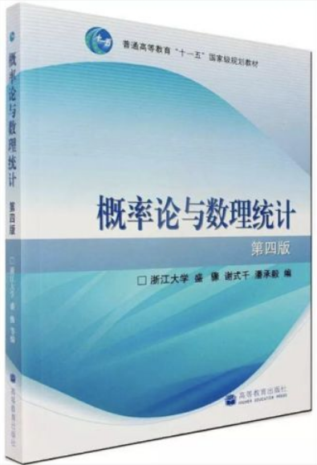
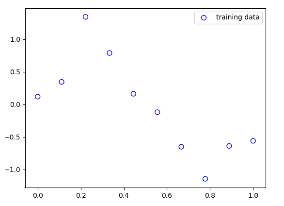
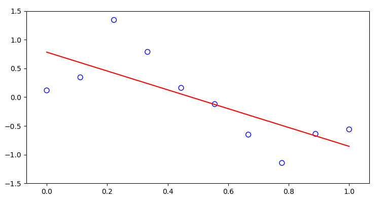
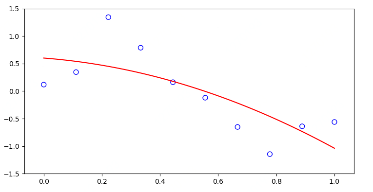
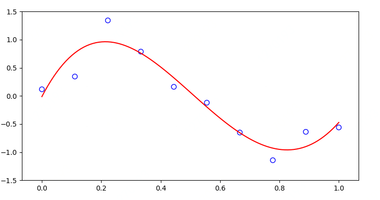
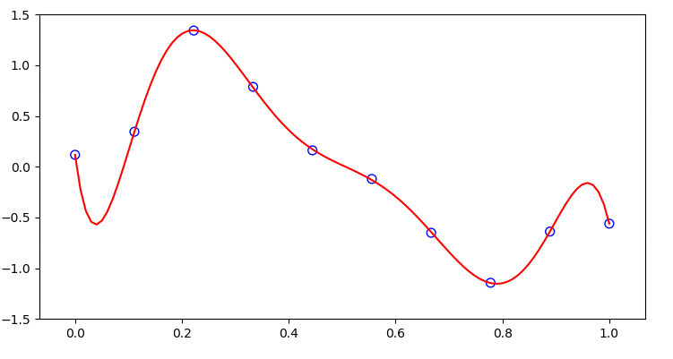
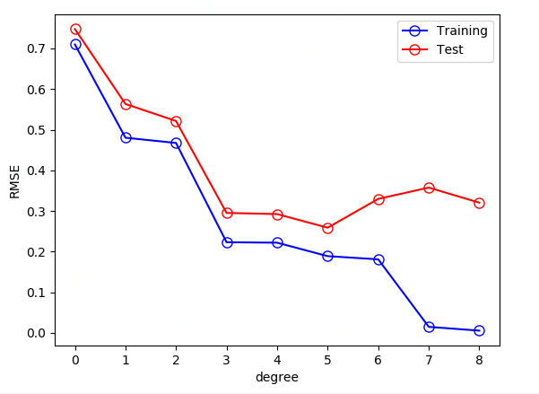
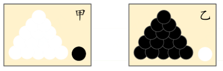
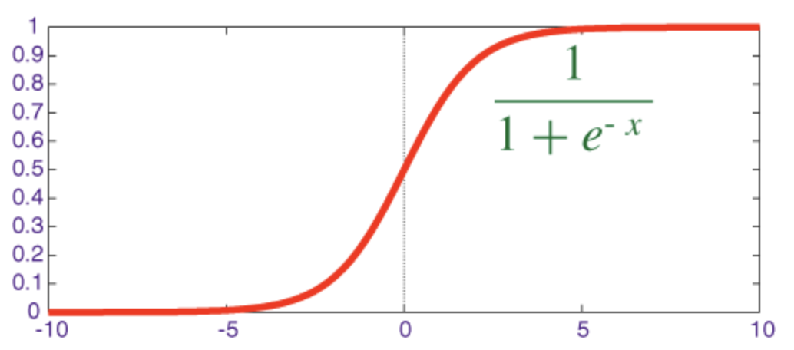

### 引言

本节介绍常见分布函数，包括均匀分布、伯努利分布、二项分布、多项式分布、指数分布、正态分布。

在介绍完常见函数分布后，我们会通过多项式分布解决一道机器学习例题。

在本节最后会简单介绍下最大似然估计，然后我们通过逻辑回归证明更加详细解释最大似然估计。



### 为什么机器学习需要概率

在上一小节，我们介绍了条件概率，我们通过几道例题让大家了解了什么是条件概率、贝叶斯公式。

可能有人会问，概率在机器学习中有什么用处。

我们看看下面这个表格，从直观上了解下各个机器学习算法中用到的数学-尤其是概率知识。可能大家对下面的数学知识点不太了解，没关系。

好的，让我们感受下机器学习用到的一些数学知识。


| 算法或者理论   | 用到的数学知识点                                             |
| -------------- | ------------------------------------------------------------ |
| 朴素贝叶斯分类 | **随机变量、贝叶斯公式、随机变量的独立性**、最大似然估计     |
| 决策树         | **概率、熵、互信息**、Gini系数                               |
| 逻辑回归       | **概率、随机变量**、最大似然估计、梯度下降法、凸优化、牛顿法、拟牛顿法 |
| 随机森林       | **抽样、方差**                                               |
| adaboost算法   | **概率、随机变量**、数学期望、凸优化                         |
| 条件随机场     | **条件概率、数学期望**                                       |
| 神经网络       | 凸优化、链式法则                                             |

从上表我们可以看出，大部分机器学习算法或者理论都需要用到概率知识。

看到上表后，你是不是特别想学习好概率知识呢。当你看完第二章后，机器学习中常用的概率知识你都会了解了。


同时，我们通过概率来解释分析机器学习算法，同时通过概率等理论知识对机器学习公式进行推导证明。

**不确定性有几种可能的来源：**

- 系统内在的随机性：例如一个扑克牌游戏，假设扑克牌随机shuffle。虽然扑克牌数量和扑克牌的种类我们是确定的，但是若我们随机抽一张扑克牌，让我们确定这张扑克牌是什么，这个时候需要使用概率去建模了。
- 不完全观测：例如一个游戏节目的参与者被要求在三个门之间选择，并且会赢得放置在选中门后的奖品。 其中两扇门的奖品是无奖品，第三扇门的奖品是一辆汽车。 选手的每个选择所导致的结果是确定的，但是站在选手的角度，结果是不确定的。很多系统在预测的时候，是不确定的，这个时候我们就要概率去描述它。


好了，接下来我们开始正式介绍本节重点内容。

在介绍各个函数分布前，我们先来看一道题目。

### 例题

我们通过一道题来详细了解分布函数的作用。

我们首先随机构造如下样本点。

那么问题来了，我们如何通过机器学习来拟合下面这些样本点呢？可能有人会想，用线性回归来拟合，没错，可以。

但这一讲我们换一种假设函数（分布函数）来拟合这些样本点。




好，现在开始正式开始本节的介绍。

### 分布函数和概率密度

定义：设X是一个随机变量，小x是任意实数，函数
$$
F\left( x \right) =P\left\{ X<=x \right\}
$$
称为X的**分布函数**。


如果对于随机变量X的分布函数F(x)，存在非负函数f(x)，使得对于任意实数小x有
$$
F\left( x \right) =\int_{-\infty}^x{f\left( t \right) d_t}
$$
则称X为连续型随机变量，其中函数f(x)称为X的概率密度函数，简称**概率密度**。

#### 均匀分布

设连续型随机变量X具有概率密度
$$
f\left( x \right) =\left\{ _{0,\ \text{其他}}^{1/\left( b-a \right) ,\ a<x<b} \right.
$$
则称X在区间(a, b)上服从均匀分布。

均匀分布很简单，我们不列举相关的例子了。

#### 伯努力分布

在每次试验中只有两种可能的结果（这两种结果是互相对立的），同时每次实验是相互独立的（即每次实验的结果与其它各次试验结果无关），则这一系列试验称为伯努利实验。

伯努力分布比较简单，就是两个互斥事件（一个标记为0，一个标记为1）的分布，一个事件的发生机率为p的话，另一个的发生机率就为(1-p)。通常情况下定义
$$
P\left( x=1 \right) =p
$$
$$
P\left( x=0 \right) =1-p
$$
$$
P\left( x \right) =p^x\left( 1-p \right) ^{1-x}
$$
$$
E\left( x \right) =P\left( x=1 \right) =p
$$

**比较常见的模型有**：掷硬币、轮盘赌等。

#### 二项分布

二项分布是从伯努力分布推出来的，二项分布是重复n次的伯努力分布。以抛硬币为例，扔一次的概率分布即为伯努力，扔n次的即为二项分布。

二项分布概率密度函数为：
$$
P(K=k) = \binom{n}{k}p^k(1-p)^{n-k}
$$

$$
\left( \begin{array} { l } { n } \\ { k } \end{array} \right) = \frac { n ! } { k ! ( n - k ) ! }
$$

其中一个事件的发生机率为$p$的话，该事件发生了$k$次；另一个事件发生机率就为$(1-p)$，该事件发生了$n-k$次。这两个事件发生次数为$n=(k+(n-k))​$次


例子：在很多工厂里，通常都会跟零件供应商约定供货合格率，并对每批供货进行抽检，就是所谓的IQC。设约定的合格品率为97%，如果每批随机抽10件，那么抽出1件不合格时，整批零件的合格率是不是达不到97%？

根据题意，p=0.97，n=10，k=9，据此算出10个样品中有9个合格品的概率是：$\mathrm { b } ( 9,10,0.97 ) = \mathrm { C } _ { 10 } ^ { 9 } \times 0.97 ^ { 9 } \times 0.03 ^ { 1 } = 0.228​$

####多项式分布

多项式分布(*Multinomial Distribution*)是二项式分布的推广。

二项分布是做n次伯努利实验，每次试验的结果只有两个。

如果现在还是做n次试验，只不过每次试验的结果可以有多m个，且m个结果发生的概率和为1，则其中一个结果发生$n_k$次的概率就是多项式分布。
$$
Mult\left( \vec{n}|\vec{p},N \right) =\left( \begin{array}{c}
	N\\
	\vec{n}\\
\end{array} \right) \prod\limits_{k=1}^K{p_{k}^{n_k}}
$$
其中
$$
\sum\limits_{k=1}^K{n_k}=N,
$$

$$
\sum\limits_{k=1}^K{p_k}=1,
$$

$$
\left( \begin{array}{c}
	N\\
	\vec{n}\\
\end{array} \right) =\frac{N!}{n_1!n_2! ... n_k!}
$$

我们用$1,2,3...k…,N$表示$N$次实验，一共有$K$个事件，其中$p_k$表示第$k$个事件对应的概率，$n_k$ 表示第$k$个事件发生的次数。

我们简单说下$\left( \begin{array}{c}
N\\
\vec{n}\\
\end{array} \right) ​$它的推导。

我们可以把问题看成在$n$个式子里，先选取$r_1$个$x_1$，然后选取$r_2$个$x_2$，最后选取$r_k$个$x_k$，然后求有多少种方法。类似把$n$个球放到$k$个不同的盒子里的方法有多少种,我们得到  $C_{n}^{r_1,r_2,\ldots r_k}=C_{n}^{r_1}C_{n-r_1}^{r_2} \ldots C_{n-r_1\ldots-r_{k-1}}^{r_k}=\frac{n!}{r_1!r_2!\ldots r_k!}$


扔骰子是典型的多项式分布。扔骰子，不同于扔硬币，骰子有6个面对应不同的6个点数，这样单次每个点数朝上的概率都是1/6。如果重复扔N次，问有K次都是点数6朝上的概率就可以用多项式分布来计算。

#### 泊松分布

泊松分布是探讨某一事件在某段时间或空间发生的次数的概率分布。实际生活中许多随机变量都符合泊松分布，例如：

*一油站在一分钟内汽车抵达的数目*

*某电话台于 30 秒内接到来电的次数*

*一本书内某一页的错字数目*

以上都是泊松分布
$$
P ( N(t) = k ) = \frac { e ^ { - \lambda t } (\lambda t) ^ { k } } { k ! }
$$

其中$λ$ 表示事件的频率, t表示时间， N表示某种函数关系, k表示次数。

例题：

已知平均每小时出生3个婴儿，请问下一个小时，出生3个婴儿的概率？

这里$λ=3, t=1, k=3$
$$
P ( N(t) = 3 ) = \frac { e ^ { - 3 * 1 } (3 * 1) ^ { 3 } } { 3 ! }
$$

####指数分布

设连续型随机变量X的概率密度为
$$
f(x) =\{ _{0,}^{e^{\lambda x},x>0}
$$
其中Q>0为常数，则称X服从参数为Q的指数分布。

**指数分布是事件的时间间隔的概率。**下面这些都属于指数分布。

- 婴儿出生的时间间隔
- 来电的时间间隔
- 奶粉销售的时间间隔
- 网站访问的时间间隔

指数分布的公式可以从泊松分布推断出来。如果下一个婴儿要间隔时间 t ，就等同于 t 之内没有任何婴儿出生。

则有：
$$
P ( N(t) = 0 ) = \frac { e ^ { - \lambda t } (\lambda t) ^ { 0 } } { 0 ! } = e ^ { - \lambda t }
$$

#### 正态分布

设连续型随机变量X的概率密度为
$$
f\left( x \right) =\frac{1}{\sqrt{2\pi}}e^{-\frac{\left( x-\mu \right) ^2}{2\sigma ^2}}
$$
上面的公为正态分布。

高斯分布的期望值决定了其位置，标准差决定了分布的幅度。我们通常提到的标准正态分布是期望值等于零，标准差等于1的正态分布。

现实生活中很多问题都符合高斯分布，例如某个国家的身高分布，体重分布；某个班级里学生的成绩分布；

#### 例题

在机器学习中，我们的目标就是选择一个假设函数。例如逻辑回归的假设函数是$sigmoid​$, 线性回归的假设函数是$y=ax+b​$。当我们学习了这么多分布函数后，**对于实际问题，我们只需要选择与实际问题（即数据）相符合的分布函数（假设函数）就好。**


上面我们讲了好多分布函数。那么本节最开头的例题如何解决呢。

好，我们就以最简单的多项式分布来作为假设函数，通过多项式分布来拟合这些样本点。

当多项式分布的系数=1，即假设函数为y=x时，它的拟合曲线为：



当多项式分布的系数=2，它的拟合曲线为：



当多项式分布的系数=4，它的拟合曲线为：



当多项式的系数为8时, 它的拟合曲线为



我们再来看下多项式对应的误差。



从上图可以看出，当多项式越复杂时，出现过拟合现象。即模型（多项式分布：这里是1,2,4,8）训练集loss很小，但测试集loss很大。


对应代码如下：

1.我们得到训练集和测试集。训练集和测试集的特征是通过多项式分布构造的。

2.之后我们调用线性回归进行预测。


```python
#1. 以下是样本点的构造方法。

x_train, y_train = create_toy_data(func, 10, 0.25)
x_test = np.linspace(0, 1, 100)
y_test = func(x_test)

plt.scatter(x_train, y_train, facecolor="none", edgecolor="b", s=50, label="training data")

plt.legend()
plt.show()


#2.预测代码
for i, degree in enumerate([1, 2, 4, 8]):
    plt.subplot(2, 2, i + 1)
    feature = PolynomialFeature(degree)
    X_train = feature.transform(x_train)
    X_test = feature.transform(x_test)

    model = LinearRegression()
    model.fit(X_train, y_train)
    y = model.predict(X_test)

    plt.scatter(x_train, y_train, facecolor="none", edgecolor="b", s=50, label="training data")
    #plt.plot(x_test, y_test, c="g", label="$\sin(2\pi x)$")
    plt.plot(x_test, y, c="r", label="fitting")
    plt.ylim(-1.5, 1.5)
    plt.annotate("M={}".format(degree), xy=(-0.15, 1))
plt.legend(bbox_to_anchor=(1.05, 0.64), loc=2, borderaxespad=0.)
plt.show()

#3.生成多项式特征函数
import itertools
import functools
import numpy as np

class PolynomialFeature(object):
    """
    polynomial features

    transforms input array with polynomial features

    Example
    =======
    x =
    [[a, b],
    [c, d]]

    y = PolynomialFeatures(degree=2).transform(x)
    y =
    [[1, a, b, a^2, a * b, b^2],
    [1, c, d, c^2, c * d, d^2]]
    """

    def __init__(self, degree=2):
        """
        construct polynomial features

        Parameters
        ----------
        degree : int
            degree of polynomial
        """
        assert isinstance(degree, int)
        self.degree = degree

    def transform(self, x):
        """
        transforms input array with polynomial features

        Parameters
        ----------
        x : (sample_size, n) ndarray
            input array

        Returns
        -------
        output : (sample_size, 1 + nC1 + ... + nCd) ndarray
            polynomial features
        """
        if x.ndim == 1:
            x = x[:, None]
        x_t = x.transpose()
        features = [np.ones(len(x))]
        for degree in range(1, self.degree + 1):
            for items in itertools.combinations_with_replacement(x_t, degree):
                features.append(functools.reduce(lambda x, y: x * y, items))
        return np.asarray(features).transpose()

```

以下是对应代码：

```python

def rmse(a, b):
    return np.sqrt(np.mean(np.square(a - b)))

training_errors = []
test_errors = []

li = [1, 2, 4, 8]
for i in range(9):

    feature = PolynomialFeature(i)
    X_train = feature.transform(x_train)
    X_test = feature.transform(x_test)

    model = LinearRegression()
    model.fit(X_train, y_train)
    y = model.predict(X_test)
    training_errors.append(rmse(model.predict(X_train), y_train))
    test_errors.append(rmse(model.predict(X_test), y_test + np.random.normal(scale=0.25, size=len(y_test))))

plt.plot(training_errors, 'o-', mfc="none", mec="b", ms=8, c="b", label="Training")
plt.plot(test_errors, 'o-', mfc="none", mec="r", ms=8, c="r", label="Test")
plt.legend()
plt.xlabel("degree")
plt.ylabel("RMSE")
plt.show()
```

### 最大似然估计

介绍完各种分布函数后，我们来介绍最大似然估计。上面讲过的分布函数，例如正态分布，我们如何求$\mu$和$\theta$呢？

在机器学习中求解参数的常用方法就是最大似然估计方法（Maximum Likelihood Estimate，MLE）。

我们本节重点介绍下什么是最大似然估计，以及以高斯分布为例，通过最大似然估计，求解高斯函数对应的参数。



如果有两个外形完全相同的箱子，甲箱中有99个白球和1个黑球，乙箱中有1个白球和99个黑球。一次试验取出一个球，结果取出的是黑球。问，黑球从哪个箱子取出？

我们的第一印象就是黑球从乙箱取出的。这个推断符合人们的经验事实。这种想法就是"最大似然估计"


#### **最大似然估计法：**

**<u>离散型</u>**：若总体$X​$属于离散型，其分布律$P(X=x)=P(x;\theta)​$，其中$\theta​$为待估计参数。

设$X_1, X_2,…,X_n​$是来自$X​$的样本，则$X_1, X_2,…,X_n​$的联合概率分布律为$\prod_{i-1}^{n}p(x_i;\theta)​$

又设$x_1,x_2,…,x_n​$是相应于样本$X_1,X_2,…,X_n​$的一个样本值。容易知道样本$X_1,X_2,…,X_n​$取到观察值$x_1,x_2,…,x_n​$的概率，即事件${X_1=x_1,X_2=x_2,…,X_n=x_n}​$发生的概率为$L(\theta)=L(x_1,x_2,…,x_n;\theta)=\prod_{i-1}^{n}p(x_i;\theta)​$，称**$L(\theta)​$为似然函数**。

如果存在一个参数$\hat{\theta}$使似然函数$L(x_1,x_2,…,x_n;\theta)$达到最大，则称**$\hat{\theta}(x_1,x_2,…,x_n)$为最大似然估计值, $\hat{\theta}(X_1,X_2,…,X_n)$为最大似然估计量。**即$L(x_1,x_2,…,x_n;\hat{\theta})=max L(x_1,x_2,…,x_n;\theta)$


**<u>连续型</u>**：若总体$X​$属于连续型，其概率密度$f(x;\theta)​$，其中$\theta​$为待估计参数。

设$X_1, X_2,…,X_n$是来自$X$的样本，则$X_1, X_2,…,X_n$的联合概率密度为$\prod_{i-1}^{n}f(x_i;\theta)​$

与离散型一样，$L(\theta)=L(x_1,x_2,…,x_n;\theta)=\prod_{i-1}^{n}f(x_i;\theta)$为似然函数。

若$L(x_1,x_2,…,x_n;\hat{\theta})=max L(x_1,x_2,…,x_n;\theta)$，则称$\hat{\theta}$为最大似然估计值.


最大似然估计的方法采用微分学中的求最大值问题，可以通过求导得到，$\frac{\mathrm{dL(\theta)} }{\mathrm{d} \theta}=0$，又因$L(\theta)$和$lnL(\theta)$在同一$\theta$处取到极值，所以$\theta$的最大似然估计也可以从$\frac{\mathrm{dlnL(\theta)} }{\mathrm{d} \theta}=0$得到


**求最大似然函数估计值的一般步骤**：

（1）写出似然函数；

（2）对似然函数取对数，并整理

（3）求导数，令导数为0，得到似然方程；

（4）解似然方程，得到的参数即为所求；

#### 高斯分布

$$
f\left( x|\mu ,\sigma ^2 \right) =f\left( x \right) =\frac{1}{\sqrt{2\pi}\sigma}e^{-\frac{\left( x-\mu \right) ^2}{2\sigma ^2}}
$$
似然函数为
$$
P\left( x \right) =\prod_{n=1}^N{f\left( x_n|\mu ,\sigma ^2 \right)}
$$
对数似然函数(对上面的公式取对数)
$$
lnP\left( x \right) =-\frac{1}{2\sigma ^2}\sum_{n=1}^N{\left( x_n-\mu \right) ^2}-\frac{N}{2}ln\sigma ^2-\frac{N}{2}ln\left( 2\pi \right)
$$
对上式进行求导，分别得到$\mu$和$\sigma^2$两个参数估计量。
$$
\mu _{ML}=\frac{1}{N}\sum_{n=1}^N{x_n}
$$

$$
\sigma _{ML}^{2}=\frac{1}{N}\sum_{n=1}^N{\left( x_n-\mu _{ML} \right) ^2}
$$

#### 逻辑回归

好，我们再举一个如何用MLE求解逻辑回归算法的公式推导过程。

Logistic Regression来说，其思想也是基于线性回归（Logistic Regression属于广义线性回归模型）。其公式如下： 
$$
h_{\theta}(x)=\frac{1}{1+e^{-z}}=\frac{1}{1+e^{-\theta^Tx}}
$$
 其中
$$
y=\frac{1}{1+e^{-x}}
$$
被称为sigmoid函数，我们可以看到，Logistic Regression算法是将线性函数的结果映射到了sigmoid函数中。

sigmoid的函数图形如下： 



我们可以看到，sigmoid的函数输出介于（0，1）之间，中间值是0.5。

于是$h_{\theta}(x)​$的含义就很好理解了。

如：

$h_{\theta}(x)$<0.5，说明当前数据属于A类

$h_{\theta}(x)$>=0.5，说明当前数据属于B类。

所以我们可以将sigmoid函数看成样本数据的概率密度函数。

有了上面的公式，我们接下来需要做的就是用最大似然估计来估计$\theta$了。

首先我们来看下，对于分类问题，类别1和类别0的概率分别为：

$$P(y=1|x;\theta)=h_{\theta}(x)$$

$$P(y=0|x;\theta)=1-h_{\theta}(x)$$

接下来我们可以最大似然估计的方法去求解损失函数，首先得到概率函数为： 
$$
P(y|x;\theta)={(h_{\theta}(x))^y} *{(1-h_{\theta}(x))^{1-y}}
$$
因为样本数据独立，所以它们的联合分布可以表示为各边的乘积

似然函数为：

$$L(\theta)=\prod_{i=1}^{m} P(y^{(i)}|x^{(i)};\theta)$$

$$L(\theta)=\prod_{i=1}^{m} {(h_{\theta}(x^{(i)}))^{y^{(i)}}} *{(1-h_{\theta}(x^{(i)}))^{1-y^{(i)}}}$$


对数似然函数为： 

$$l(\theta)=log(L(\theta))=\sum_{i=1}^{m} log({(h_{\theta}(x^{(i)}))^{y^{(i)}}}) + log({(1-h_{\theta}(x^{(i)}))^{1-y^{(i)}}})$$

$$l(\theta)=log(L(\theta))=\sum_{i=1}^{m} {y^{(i)}}log{(h_{\theta}(x^{(i)}))} + ({1-y^{(i)}})log{(1-h_{\theta}(x^{(i)}))}$$

对上面求导就可以求解得到$\theta$ 了


好了，本节就先到这里。我们回顾下：我们介绍了七种分布函数同时通过多项式分布函数来解决了一道机器学习问题。之后我们介绍最大似然估计来求解各种分布函数中的参数。

更多精彩内容在等待大家，我们下节见。