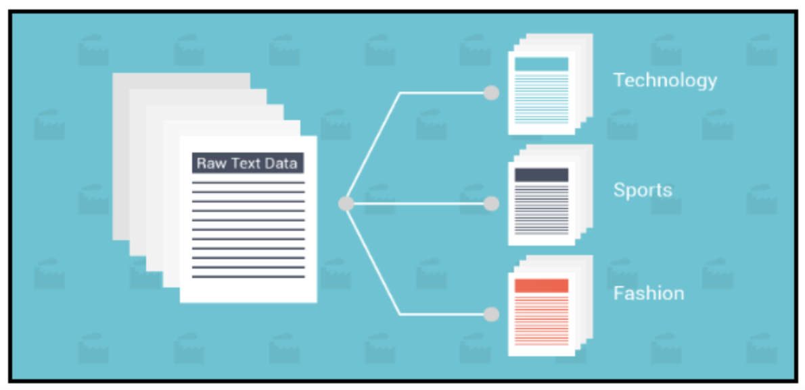

### 引言

本节介绍机器学习中一个重要的分支，机器学习意图识别算法。

我们本节主要介绍本文分类这个意图识别问题。在本节中，如果没有特别说明，本文分类=意图识别。



文本分类是根据文本内容给文本分配标签的过程。它是自然语言处理（NLP -nature language process）中的基本任务之一，具有广泛的应用，如情感分析、垃圾邮件检测、意图检测等。

但是，什么是文本分类？文本分类如何工作？用于分类文本的算法是什么？什么是最常见的业务应用程序？

我们将尝试在本节中回答这些问题。您可以在本指南中找到的一些主题包括以下内容：

1.什么是文本分类

2.文本分类是如何工作的

3.文本分类的应用

4.数据

### 什么是文本分类

本文分类的概率表示$p(y|x_1x_2x_3…x_n)$，$x_1x_2x_3…x_n$表示整个文本，$y$表示文本对应的分类。

大家对这个公式是不是很熟悉，对，这就是第7节讲的条件概率呀。

对，**文本分类就是求在给定文本$x_1x_2x_3…x_n$条件下，其得到$y$的概率。**

文本分类（例如文本分类或垃圾邮件检测）是将一组预定义类别分配给文本的任务。文本分类器可用于组织，构造和分类相关任务。例如，可以按主题组织新文章，可以区分垃圾邮件，可以按语言组织聊天对话，可以通过情感识别用户的情绪等等。

我们看下面这段文字：

***gitchat真是个好的学习网站。***


分类器可以将此文本作为输入，分析其内容，然后自动分配相关标签，例如“gitchat真是个好的学习网站”这句文本表示此文本对应的用户情绪为正向的。


### 文本分类是如何工作的

文本分类算法可以通过两种：手动规则算法和机器学习算法。

在前者中，人类解释文本的内容,制作相应的规则对其进行分类。这种方法通常可以提供高质量的结果，但是耗时且昂贵。

后者应用机器学习，自然语言处理技术，以更快，更经济的方式自动分类文本。

自动文本分类有很多种方法，可以分为两种不同类型的系统：

- 基于规则的系统
- 基于机器学习的系统

**基于规则的方法**

通过专家总结规则，使用一组手工制作的规则将文本分类为有组织的类别。

假设您想将新闻文章分为两组，即体育和政治。首先，你需要定义两个单词列表来表征每个小组（例如，与足球，篮球，勒布朗詹姆斯等体育相关的单词，以及与政治相关的单词，如唐纳德特朗普，希拉里克林顿，普京等）。接下来，当您想要对新的输入文本进行分类时，您需要计算文本中出现的与运动相关的单词数量，并对与政治相关的单词执行相同的操作。如果与运动相关的单词出现的数量大于与政治相关的单词计数的数量，则该文本被分类为运动，反之亦然。

基于规则的系统是人类可理解的，并且可以随着时间的推移而得到改进。但这种方法有一些缺点。首先，这些系统需要深入了解相关领域，有相关领域背景知识。其次复杂系统生成规则非常耗时，具有挑战性，并且通常需要大量的分析和测试。基于规则的系统也难以维护，并且不能很好地扩展，因为添加新规则会影响预先存在的规则的结果。


**基于机器学习的方法**

机器学习的文本分类不是依赖于手工制作的规则，而是学习根据过去的观察进行分类（其实你可以理解为机器学习算法是模拟人类的基于规则的方法构造大量规则，只不过这些规则是机器构造的，相对于人类构造的方法更快捷）。通过使用预先标记的示例作为训练数据，机器学习算法可以学习文本片段之间的不同关联，并且特定输入（即文本）期望特定输出（即标签）。

使用机器学习训练分类器的第一步是特征提取：使用方法将每个文本转换为矢量形式的数字表示。最常用的方法之一是bag of word词袋，其中向量表示词典中单词的分布。


机器学习的文本分类通常比人工制定的规则系统更准确，尤其是在复杂的分类任务上。此外，具有机器学习的分类器更易于维护，您始终可以标记新示例以学习新任务。

一些用于创建文本分类模型的最流行的机器学习算法包括朴素贝叶斯算法族，支持向量机、决策树、随机森林、boosting tree、深度学习等

在这里我们主要介绍传统特征提取方法和深度学习方法。


**文本分类的数学表达**

深度学习从2012年开始火爆起来，当时深度学习在图像分类刷爆学术界和工业界。

文本分类受益于最近深度学习架构的复兴，因为它们有可能在不需要工程特征的情况下达到高精度。

文本分类中使用的两种主要深度学习架构是卷积神经网络（CNN）和递归神经网络（RNN）。

文本分类就是求解如下的数学形式：

$p(y|x_1x_2x_3…x_n)=p(y|f(w*(x_1x_2…x_n) + b))​$

其中$x_1x_2x_3…x_n$表示的是一段文本内容，$f(w*(x_1x_2…x_n) + b)$是文本的深层形式表达。

其中在深度学习中不论是CNN，RNN等模型都是在学习如何更好的表示$f(w*(x_1x_2…x_n) + b)​$

我们这里以一个伪代码为例讲解下在深度学习模型中的例子：


设$x_i$表示第$i$个词，$a_i$表示第$i$个词对应的attention权重，则

$p(y|x_1x_2x_3…x_n)=p(y|f(w*(x_1x_2…x_n) + b))=p(y|s)=softmax(w_c*s+b_c)$

$f(w*(x_1x_2…x_n) + b)=s=\sum_{i=1}^{n}\alpha_i*x_i $

$u_i=tanh(W_w*x_i+b_w)$

$\alpha_i = \frac{exp(u_i^tu_w)}{\sum_nexp(u_i^tu_w)}$

由于CNN和RNN相对简单，这里不再赘述，我们首先介绍下传统机器学习方法-特征其提取方法，之后在介绍深度学习在文本分类上的尝试。

### 特征提取方法介绍

传统机器学习方法主要工作之一就是构造各种特征，特征工程在传统机器学习中作用非常重要。接下来我们介绍特征工程中几种特征提取方法：熵，条件熵，信息增益。

**熵**： 用来度量信息的不确定程度。

解释： 熵越大，信息量越大。不确定程度越低，熵越小，比如“明天太阳从东方升起”这句话的熵为0，因为这个句话没有带有任何信息，它描述的是一个确定无疑的事情。

例子：假设有随机变量X，用来表达明天天气的情况。X可能出现三种状态 1) 晴天2) 雨天 3)阴天 每种状态的出现概率均为P(i) = 1/3，那么根据熵的公式：

$H(X)=-\sum_{i=1}^{n}p(x_i)logp(x_i)$

$H(X) = - 1/3 * log(1/3) - 1/3 * log(1/3) + 1/3 * log(1/3) = log3 =0.47712$


**条件熵**：在一个条件下，随机变量的不确定性

$H(X|Y)=-\sum^{x,y}P(x,y)logp(x|y)$


举例说明：

假设随机变量X表示明天的天气情况，随机变量Y表示今天的湿度，Y 有两种状态 1) 潮湿 2) 干燥。

假设基于以往的18个样本， X 的三种状态，概率均为 0.33， Y的两种状态，概率为0.5

| Y/X   | 晴天0 | 雨天1 | 阴天2 |
| ----- | ----- | ----- | ----- |
| 潮湿0 | 1     | 5     | 3     |
| 干燥1 | 5     | 1     | 3     |

条件概率可以通过朴素贝叶斯公式进行计算:

$P(X=0|Y=0) =P(X=0,Y=0)/P(Y=0) = (1/18)/(9/18) = 1/9$

$P(X=1|Y=0)= P(X=1,Y=0)/P(Y=0) = (5/18)/(9/18) = 5/9$

$P(X=2|Y=0) =P(X=2,Y=0)/P(Y=0) = (3/18)/(9/18) = 3/9$

$P(X=0|Y=1) =P(X=0,Y=0)/P(Y=1) = (1/18)/(9/18) = 1/9$

$P(X=1|Y=1)= P(X=1,Y=0)/P(Y=1) = (5/18)/(9/18) = 5/9$

$P(X=2|Y=1) =P(X=2,Y=0)/P(Y=1) = (3/18)/(9/18) = 3/9$

根据这个公式：

$H(X|Y) = (1/18)*log(1/9) +  (5/18)*log(5/9) +\\ (3/18)*log(3/9) + (1/18)*log(1/9) +\\ (5/18)*log(5/9) + (3/18)*log(3/9) = 0.406885$


**信息增益**的定义：在一个条件下，信息不确定性减少的程度

所以Y条件产生的信息增益为 0.47712 - 0.406885

信息增益的应用： 我们在利用进行分类的时候，常常选用信息增益更大的特征，信息增益大的特征对分类来说更加重要。决策树就是通过信息增益来构造的，信息增益大的特征往往被构造成底层的节点。

### 深度学习方法-transformer介绍

transformer的介绍可以看以下的网址，介绍的非常详细。

https://jalammar.github.io/illustrated-transformer/

我这里只是简单的说两句。

transformer摒弃了我们熟知的CNN和RNN网络结构，引入了新的self-attention网络结构。我们可以把CNN、RNN、transformer理解为特征提取器，而transformer就是更加强大的特征提取网络。

以下是transformer的网络结构图：


上图包括一个self-attention网络结构，Feed-Forward网络结构，以及一个Normalize的网络结构。

#### bert实验

本节通过bert实验来看看现在state of the art的分类模型，以及看看他有多优秀。

**BERT文本分类介绍**

bert github地址：https://github.com/google-research/bert

里面已经提供了文本分类fine-tuning.py的代码：run_classifier.py文件


这里我们以MRPC数据为例，说明如何使用bert来实现文本分类实验。

这里要说明下，虽然MRPC数据集是文本匹配的数据集，但是在BERT中，它把这个任务当成分类问题来解决。


**数据准备**：

1.下载BERT提供的中文模型；2.我们需要下载MRPC数据，使用[这个脚本](https://gist.github.com/W4ngatang/60c2bdb54d156a41194446737ce03e2e) 下载

| 文件      | 行数 |
| --------- | ---- |
| train.tsv | 3669 |
| dev.tsv   | 409  |


**参数如下**：

```
以下是bert参数

{
"attention_probs_dropout_prob": 0.1,
"hidden_act": "gelu",
"hidden_dropout_prob": 0.1,
"hidden_size": 768,   # cell 维度
"initializer_range": 0.02,
"intermediate_size": 3072, #FFN 维度
"max_position_embeddings": 512, #embedding维度
"num_attention_heads": 12, # multi-head numbers
"num_hidden_layers": 12, # layer numbers
"type_vocab_size": 2,
"vocab_size": 30522
}
```


**之后调用如下脚本**

```python
export BERT_BASE_DIR=/path/to/bert/uncased_L-12_H-768_A-12
export GLUE_DIR=/path/to/glue

python run_classifier.py \
  --task_name=MRPC \
  --do_train=true \
  --do_eval=true \
  --data_dir=$GLUE_DIR/MRPC \
  --vocab_file=$BERT_BASE_DIR/vocab.txt \
  --bert_config_file=$BERT_BASE_DIR/bert_config.json \
  --init_checkpoint=$BERT_BASE_DIR/bert_model.ckpt \
  --max_seq_length=128 \
  --train_batch_size=32 \
  --learning_rate=2e-5 \
  --num_train_epochs=3.0 \
  --output_dir=/tmp/mrpc_output/
```


**你会看到如下结果**：

```python
***** Eval results *****
  eval_accuracy = 0.845588
  eval_loss = 0.505248
  global_step = 343
  loss = 0.505248
```

非常简单，我们就可以实现一个简单的文本分类算法。


接下来我们详细对比下BERT模型和其他模型的效果。

| 序号 | 模型                   | 参数     | 正确率1 | 总预测时间(409条数据) | 平均一条时间（batch=1） |
| ---- | :--------------------- | -------- | ------- | --------------------- | ----------------------- |
| 0    | cnn                    | 官网参数 | 0.6879  | 10s                   | 2ms                     |
| 1    | BERT，未加载预训练模型 | 官网参数 | 0.683   | 20.15 s               | 49.2ms                  |
| 2    | BERT，加载预训练模型   | 官网参数 | 0.873   | 21.618 s              | 51ms                    |


从上图可以看出，

1.在默认参数情况下，即num_hidden_layers=12时，正确率达到0.873，效果最好。

2.一个很有意思的现象（看序号1和序号2）：直接使用BERT进行fine tuning(未加载)，和加载bert 预训练模型再fine tuning/num_hidden_layers=12时效果差的非常多。这说明预训练模型对指标有非常大的影响。预训练模型起了非常大的效果。

3.不同模型比较：

​     在没有加载预训练时，bert效果和cnn差不多（序号0和序号1），但预测时间bert太长

​     当加载了预训练后，在MRPC任务上fine-tuning后，bert效果明显强于cdssm。当然这样是不公平的：序号0和序号2


好了，意图识别就到这里了。

我们在总结下，

意图识别就是将一段文本分配标签的过程。

意图识别包括传统方法和深度学习方法

深度学习方法中BERT是state of the art方法。建议大家课后好好学习下BERT源代码。