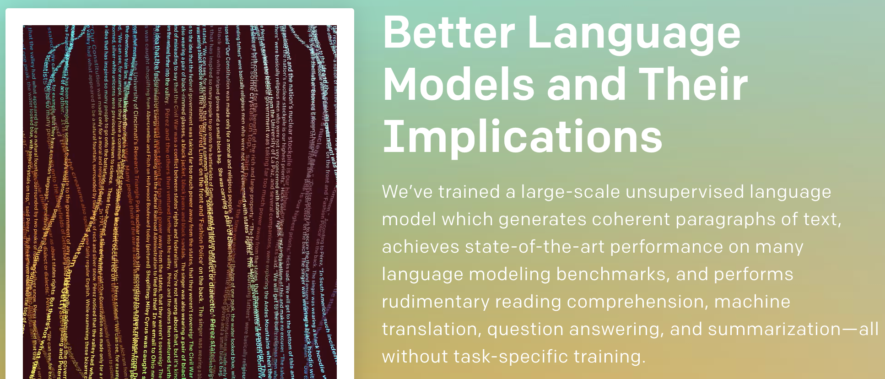
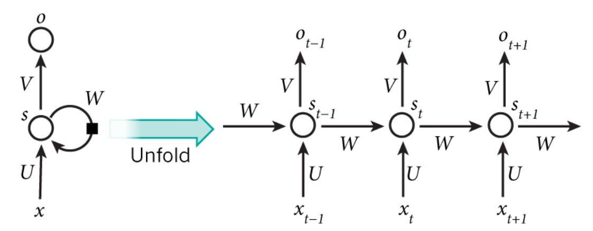
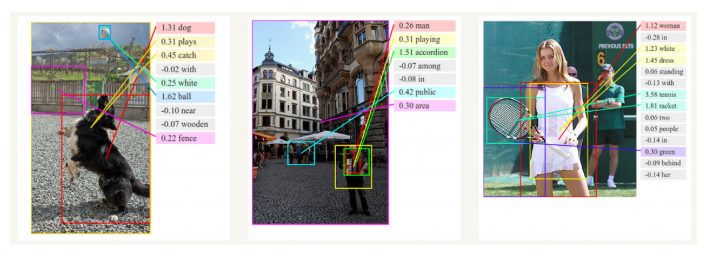
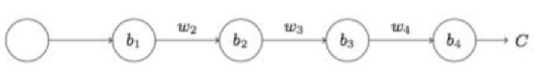
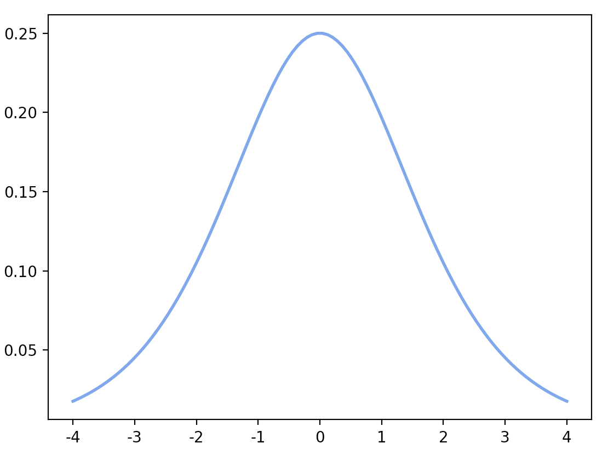
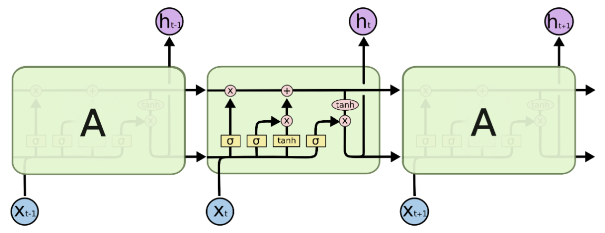
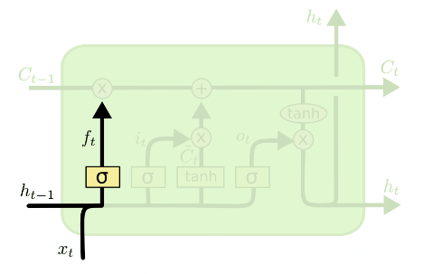
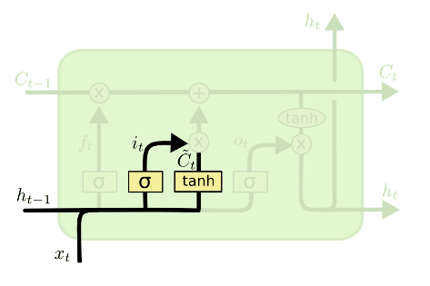
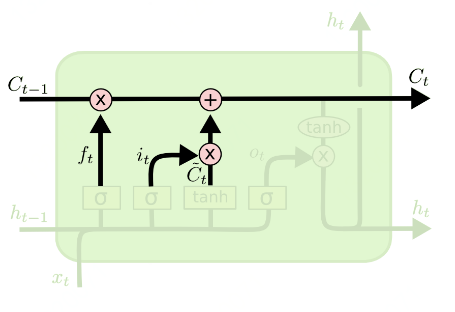

### 引言

我们在第7节介绍条件概率时，简单介绍过语言模型，当时没有深入介绍。

本节主要介绍RNN循环什么网络以及LSTM，在文章的最后我们会写一个小demo，诗歌生成的demo。



### RNN（Recurrent Neural Network）简介

人工神经网络（ANN）由多层互相连接的称为人工神经元的单元构成。「浅层网络」指的是没有循环连接，且只有一个输入层、一个输出层，并至多只有一个隐藏层的 ANN。

随着网络层数增加，复杂度也增加。层数或循环连接数的增加通常会增加网络的深度，从而使网络能提供多层次的数据表征以及特征提取，即「深度学习」。一般而言，这些网络由非线性的、简单的单元构成，其中更高的层提供数据的更抽象表征，并压制不需要的可变性。由于每个层的非线性构成带来的优化困难，直到 2006 年出现重大研究进展之前，关于深度网络架构的研究工作很少。

结合了循环连接的 ANN 被称为循环神经网络（RNN），可以对序列数据建模，用于序列识别和预测。RNN 隐藏状态的结构以循环形成记忆的形式工作，每一时刻的隐藏层的状态取决于它的过去状态。这种结构使得 RNN 可以保存、记住和处理长时期的过去复杂信号。RNN 可以在当前时间步将输入序列映射到输出序列，并预测下一时间步的输出。

RNN 跟 CNN 历史相似之处在于，都是上个世纪提出来的概念。但是由于当时计算量和数据量都比较匮乏，它们都被尘封，直到近几年开始大放异彩，可以说是超越时代的产物。区别在于，CNN 在2012年就开始大行其道，而 RNN 的流行却要到2015年以后了。

递归神经网络（RNN）是流行的模型，在许多NLP任务中表现初色。

语言模型的应用：

首先，它允许我们根据它们在现实世界中发生的可能性来评分任意句子。这为我们提供了语法和语义正确性的衡量标准。这些模型通常用作机器翻译系统的一部分。

其次，语言模型允许我们生成新文本（我认为这是更酷的应用程序）。在莎士比亚训练语言模型可以让我们生成类似莎士比亚的文本。

#### 什么是RNN呢？

RNN背后的想法是利用顺序信息（时序信息）来进行建模的。

在传统的神经网络中，我们假设所有输入（和输出）彼此独立。但对于许多任务而言，这是一个非常糟糕的主意。如果你想预测句子中的下一个单词，你最好知道它前面有哪些单词。

 RNN被称为循环，因为它们对序列的每个元素执行相同的任务，输出取决于先前的计算。考虑RNN的另一种方式是它们具有“记忆”，其捕获到目前为止已经计算的信息。

rnn的网络结构如下：




上图显示了RNN对应展开后的网络结构。

通过展开的这种方式，我们可以知道整个网络结构长什么样子。

例如，如果我们关心的序列是5个单词的句子，则网络将展开为5层神经网络，每个单词一层。控制RNN中发生的计算的公式如下：

- $x_t$是时间步t的输入。例如，$x1$可以是对应于句子的第1个单词的向量。
- $s_t​$是时间步$t​$的隐藏状态。$ s_t​$是基于先前隐藏状态和当前步骤的输入计算得到的：$s_t = f(Ux_t + Ws_{t-1})​$。
- 函数$f$通常是非线性，例如$tanh$或$ReLU$。
- $o_t​$是步骤t的输出。例如，如果我们想要预测句子中的下一个单词，那么它对应词表中某个词的概率为：
- $o_t = softmax（V*s_t）$

RNN公式总结如下：

> $s_t = f(Ux_t + Ws_{t-1})$
>
> $o_t = softmax（V*s_t）$


#### RNN能做什么

RNN在许多NLP任务中取得了巨大成功。

在这一点上，我应该提到最常用的RNN类型是LSTM，它在捕获长距离依赖方面要比RNN好多。

但不要担心，LSTM与我们将在本教程中开发的RNN基本相同，它们只是采用不同的方式来计算隐藏状态。

我们将在稍后的文章中更详细地介绍LSTM。

**语言模型**

什么是语言模型：给定单词序列集合，我们想要根据前面时刻的单词预测下一个词的概率。

语言模型允许我们测量句子的可能性，这是机器翻译的重要输入（因为高概率句子通常是正确的）。

能够预测下一个单词的另一个作用是我们可以得到生成模型，它允许我们让机器生成诗歌和文本。

根据我们的训练数据，我们可以生成各种各样的东西。在语言建模中，我们的输入通常是一个序列，我们的输出是预测单词的序列。

**翻译**

机器翻译类似于语言建模，因为我们的输入是源语言中的一个序列（例如德语），我们希望以目标语言输出一个新的序列（例如英语）。

一个关键的区别是我们的输出仅在我们看到完整输入后才开始，因为我们翻译的句子的第一个单词可能需要从完整的输入序列中捕获。

**语音识别**

给定来自声波的声学信号的输入序列，我们可以预测一系列语音片段及其概率。

**图像描述生成**
RNN可以作为生成无标注图像描述模型的一部分。



#### RNN存在的问题

RNN有梯度消失问题。

以下我们证明下RNN为什么会出现梯度消失问题。

我们先看一个简单的例子，来说明为什么会产生梯度消失。

假设我们的网络如下图所示：



即

$z_1=w_1x_1+b_1\\x_2=\sigma(z_1)​$

$z_2=w_2x_2+b_2\\x_3=\sigma(z_2)$

$z_3=w_3x_3+b_3\\x_4=\sigma(z_3)​$

$z_4=w_4x_4+b_4\\y_4=\sigma(z_4)$

我们有

$\frac{\delta_C}{\delta_{b_1}}=\frac{\delta_C}{\delta_{y_4}}\frac{\delta_{y_4}}{\delta_{z_4}}\frac{\delta_{z_4}}{\delta_{x_4}}\frac{\delta_{x_4}}{\delta_{z_3}}\frac{\delta_{z_3}}{\delta_{x_2}}\frac{\delta_{x_2}}{\delta_{z_1}}\frac{\delta_{z_1}}{\delta_{b_1}}\\ = \frac{\delta_C}{\delta_{y_4}}({\sigma}'(z_4)w_4)({\sigma}'(z_3)w_3)({\sigma}'(z_2)w_2)({\sigma}'(z_1))​$ 

而$sigmoid$函数的导数为${S}'(x)=\frac{e^{-x}}{(1+e^{-x})^{2}}=S(x)(1-S(x))$，它的图形曲线为



由上图可以看出，$sigmoid$函数的导数最大值为1/4，通常我们的权值$|w|<1$时，因此我们可以得到${\sigma}'(z_4)w_4<1/4$，随着层数的增加，这个值越来越小，这也就是我们常提到的梯度消失问题。

那么如果我们设置初始权重$w​$的权值比较大$|w|>1​$时，会有${\sigma}'(z_4)w_4>1/4​$, 造成梯度越来越大，这也是造成梯度爆炸的原因。

RNN梯度消失的问题和上面举的例子是相同的。所以当RNN的层数比较多时，就会存在梯度消失问题。

### LSTM介绍

为了解决RNN的问题，研究人员提出了LSTM，以下是LSTM介绍。

LSTM(Long Short Term)是一种 RNN 的变种，可以学习长期依赖信息。在很多问题，LSTM 都取得相当巨大的成功，并得到了广泛的使用。LSTM 的提出为了解决RNN的小问题：梯度消失以及RNN长距离效果不好。为了解决上面的问题，researchers提出了LSTM网络结构。

以下是LSTM网络结构：



我们接下来会详细介绍这个网络结构。

LSTM的关键是神经元的状态信息，水平线贯穿图的顶部。神经元状态信息有点像传送带上传送东西。

LSTM通过各种门，将神经元的信息从左向右传送，有些信息被移除，有些信息被到神经元中。

**1.LSTM 中第一步是决定丢弃什么信息。**

这个通过一个称为**忘记门**（forget gate layer）完成。该门会读取 $h_{t-1}​$ 和 $x_t​$，输出一个在0到1之间的数值，根据这个数据，LSTM决定是移除还是保留给神经元状态 $C_{t-1}​$。1表示“完全保留”，0表示“完全舍弃”。



$f_t=\sigma (W_f*[ h_{t-1},x_t ] +b_f)$

其中$f_t$表示遗忘的概率，1表示“完全保留”，0表示“完全舍弃”。


**2.下一步是确定什么样的老信息被保存下来**

输入门（input gate layer） 决定保留什么样的信息。即$i_t​$决定保留多少信息，$\tilde{C}_t​$是要保留的信息。



$i_t=\sigma ( W_i*[ h_{t-1},x_t] +b_i)$

$\tilde{C}_t=\tanh( W_c*[ h_{t-1},x_t] +b_c)$

$i_t$决定保留多少信息,取值为[0, 1]，​$\tilde{C}_t$是要保留的信息。


**3.得到新的信息**

这一步是信息融合，将丢弃的和保留的信息累加起来。

新信息等于$f_t$乘上老信息$C_{t-1}$，再加上$i_t$乘上新信息$\tilde{C}​$



$C_t=f_t*C_{t-1}+i_t*\tilde{C}_t​$

#### LSTM公式

以上就是LSTM介绍，现在将LSTM公式总结下，如下：

遗忘门：$f_t=\sigma \left( W_f*\left[ h_{t-1},x_t \right] +b_f \right)​$

输入门：$i_t=\sigma \left( W_i*\left[ h_{t-1},x_t \right] +b_i \right)​$

输出门：$o_t=i_t=\sigma \left( W_o*\left[ h_{t-1},x_t \right] +b_o \right)$

要保留的信息：$\tilde{C}_t=\tan\text{h}\left( W_c*\left[ h_{t-1},x_t \right] +b_c \right)​$

当前状态信息：$C_t=f_t*C_{t-1}+i_t*\tilde{C}_t​$

当前时刻的隐层输出：$h_t=o_t * tanh(C_t)​$


**那现在问题来了，为什么LSTM可以解决梯度消失问题呢？**

我们注意到， 首先三个门的激活函数是sigmoid， 这也就意味着这三个门的输出要么接近于0 ， 要么接近于1。当门为1时， 梯度能够很好的在LSTM中传递，很大程度上减轻了梯度消失发生的概率， 当门为0时，说明上一时刻的信息对当前时刻没有影响， 我们也就没有必要传递梯度回去来更新参数了。


接下来我们就是例子时间。本节我们介绍LSTM的重要应用诗歌生成demo。

### 诗歌生成demo

以下就是诗歌生成demo。

简单介绍下：

需求：根据一句话，预测下一个词。

所以从我们的需求看，这就是一个时间序列问题，所以我们采用RNN/LSTM/GRU建模。

数据：我们构造时间序列数据。即x=一句话，y=下一个词

模型：我们采用LSTM建模

以下即是详细代码。

```python
class DemoModel(object):
  """The PTB model."""

  def __init__(self, is_training, config, input_):
    self._is_training = is_training
    self._input = input_
    self._rnn_params = None
    self._cell = None
    self.batch_size = input_.batch_size
    self.num_steps = input_.num_steps
    size = config.hidden_size
    vocab_size = config.vocab_size

    with tf.device("/cpu:0"):
      embedding = tf.get_variable(
          "embedding", [vocab_size, size], dtype=data_type())
      inputs = tf.nn.embedding_lookup(embedding, input_.input_data)

    if is_training and config.keep_prob < 1:
      inputs = tf.nn.dropout(inputs, config.keep_prob)

    output, state = self._build_rnn_graph(inputs, config, is_training)

    softmax_w = tf.get_variable(
        "softmax_w", [size, vocab_size], dtype=data_type())
    softmax_b = tf.get_variable("softmax_b", [vocab_size], dtype=data_type())
    logits = tf.nn.xw_plus_b(output, softmax_w, softmax_b)
     # Reshape logits to be a 3-D tensor for sequence loss
    logits = tf.reshape(logits, [self.batch_size, self.num_steps, vocab_size])

    # Use the contrib sequence loss and average over the batches
    loss = tf.contrib.seq2seq.sequence_loss(
        logits,
        input_.targets,
        tf.ones([self.batch_size, self.num_steps], dtype=data_type()),
        average_across_timesteps=False,
        average_across_batch=True)

    # Update the cost
    self._cost = tf.reduce_sum(loss)
    self._final_state = state

    if not is_training:
      return

    self._lr = tf.Variable(0.0, trainable=False)
    tvars = tf.trainable_variables()
    grads, _ = tf.clip_by_global_norm(tf.gradients(self._cost, tvars),
                                      config.max_grad_norm)
    optimizer = tf.train.GradientDescentOptimizer(self._lr)
    self._train_op = optimizer.apply_gradients(
        zip(grads, tvars),
        global_step=tf.train.get_or_create_global_step())

    self._new_lr = tf.placeholder(
        tf.float32, shape=[], name="new_learning_rate")
    self._lr_update = tf.assign(self._lr, self._new_lr)
```

