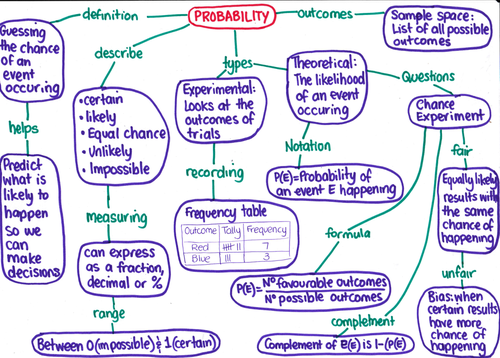
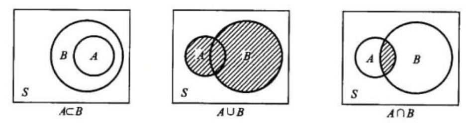
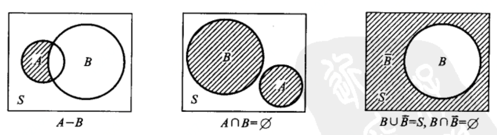
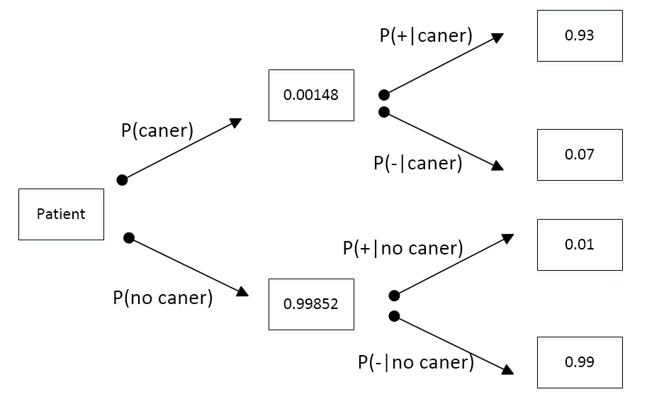
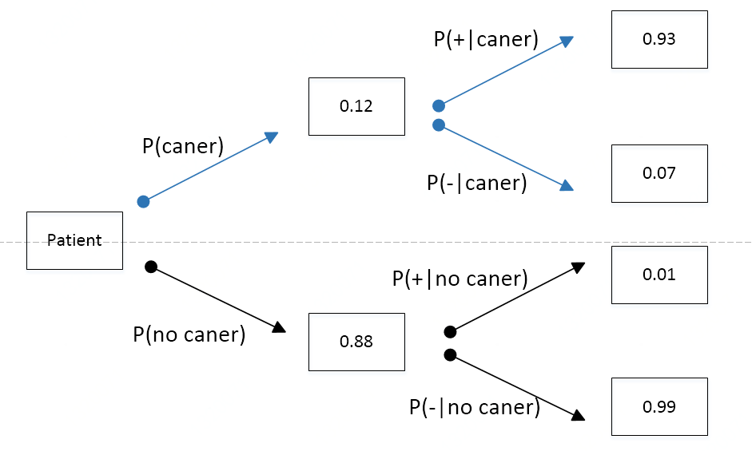

### 引言

第二章主要介绍概率知识。包括条件概率、贝叶斯公式、常见分布函数、参数估计、大数定理、蒙特卡罗方法、Gibbs抽样等理论知识。第二章后面几节，我们会介绍这方面的应用，例如CRF应用、时序预测、以及意图识别等应用。通过这些知识的学习，你不光会使用机器学习算法解决实际问题，而且还知道其背后的概率原理。



好了，那我们开始我们的概率征程吧。

### 相关概率知识预览

在介绍条件概率和朴素贝叶斯知识点之前，我们先简单的介绍下概率相关知识。

#### 概率历史

早期的埃及人为了忘记饥饿，经常聚集在一起玩一种叫做 “猎犬与胡狼” 的游戏，实际上就是今天的掷骰子游戏，相对面的数字之和是 7 的骰子大约产生于公元前 1400 年的埃及，骰子就是游戏中常用的随机发生器，这类游戏也叫做机会性游戏。这些就是历史上的一些概率小故事。

好了，我们开始正式内容的介绍。

#### 随机试验

下面举一些例子。

E1：抛一枚硬币，观察正面H和反面T出现的情况。

E2：将一枚硬币抛掷三次，观察正面H和反面T出现的情况。

E3：将一枚硬币抛掷三次，观察正面H出现的情况。

E4：抛一颗骰子，观察出现的点数。

E5：在一批灯泡中任意抽取一只，测试它的寿命。

上面几个例子都有如下的特点：

​	（1）可以在相同的条件下重复地进行
​	（2）每次试验的可能结果不止一个，并且能事先明确试验的所有可能结果
​	（3）进行一次试验之前不确定哪一个结果会出现
在概率论中，我们将具有上述三个特点的试验成为**随机试验**。

#### 样本空间 (S)

​	随机试验E所有可能的结果组成的集合称为E的样本空间，记为S。样本空间中的元素，即E的每个结果，成为样本点。

针对上面的随机事件，对应的样本空间S为：

S1: {H, T}

S2:{HHH, HHT, HTH, HTT, THH, THT, TTH, TTT}

S3:{0, 1, 2, 3}

S4:{1,2,3,4,5,6}

S5:{t| t> 0}

#### 随机事件

​	我们称随机试验E的样本空间S的子集称为随机事件，简称事件。在每次试验中，当且仅当这一子集中的一个样本点出现时，称这一事件发生。

#### 事件的关系与事件的运算 （类似于集合运算）

​	事件是一个集合，因此事件间的关系与事件的运算可以参考集合论中集合之间的关系和集合运算来处理。集合的关系包括：相等、和事件、积事件、差事件、互不相容（互斥）、逆事件（对立事件）





#### 频率

定义：在相同条件下，进行$n$次试验，在这$n$次试验中，事件A发生的次数$n_A$称为事件A发生的**频数**，比值：$n_A／n$，称为事件A发生的**频率**，记成$f_n(A)​$

基本性质：

（1）$0 <= f_n(A) <= 1​$

（2）$ f_n(S) = 1$

（3）若各个事件是不相容的事件，则$f_n(A_1 \bigcup A_2 \bigcup ... \bigcup A_k)=f_n(A_1)+f_n(A_2)+…+f_n(A_k)​$

稳定性：当试验重复次数很大时，频率趋于稳定，可以用来表征事件A发生可能性的大小。

#### 概率

定义：设E是随机试验，样本空间为S，对于E的每一个事件A赋予一个实数，记为P(A)，称为A的**概率**
性质：

非负性：对于一个事件A， P(A) >= 0

规范性：对于必然事件S，有$P(S)=1​$ 

可列可加性:（互不相容事件）$P(A_1 \bigcup A_2 \bigcup ... \bigcup A_k)=P(A_1)+P(A_2)+…+P(A_k)$

#### 古典概型

满足两个性质：（1）试验的样本只包含**有限**个元素；（2）试验中每个基本事件发生的可能性相同。
典型例子：抛硬币
长期实践的发现：“概率很小的事件在一次试验中几乎是不发生”

以上就是一些简单的概率知识回归。现在我们开始条件概率和贝叶斯公式的介绍。

### 什么是条件概率

本小节介绍条件概率以及贝叶斯公式。为了让大家更好理解和应用这两个知识点，我们举了大量的例子，帮助大家加深条件概率和贝叶斯公式概念的理解。

#### 条件概率定义

设A, B是两个事件，且P(A)>0，称
$$
P\left( B|A \right) =\frac{P\left( AB \right)}{P\left( A \right)}
$$
为在事件A发生的条件下事件B发生的条件概率。

条件概率表示为P(B|A)，读作“在B的条件下A发生的概率”。

P(AB)表示事件A和事件B共同发生的概率

P(A)表示事件A发生的概率。

同时P(A)，P(B)我们称之为**先验概率**，而P(B|A)也成为**后验概率**。


引子：掷一枚骰子，已知得到的骰子对应的点数是偶数，求该骰子是2的概率。大家可以先想一想。我们先介绍条件概率的链式法则，之后我们会给出几道条件概率题，让大家熟悉下。

#### 条件概率的链式法则

设P(A)>0, 则P(AB)的概率如下
$$
P\left( AB \right) =P\left( B|A \right) P\left( A \right)
$$
P(AB)的概率等于P(A)的概率乘以P(B|A)的概率。


同理，P(ABC)概率如下    
$$
P\left( ABC \right) =P\left( AB \right) P\left( C|AB \right) =P\left( A \right) P\left( B|A \right) P\left( C|AB \right) 
$$


那问题来了，条件概率有什么用呢？ 

条件概率用处非常广泛，在自然语言处理中语言模型的定义就是用条件概率表示的。


好了，做题时间开始了。

在本章开头，我们给了一个引子。我们先来讲解下如何用条件概率解决这道题。

解：

我们设**P(2|偶数)**表示当骰子是偶数的条件下，骰子点数是2的概率。

**P(2 & 偶数)**表示骰子是偶数并且骰子的点数是2。

**P(偶数)**表示骰子点数是偶数的概率。

则结果如下：
$$
P\left( 2|\text{偶数} \right) =\frac{P\left( 2\&\text{偶数} \right)}{P\left( \text{偶数} \right)}=\frac{1/6}{1/2}
$$
好的，趁热打铁，我们再来做几道题。


例题2.1（语言模型的表示）

一个句子由W1、W2、W3三个词组成，即S=W1W2W3，则这个句子S的概率用P(W1W2W3)表示。那么句子的概率就可以用条件概率来计算得到
$$
P\left( W1W2W3 \right) =P\left( W1 \right) P\left( W2|W1 \right) P\left( W3|W1W2 \right)
$$


例题2.2（扑克牌小问题）

我们在讲一道。

我们有一副扑克牌，52张。你可以从这52张随机抽取2次，请问在第一次抽到A的条件下，第二次抽到王的概率是多少？

我们设P(A)表示抽到扑克牌A的概率，P(AB)表示第一次抽到A并且第二次抽到王的概率，P(B|A)表示第一次抽到A的条件下第二次抽到王的概率。

则
$$
P\left( B|A \right) =\frac{P\left( AB \right)}{P\left( A \right)}=\frac{4/52\ *\ 2/51}{4/52}
$$


例题2.3（黑白球经典问题）

假设一个袋子里有6个球，3个白球，3个黑球。请问在第一次拿到白球的条件下，第二次拿到黑球的概率。（无放回抽取）

设P(A) 表示第一次拿到白球的概率，P(B)表示第二次拿到黑球的概率，P(AB)表示在第一次拿到白球的条件下并且第二次拿到黑球的概率。

则

P(A) = 3/6 = 1/2

P(B) = 3/5

P(AB) = 3/6 * 3/5
$$
P\left( B|A \right) =\frac{P\left( AB \right)}{P\left( A \right)}=\frac{3/6\ *\ 3/5}{3/6}
$$


例题2.3（汽车撞人逃逸事件）

某城市发生了一起汽车撞人逃跑事件，该城市只有两种颜色的车,比例为蓝色10% 绿色90%，事发时有一个目击者在现场看见了，他指证是蓝车但是根据专家在现场分析,当时那种条件目击者看正确车的颜色的可能性是80%
那么，肇事的车是蓝车的概率到底是多少（）

我们如何计算呢？

为了解决这个问题，我们需要讲讲贝叶斯公式


#### 什么是贝叶斯公式

设$A_1,A_2,A_3,...,A_i,...,A_n, B$这N+1个事件组成一个集合，P(Ai) > 0, P(B) > 0, i=1,2,...,n

则
$$
P\left( A_i|B \right) \ =\ \frac{P\left( A_i \right) *P\left( B|A_i \right)}{\sum_{j=1}^n{P\left( A_j \right) *P\left( B|A_j \right)}}
$$
上面公式我们叫贝叶斯（Bayes）公式。


为了讲清楚贝叶斯公式，我们还是以例题为例来详细说明。


例子1（乳腺癌病人例子1）：

让我们举一个贝叶斯的例子-乳腺癌病人的例子。

据统计某个国家1000个人中有1.48个人会得乳腺癌。

如果病人得乳腺癌的话，则病人去医院检查身体，被监测为阳性的概率为0.93，即P(+|cancer) = 0.93

如果病人没有得乳腺癌，则病人去医院检查身体，被监测为阴性的概率为0.01，即P(-|no cancer) = 0.99

那让我们计算下，在一次检查中，检测为阳性，病人可能得乳腺癌的概率是多少呢？P (has cancer | +) = ？

已知的信息如下：

P (cancer) = 0.00148。这个概率我们称之为**先验概率**。

P (+ | cancer) = 0.93	

P (- | no cancer) = 0.99


我们用图来直观的表示这些信息。

 


从上图，我们可以直观的看到：

P (cancer and +) = P (cancer) * P (+|cancer) = 0.00148*0.93

P (no cancer and +) = P (no cancer) * P(+|no caner) = 0.99852*0.01


则P(患乳腺癌|阳性) = 
$$
P\left( cancer|+ \right) \ =\ \frac{P\left( caner\ and\ + \right)}{P\left( + \right)}=\frac{P\left( caner\ and\ + \right)}{P\left( caner \right) P\left( +|caner \right) \ +\ P\left( no\ caner \right) P\left( +|no\ caner \right)}\ =\ 0.12
$$
这个称谓**后验概率**。


例子2（乳腺癌病人例子2）

现在，我们计算下在第二次检查时，当检测为阳性时病人患乳腺癌的概率。

现在，请记住，只有当病人第一次检查为阳性时，才有第二次检查。因此，这名病人不再是随机选择的(即这个病人得癌症的概率不再是0.00148)。我们是知道他/她的得癌症概率的，因此先验概率改变了，根据例题1我们得到这个病人得癌症的概率为0.12，我们更新之前的先验概率。

概率图如下：




现在我们计算第二次检查时的概率。

P (cancer and +) = P(cancer) * P(+) = 0.12 * 0.93

P (no cancer and +) = P (no cancer) * P (+) = 0.88 * 0.01


$$
P\left( cancer|+ \right) \,\,=\,\,\frac{P\left( caner\,\,and\,\,+ \right)}{P\left( + \right)}=\frac{P\left( caner\,\,and\,\,+ \right)}{P\left( caner \right) P\left( +|caner \right) \,\,+\,\,P\left( no\,\,caner \right) P\left( +|no\,\,caner \right)}\,\,=\,\,0.93
$$
我们可以看到，在第二次检查中，病人得乳腺癌的概率变为0.93


好的，讲完了贝叶斯公式，我们回过头来看看最开始那道题。


某城市发生了一起汽车撞人逃逸事件，该城市只有两种颜色的车,比例为蓝色10% 绿色90%，事发时有一个目击者在现场看见了，他指证是蓝车但是根据专家在现场分析,当时那种条件目击者看正确车的颜色的可能性是80%
那么，肇事的车是蓝车的概率到底是多少（）


现在大家一定会做这道题了。其实这个用贝叶斯公式就可以解决

P(蓝车)=0.1

P(绿车)=0.9

P(+|蓝车) = 0.8

P(+|绿车) = 0.2

则
$$
P\left( \text{蓝车|}+ \right) =\frac{P\left( \text{蓝车} \right) P\left( +|\text{蓝车} \right)}{P\left( \text{蓝车} \right) P\left( +|\text{蓝车} \right) +P\left( \text{绿车} \right) P\left( +|\text{绿车} \right)}=\frac{0.1*0.8}{0.1*0.8+0.9*0.2}=8/26
$$

### 朴素贝叶斯在机器学习中的应用

本节介绍朴素贝叶斯在机器学习中的应用。

朴素贝叶斯是一种构建分类器的简单方法。朴素贝叶斯不是训练这种分类器的单一算法，而是一系列基于相同原理的算法：所有朴素贝叶斯分类器都假定样本每个特征与其他特征都不相关。举个例子，如果一种水果其具有红，圆，直径大概3英寸等特征，该水果可以被判定为是苹果。尽管这些特征相互依赖或者有些特征由其他特征决定，然而朴素贝叶斯分类器认为这些属性在判定该水果是否为苹果的概率分布上独立的。

对于某些类型的概率模型，在监督式学习的样本集中能获取得非常好的分类效果。在许多实际应用中，朴素贝叶斯模型参数估计使用最大似然估计方法。

尽管是带着这些朴素思想和过于简单化的假设，但朴素贝叶斯分类器在很多复杂的现实情形中仍能够获取相当好的效果。

本节通过朴素贝叶斯方法来做一道机器学习题目。


我们首先介绍下Iris数据集：

Iris数据集是常用的分类实验数据集，由Fisher, 1936收集整理。Iris也称鸢尾花卉数据集，是一类多重变量分析的数据集。数据集包含150个数据集，分为3类，每类50个数据，每个数据包含4个属性。可通过花萼长度，花萼宽度，花瓣长度，花瓣宽度4个属性预测鸢尾花卉属于（Setosa，Versicolour，Virginica）三个种类中的哪一类。

该数据集包含了5个属性：

& Sepal.Length（花萼长度），单位是cm;

& Sepal.Width（花萼宽度），单位是cm;

& Petal.Length（花瓣长度），单位是cm;

& Petal.Width（花瓣宽度），单位是cm;

& 种类：Iris Setosa（山鸢尾）、Iris Versicolour（杂色鸢尾），以及Iris Virginica（维吉尼亚鸢尾）。

数据集示例如下：

```
sepal_length	sepal_width	petal_length	petal_width	species
5.1	3.5	1.4	0.2	setosa
4.9	3	1.4	0.2	setosa
4.7	3.2	1.3	0.2	setosa
4.6	3.1	1.5	0.2	setosa
5	3.6	1.4	0.2	setosa
7	3.2	4.7	1.4	versicolor
6.4	3.2	4.5	1.5	versicolor
6.9	3.1	4.9	1.5	versicolor
5.5	2.3	4	1.3	versicolor
6.5	2.8	4.6	1.5	versicolor
6.3	3.3	6	2.5	virginica
5.8	2.7	5.1	1.9	virginica
7.1	3	5.9	2.1	virginica
6.3	2.9	5.6	1.8	virginica
6.5	3	5.8	2.2	virginica
```


题目：我们要根据sepal_length, sepal-width, petal_length, petal-width这4类特征，预测鸢尾花卉属于（Setosa，Versicolour，Virginica）三个种类中的哪一类。

我们采用naive bayes方法来做这道题。

那么我们需要做以下几个步骤，就可以用朴素贝叶斯算法完成一这个机器学习题目。

1.导入数据

2.得到训练集和测试集。这里训练集和测试集比例为4:1

3.创建naive bayes模型

4.进行预测，并打印混淆矩阵


```python
# Naive Bayes Classification
import sys

import numpy as np
import pandas as pd
from sklearn.model_selection import train_test_split
from sklearn.naive_bayes import GaussianNB
from sklearn.metrics import confusion_matrix

#1.导入数据
dataset = pd.read_csv('iris.csv')

#2.得到X, y
X = dataset.iloc[:,:4].values
y = dataset['species'].values

#2.得到train和test
X_train, X_test, y_train, y_test = train_test_split(X, y, test_size = 0.20, random_state = 82)

#3.创建naive bayes模型
nvclassifier = GaussianNB()
nvclassifier.fit(X_train, y_train)

#4.预测结果
y_pred = nvclassifier.predict(X_test)

#4.混淆矩阵
cm = confusion_matrix(y_test, y_pred)
print(cm)
```

好了，条件概率和贝叶斯公式今天就介绍到这里。大家如何还有什么问题，可以结合相对应的例题温习下。

对于朴素贝叶斯在机器学习中的应用这一节，有个概念（最大似然估计MLE）我们会在接下来章节介绍，大家如果不理解，可以先看对应章节。总之，我们想通过一道简单实际的机器学习例题，给大家一个使用朴素贝叶斯方法的一个直观的例子。

后面我们会继续介绍其他概率相关内容。

谢谢大家的阅读，大家辛苦了。