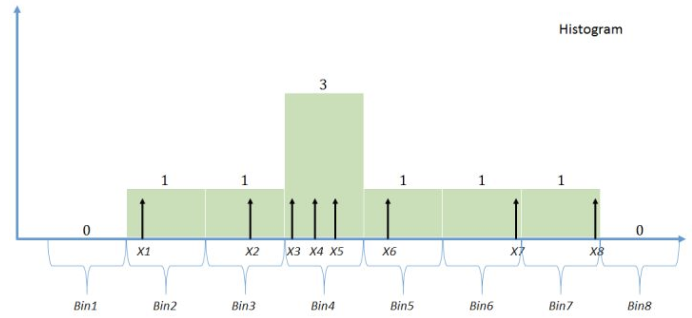

### 引言

在第8节我们介绍过参数估计，以及用MLE方法估计参数。

那什么是非参数估计呢？为什么要引入非参数估计呢？对于非参数估计如何进行估计呢？接下来我们详细介绍。

### 介绍非参数估计

什么是非参数估计呢？为什么要引入非参数估计呢？

非参数统计是统计学的一个重要分支，它在实践中有着广泛的应用。

在一个统计问题中，假定总体分布的数学形式已知，仅包括（少数）有限个未知参数，这个问题就是参数统计问题。而非参数估计的参数空间维度是无限的。这里的nonparametric这个词有一定的误导性，在这里nonparametric其实是of infinite parameters的意思。

如果我们所知很少，以致于在推断之前不能对总体作任何假设，或仅能作一些非常一般性(例如连续分布、对称分布等)的假设，这时如果仍然使用参数统计方法，其统计推断的结果显然是不可信的，甚至有可能是错的。在对总体的分布不作假设或仅作非常一般性假设条件下的统计方法称为“非参数统计”。

由于非参数统计方法与总体究竟是什么分布几乎没有什么关系，所以它的应用范围很广，它在社会学、医学、生物学、心理学、教育学等领域都有着广泛的应用。由于有关于总体的假设，所以参数统计的推断方法是针对这个假设的。相对而言，非参数统计的推断方法是很一般的，它仅应用样本观察值中一些非常直观(例如次序)的信息。所以非参数统计分析含有丰富的统计思想。

假定两个变量(X, Y)之间有如下的回归关系：

$Y=f(x)+\mu​$,

大家知道，统计里关心的是$f(x)$，也就是我们要估计的$f(x)$。从数学的角度，我们知道$f(X)$的形式有多种多样，线性，多项式，三角函数等。我们从线性代数基的角度来看：

$f(x) = a$，那么对应的基为(1)，可以认为是1维的。估计$f(x)$也就是在一维空间里找到一个解。

$f(x)=a+bx$，那么对应的基为${(1, x)}$，可以认为是2维的。估计$f(x)$也就是在二维空间里找到一个数值。例如我们的最小二乘就是在二维平面上找到一个点。

$f(x)=a+bx+cx^2​$，对应的基是3维的${1,x,x^2}​$

$f(x)=a+a_1x+…+a_nx^n​$,对应的基为${1,x,…,x^n}​$，可以认为是$(n+1)​$维的。

由Talyer展开，对于一大类函数，我们都可以展开为$f(x)=a+a_1x+…+a_nx^n$，估计$f(x)$也就是找到$a_0,a_1,…,a_n$，从这个角度我们可以把非参数估计看成无穷维的参数估计。

### 非参数估计方法

在统计问题中，如何估计一条曲线$h(x)$?

例如$X_1, X_2,…, X_n$服从独立同分布iid， 我们如何估计其分布函数$F(x)$和密度函数$f(x)$?

非参数估计是一种对先验知识要求最少，完全依靠训练数据进行估计，而且可以用于任意形状密度估计的方法。常见的非参数估计方法有以下几种：

#### 直方图

柱状图是最简单的非参数估计方法，将样本分布范围进一步划分成若干抽屉（bin），按照抽屉的宽度确定每个抽屉对应的概率密度（不是样本数），即概率密度的估计。

直方图：如果确定直方图的结点$t_0 < t_1< … < t_{m-1}<t_m ​$，定义一个新的函数，$\gamma _x(t)=\sum_{k-1}^{m}I(t_{k-1}<x, t<=t_k) ​$

那么计数直方图可以表示为：$H_n(x) = \sum_{i=1}^{n}\gamma x_i(x)​$

如果我们想展示密度函数，可以定义$\gamma _x(t)=\sum_{k-1}^{m}I(t_{k-1}<x, t<=t_k)/(t_k-t_{k-1})$

然后直方图表示为$H_n(x)=(1/n) \sum_{i=1}^{n}\gamma x_i(x)$

实际上这里的$\gamma_x(t) = \left\{\begin{matrix}
 1/(t_k-t_{t-1})  , t_{k-1}<t<=t_k \\ 
 0    ,other 
\end{matrix}\right.​$

上面的公式比较难于理解，实际上我们看下面的通俗易通的语言就好理解了。

**实际上直方图公式等于：$f(x)​$=当前抽屉中的样本数/(样本总数*当前抽屉宽度)​**

当前抽屉中的样本数即$x_i(x)​$， 当前抽屉的宽度即$\gamma_x(t) = \left\{\begin{matrix}
 1/(t_k-t_{t-1})  , t_{k-1}<t<=t_k \\ 
 0    ,other 
\end{matrix}\right.​$

大家在结合下面的图感受下。

现在是不是对直方图了解了。那我们在回归头来看下那些复杂的公式。

直方图表示为$H_n(x)=(1/n) \sum_{i=1}^{n}\gamma x_i(x)$

实际上这里的$\gamma_x(t) = \left\{\begin{matrix}
 1/(t_k-t_{t-1})  , t_{k-1}<t<=t_k \\ 
 0    ,other 
\end{matrix}\right.$

这里对于某个$k, t_{k-1}<x<=t_k$，且满足$\int \gamma_x(t)d_t=1$。对于一般的直方图，我们会选取一个起点$h_0$及固定的宽度，而实际问题中这两个参数的选取对于最后的结果影响也是比较大的。抽屉的宽度可以变，也可以是定值。

柱状图的优点是简单，缺点是在抽屉之间的不连续性，导致其无法适用于需要估计概率密度的倒数的场合。

#### 核密度估计

仔细检查直方图，我们会发现直方图对于所有发生在$[t_{k-1}, t_k]$中的样本都同等的对待。简单起见我们考虑[0, 1]区间，如果有两个样本取值$0-, 1+$ 那么我们应该认为前者表达的信息是分布在0周围有密度，而后者应该是在1周围有密度，而不能把两个完全同等的看待。

核密度估计的原理和直方图类似，是一种平滑的无参数密度估计方法。

对于一组数据，把数据的值域分为若干相等的区间，每个区间称为一个`bin`，数据就按区间分成若干组，每组数据的个数比上总参数个数的比率就是每个**bin**的概率值。

相对于直方图，它多了一个用于平滑数据的核函数。并且密度估计方法适用于中小规模的数据集，可以很快产生一个渐进无偏的密度估计，有良好概率统计性质。

具体来说，对于直方图，给定宽度$\delta$，

我们认为样本$X_i$ 应该反应区间$[X_i-\delta/2, X_i+\delta/2]$的信息，

例如我们定义$K_\Delta(x)=I(-\delta/2<=x<=\delta/2)/\delta$

那么对应的估计为：$f_n(x)=1/n \sum_{i=1}^{n}K_\delta(X_i-x)​$

以上就是核密度估计的方程。

这里$K(x)$称为核函数(Kernel function)，它通常满足对称性以及$\int K(x){\rm d}x=1$

可以看出，核函数是一种权函数，该估计利用数据点$x_i​$到$x​$的距离来决定$x_i​$在估计点$x​$的密度时所起的作用，距离$x​$越近的样本所起的作用越大，其权值越大。

式子中的$\delta​$表示带宽，$\delta​$越大，估计密度函数就越平滑，但偏差可能比较大。

如果$\delta$选择的比较小，那么估计的密度曲线和样本拟合的比较好，但是可能很不光滑，一般以均方误差最小为选择原则。

需要说明的是，核密度估计也可以扩展到多维空间，当$x$为$d$维空间向量时，多核密度估计可以表示为:

$f(x)=\frac{1}{nh^d}\mathbf{\sum ^n_{i=1}}K(\frac{x-\mathbf{x_{i}}}{h})$

#### K临近估计

核密度估计的加权时以数据点到x的欧式距离为基准来进行的，而K临近估计是无论欧氏距离是多少，只要是离x点的最近的k个点其中之一就可以加权。即K临近密度估计可以表示为下列形式:

$f(x)=\frac{k-1}{2n\mathbf{d_{k}}(x)}​$

其中$d_k(x)$表示点x到所有样本点的欧式距离，而且$d1(x)<=d2(x)<=……<=dk(x)$,显然k的取值决定了估计密度曲线的光滑程度，**k越大越光滑**

### 机器学习参数估计和非参数估计

是不是有点和以前介绍的机器学习算法混淆了。

到底哪种机器学习算法是参数估计，哪种机器学习算法是非参数估计。本节详解介绍下。

**参数估计**：A learning model that summarizes data with a set of parameters of fixed size (independent of the number of training examples) is called a parametric model. No matter how much data you throw at a parametric model, it won’t change its mind about how many parameters it needs.* 
——[Artificial Intelligence: A Modern Approach,](http://www.allitebooks.com/artificial-intelligence-a-modern-approach-3rd-edition/) page 737

**参数机器学习算法的一些常见例子包括**

- 线性回归

- Logistic Regression

- 感知机

  

**参数机器学习算法的优点：**

- 简单：这些算法很容易理解和解释结果；

- 快速：参数模型可以很快从数据中学习；

- 少量的数据：它们不需要太多的训练数据，甚至可以很好地拟合有缺陷的数。

  

**参数机器学习算法的局限性**：

- 约束：这些算法选择一种函数形式高度限制模型本身；

- 有限的复杂性：这种算法可能更适合简单的问题；

- 不适合：在实践中，这些方法不太可能匹配潜在的目标（映射）函数。

  

**非参数机器学习算法**

> *非参数估计：Nonparametric methods are good when you have a lot of data and no prior knowledge, and when you don’t want to worry too much about choosing just the right features.*
> ——[Artificial Intelligence: A Modern Approach,](http://www.allitebooks.com/artificial-intelligence-a-modern-approach-3rd-edition/) page 757

**非参数机器学习算法的一些常见例子包括**

- KNN：一种理解非参模型的最好例子是KNN算法
- 决策树，比如CART和C4.5
- SVM
- Adaboost
- 神经网络

**非参数机器学习算法的优点**

- 灵活性：拟合大量的不同函数形式；

- 能力：关于潜在的函数不需要假设；

- 性能：可以得到用于预测的高性能模型。

  

**非参数机器学习算法的局限性**

- 更多的数据：需要更多的训练数据用于估计目标函数；

- 慢：训练很慢，因为它们常常需要训练更多的参数；

- 过拟合：更多的过度拟合训练数据风险，同时它更难解释为什么要做出的具体预测。

  

### 总结

在统计学中，参数模型通常假设总体（随机变量）服从某一个分布，该分布由一些参数确定（比如正太分布由均值和方差确定），在此基础上构建的模型称为参数模型；

非参数模型对于总体的分布不做任何假设，只是知道总体是一个随机变量，其分布是存在的（分布中也可能存在参数），但是无法知道其分布的形式，更不知道分布的相关参数，只有在给定一些样本的条件下，能够依据非参数统计的方法进行推断。

**问题中有没有参数，并不是参数模型和非参数模型的区别。其区别主要在于总体的分布形式是否已知。**

非参数统计对总体假设较少，容易计算结果，稳定性高，而且具有广泛适应性。

1、非参数统计比参数统计来说，不需要太多的假设，在不知道总体分布情况下可采用非参，而知道总体分布情况下则采用参数统计。

2、非参数计算比较简单。

3、非参不需要具备太多统计理论知识。

参数与非参统计检验都是用来对总体和样本参数进行估计的。

